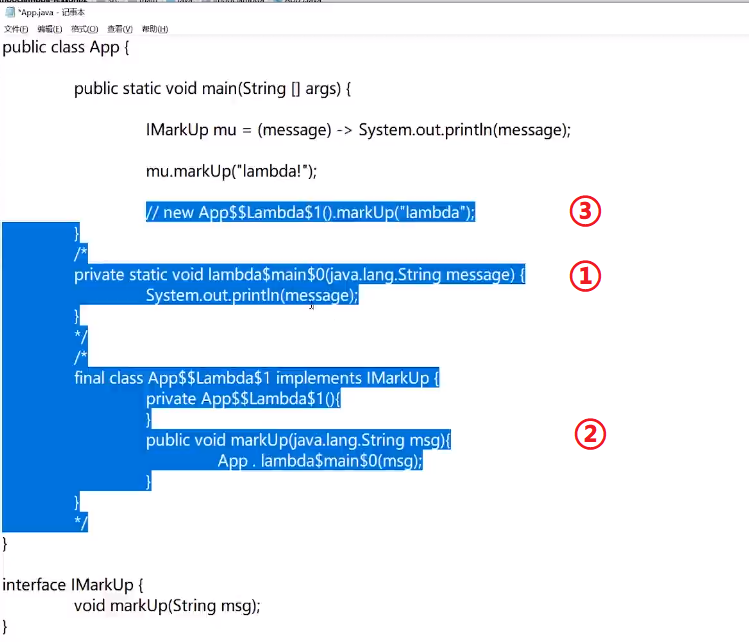

# Lambda表达式和函数式接口
- 1.lambda表达式必须和接口绑定
- 2.lambda表达式的参数可以是0~n个。括号中类型的指定可以省略，JVM会自动帮我们匹配。
- 3.lambda表达式的返回值

## 1.Java.util内建的函数式接口
```java
java.util.function.Predicate<T>
//boolean test(T t);
//接受参数对象T，返回一个boolean类型

java.util.function.Consumer<T>
//void accept(T t);
//接受参数对象T，没有返回值

java.util.function.Function<T, R>
//R apply(T t);
//接受参数对象T，返回类型R

java.util.function.Supplier<T>
//T get();
//不接受参数，提供T对象的创建工厂

java.util.function.UnaryOperator<T>
//T apply(T t);
//接收参数对象T，返回结果对象T

java.util.function.BinaryOperator<T>
//T apply(T t1, T t2);
//接受2个T对象，返回一个T接口
```

## 2.lambda表达式的特性和实现原理

### 2.1.特性
- 可以使用``this``关键字表示当前实例(匿名内部类的``this``方法不能。。。)

### 2.2.实现原理
<br>

## 3.lambda表达式的使用

### 3.1.lambda表达式的获得和转换
```java
public class Main {
    public static void main(String[] args) {
        String[] str = new String[]{"admin", "tom", "ajax"};
        //数组->stream
        Stream<String> stream1 = Stream.of(str);

        //列表->stream
        List<String> list = new ArrayList<>();
        list.add("admin");
        list.add("tom");
        list.add("ajax");
        Stream<String> stream2 = list.stream();

        //集合->stream
        Set<String> set = new HashSet<>();
        set.add("admin");
        set.add("Tom");
        set.add("Ajax");
        Stream<String> stream3 = set.stream();

        //map -> stream
        Map<String, Integer> map = new HashMap<>();
        map.put("ten", 10);
        map.put("nine", 9);
        map.put("eight", 8);
        Stream<Map.Entry<String, Integer>> stream4 = map.entrySet().stream();

        //stream -> 列表
        List<String> l = stream2.collect(Collectors.toList());

        //stream -> 字符串
        String strT = stream1.collect(Collectors.joining());

        //stream -> map
        map = stream4.collect(Collectors.toMap((a) -> {     //注意这里的a参数是EntrySet<String, Integer>类型
            return a.getKey();
        }, (b) -> {
            return b.getValue();
        }));
        System.out.println(map);
    }
}
```

### 3.2.常用的Stream处理过程
```java
public class Main {

    public static void main(String[] args) {
        //列表->stream
        List<String> list = new ArrayList<>();
        list.add("admin");
        list.add("tom");
        list.add("ajax");

        //map() 中间操作，map()接收一个Function接口
        list = list.stream().map(x -> "map->" + x).collect(Collectors.toList());

        //filter() 中间操作，过滤filter()接受一个Predicate接口
        list = list.stream().filter(x -> x.length() < 14).collect(Collectors.toList());

        //peek() 循环中间操作; forEach() 终结操作 增强循环
//        list.stream()
//                .peek(x -> System.out.println("peek1+" + x))
//                .peek(x -> System.out.println("peek2+" + x))
//                .forEach(x -> System.out.println("forEach->" + x));

        //skip(int) limit(int) 切割流的数量
        list.stream().skip(1).forEach(System.out::println);
        list.stream().limit(2).forEach(System.out::println);
        //sorted() 中间操作 排序
        //distinct() 中间操作 剔除重复数据

        List<Integer> intList = new ArrayList<>();
        intList.add(11);
        intList.add(111);
        intList.add(4);
        intList.add(99);
        intList.add(76);
        intList.add(57);
        //max() 中间操作 获取最大数值
        Optional optional = intList.stream().max((x,y)->x-y);
        System.out.println(optional.get());
        //min() 中间操作 获取最小值
        //reduce() 合并处理数据
    }
}
```