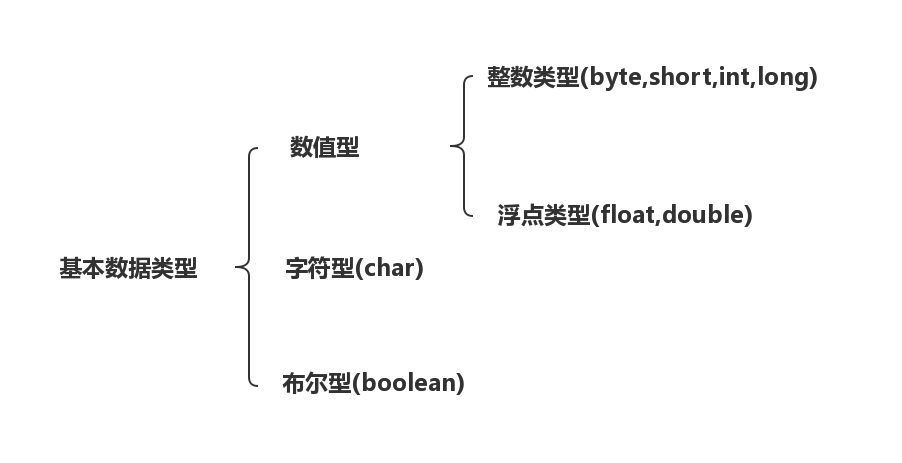

# 包装类
java的基本数据类型不具备对象特征,包装类的产生就是为了解决基本数据类型不能使用对象方法交互的问题<br>
<br>

## 1.基本类型和对应包装类

| 基本类型 | 对应包装类 |
|---------|-----------|
| byte | Byte |
| short | Short |
| int | Interger |
| long | Long |
| float | Float |
| double | Double |
| char | Character |
| boolean | Boolean |

## 2.包装类学习

### 2.1.数值型
数值型包装类是处理Character和Boolean类型的包装类.他们共同继承``Numbere``类<br>
#### 2.1.1.Interger类型
我们拿Integer类型举例<br>
通过查阅[官方文档](https://docs.oracle.com/javase/8/docs/api/)可以看到Integer有Static方法和Instance方法.<br>
其中Instance方法中:<br>
```java
//将int类型转换成其他类型的值
byte byteValue();
double doubleValue();
float floatValue();
long longValue();
short shortValue();
int intValue();
```
#### 2.1.2.装箱和拆箱
```java
int t1 = 4;
Integer T1a = new Integer(t1);//装箱
Integer T1b = t1;//自动装箱

Integer T2 = new Integer(4);
int t2a = T2.intValue();//拆箱
int t2b = T2;//自动拆箱
```
#### 2.1.3.包装类和字符串的相互转换
**包装类转换成字符串:**<br>
```java
int t1 = 2;
String t2 = Integer.toString(t1);
```

**字符串转换成包装类**<br>
```java
int t3 = Integer.parseInt(t2);
int t4 = Integer.valueOf(t2);
```

### 2.2.Character和Boolean