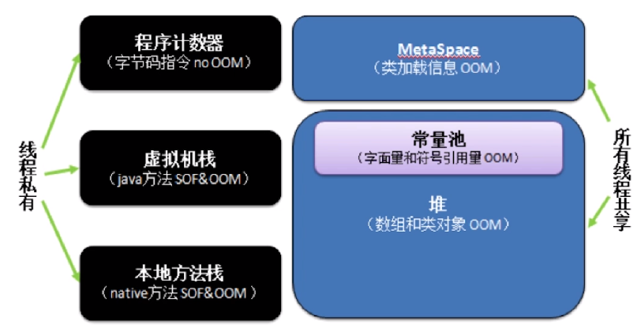
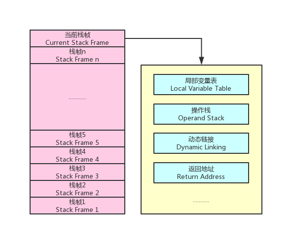
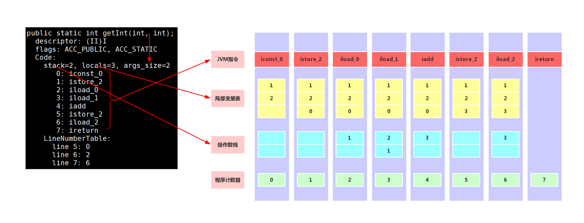

# java内存模型
- 1.线程角度
- 2.存储角度

## 1.从线程角度
线程私有:<br>
- 1.程序计数器
- 2.虚拟机栈
- 3.本地方法栈

线程共享:<br>
- 1.MetaSpace
- 2.java堆

<br>

### 1.1.程序计数器
- 1.当前线程执行字节码行号指示器(逻辑)
- 2.改变当前计数器的值来指向下一条要执行的字节码指令
- 3.每个线程有一一对应的程序计数器
- 4.只有java方法计算,native方法计数器为Undefined
- 5.不会发生内存泄漏

### 1.2.虚拟机栈
<br>
- 1.局部变量表:包含方法执行过程中的所有变量
- 2.操作数栈:入栈,出栈,复制,交换,产生消费变量

下面详细介绍局部变量表和操作数栈的关系:<br>
以下面的代码为例:<br>
```java
package com.noble;
  
class Test{
        public static int getInt(int i, int j){
                int c = 0;
                c = i + j;
                return c;
        }
}
```

```
javac com/noble/Test.java
javap -verbose com/noble/Test.class
```
下图详细解释了字节码指令执行时,操作数栈,局部变量表的变化规律.<br>
<br>

#### 问题java递归为什么会抛出java.lang.StackOverFlowError异常?
答案是 栈空间本身是有限制的.<br>

### 1.3.本地方法栈
- 与虚拟机栈类似.主要作用与标注了native的方法.<br>

### 1.4.MetaSpace元空间