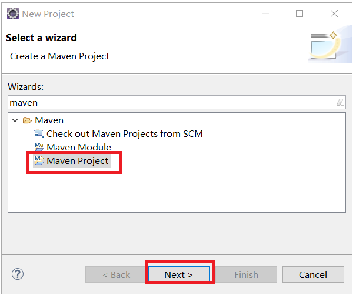
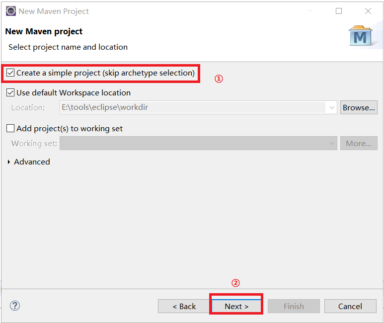
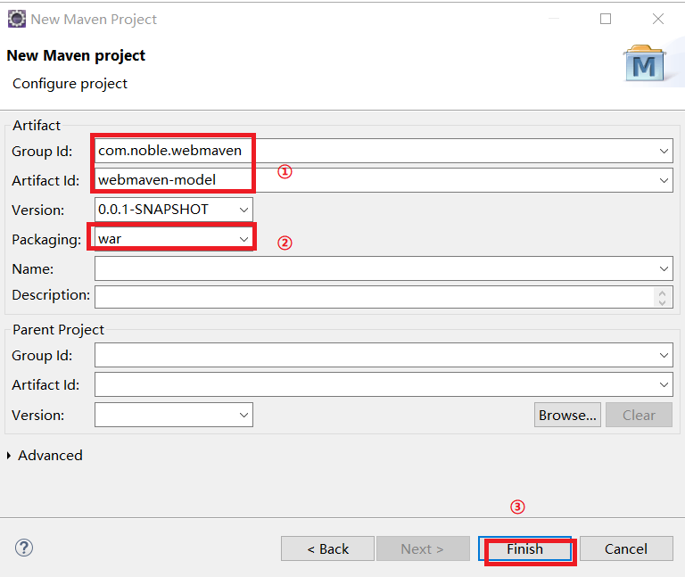
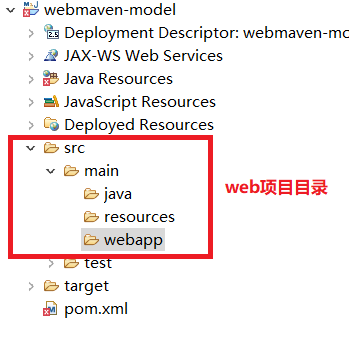
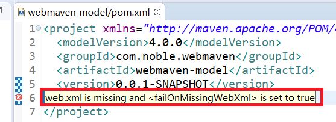
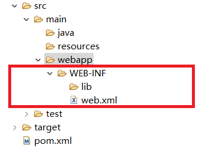

# 在eclipse创建Maven工程

## 1.里程碑一 创建eclipse默认maven-web模板
### 1.1.创建项目
<br>

### 1.2.勾选默认simple project
<br>

### 1.3.填写 groupId等
<br>

### 1.4.查看创建成功的目录树
<br>

## 2.里程碑二 添加web.xml
在新创建的Maven-web工程中,我们会看到pom.xml文件报错:<br>
<br>

在webapp目录下创建如下目录结构和web.xml文件。<br>
<br>
web.xml的内容是：<br>
```xml
<?xml version="1.0" encoding="UTF-8"?>
<web-app xmlns:xsi="http://www.w3.org/2001/XMLSchema-instance" 
		 xmlns="http://java.sun.com/xml/ns/javaee" 
		 xsi:schemaLocation="http://java.sun.com/xml/ns/javaee http://java.sun.com/xml/ns/javaee/web-app_2_5.xsd" id="WebApp_ID" version="2.5">
  <display-name>webdemo</display-name>
  <welcome-file-list>
    <welcome-file>index.html</welcome-file>
    <welcome-file>index.htm</welcome-file>
    <welcome-file>index.jsp</welcome-file>
    <welcome-file>default.html</welcome-file>
    <welcome-file>default.htm</welcome-file>
    <welcome-file>default.jsp</welcome-file>
  </welcome-file-list>
</web-app>
```

# 2.pom模板
```xml
<project xmlns="http://maven.apache.org/POM/4.0.0"
	xmlns:xsi="http://www.w3.org/2001/XMLSchema-instance"
	xsi:schemaLocation="http://maven.apache.org/POM/4.0.0 http://maven.apache.org/xsd/maven-4.0.0.xsd">
	<modelVersion>4.0.0</modelVersion>
	<groupId>com.noble.webdemo</groupId>
	<artifactId>webdemo</artifactId>
	<version>0.0.1-SNAPSHOT</version>
	<packaging>war</packaging>


	<dependencies>
		<dependency>
			<groupId>javax.servlet</groupId>
			<artifactId>javax.servlet-api</artifactId>
			<version>3.1.0</version>
			<scope>provided</scope>
		</dependency>
		<dependency>
			<groupId>junit</groupId>
			<artifactId>junit</artifactId>
			<version>4.10</version>
		</dependency>
	</dependencies>
	<build>
		<plugins>
			<plugin>
				<groupId>org.apache.tomcat.maven</groupId>
				<artifactId>tomcat7-maven-plugin</artifactId>
				<version>2.2</version>
				<executions>
					<execution>
						<id></id>
						<phase>package</phase>
						<goals>
							<goal>run</goal>
						</goals>
					</execution>
				</executions>
			</plugin>
		</plugins>

	</build>

</project>
```