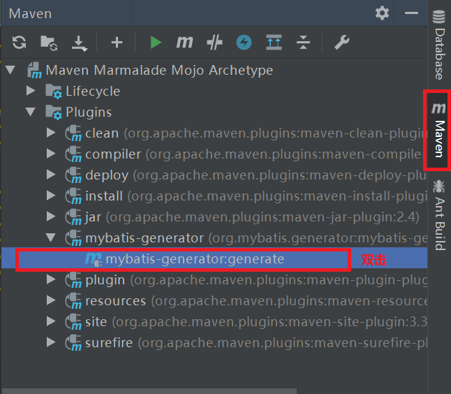

# Mybatis常用插件

## 1.Mybatis-generator
Mybatis-generator可以自动生成dao层、pojo层和mappers。<br>

### 1.1.maven按照插件
在Maven的``pom.xml``文件中加入如下信息就成功添加Mybatis-generator插件.<br>
```xml
<build>
<plugins>
    <plugin>
    <groupId>org.mybatis.generator</groupId>
    <artifactId>mybatis-generator-maven-plugin</artifactId>
    <version>1.3.2</version>
    <configuration>
        <verbose>true</verbose>
        <overwrite>true</overwrite>
    </configuration>
    </plugin>
</plugins>
</build>
```

### 1.2.配置参数
需要告诉Mybatis-generator的是:<br>
- 1.DB的链接参数(url,user,pass,db_driver的路径和包名)
- 2.dao,pojo,mapper的位置
- 3.数据表的信息(注意要显示的将mysql中test类型映射为varchar类型,因为不同版本的Mybatis转换java类型不一致)

```xml
<?xml version="1.0" encoding="UTF-8"?>
<!DOCTYPE generatorConfiguration
        PUBLIC "-//mybatis.org//DTD MyBatis Generator Configuration 1.0//EN"
        "http://mybatis.org/dtd/mybatis-generator-config_1_0.dtd">

<generatorConfiguration>
    <!--导入属性配置-->
    <properties resource="datasource.properties"></properties>

    <!--指定特定数据库的jdbc驱动jar包的位置-->
    <classPathEntry location="${db.driverLocation}"/>

    <context id="default" targetRuntime="MyBatis3">

        <!-- optional，旨在创建class时，对注释进行控制 -->
        <commentGenerator>
            <property name="suppressDate" value="true"/>
            <property name="suppressAllComments" value="true"/>
        </commentGenerator>

        <!--jdbc的数据库连接 -->
        <jdbcConnection
                driverClass="${db.driverClassName}"
                connectionURL="${db.url}"
                userId="${db.username}"
                password="${db.password}">
        </jdbcConnection>


        <!-- 非必需，类型处理器，在数据库类型和java类型之间的转换控制-->
        <javaTypeResolver>
            <property name="forceBigDecimals" value="false"/>
        </javaTypeResolver>


        <!-- Model模型生成器,用来生成含有主键key的类，记录类 以及查询Example类
            targetPackage     指定生成的model生成所在的包名
            targetProject     指定在该项目下所在的路径
        -->
        <!--<javaModelGenerator targetPackage="com.mmall.pojo" targetProject=".\src\main\java">-->
        <javaModelGenerator targetPackage="com.noble.pojo" targetProject="./src/main/java">
            <!-- 是否允许子包，即targetPackage.schemaName.tableName -->
            <property name="enableSubPackages" value="false"/>
            <!-- 是否对model添加 构造函数 -->
            <property name="constructorBased" value="true"/>
            <!-- 是否对类CHAR类型的列的数据进行trim操作 -->
            <property name="trimStrings" value="true"/>
            <!-- 建立的Model对象是否 不可改变  即生成的Model对象不会有 setter方法，只有构造方法 -->
            <property name="immutable" value="false"/>
        </javaModelGenerator>

        <!--mapper映射文件生成所在的目录 为每一个数据库的表生成对应的SqlMap文件 -->
        <!--<sqlMapGenerator targetPackage="mappers" targetProject=".\src\main\resources">-->
        <sqlMapGenerator targetPackage="mappers" targetProject="./src/main/resources">
            <property name="enableSubPackages" value="false"/>
        </sqlMapGenerator>

        <!-- 客户端代码，生成易于使用的针对Model对象和XML配置文件 的代码
                type="ANNOTATEDMAPPER",生成Java Model 和基于注解的Mapper对象
                type="MIXEDMAPPER",生成基于注解的Java Model 和相应的Mapper对象
                type="XMLMAPPER",生成SQLMap XML文件和独立的Mapper接口
        -->

        <!-- targetPackage：mapper接口dao生成的位置 -->
        <!--<javaClientGenerator type="XMLMAPPER" targetPackage="com.mmall.dao" targetProject=".\src\main\java">-->
        <javaClientGenerator type="XMLMAPPER" targetPackage="com.noble.dao" targetProject="./src/main/java">
            <!-- enableSubPackages:是否让schema作为包的后缀 -->
            <property name="enableSubPackages" value="false" />
        </javaClientGenerator>


        <table tableName="mmall_shipping" domainObjectName="Shipping" enableCountByExample="false" enableUpdateByExample="false" enableDeleteByExample="false" enableSelectByExample="false" selectByExampleQueryId="false"></table>
        <table tableName="mmall_cart" domainObjectName="Cart" enableCountByExample="false" enableUpdateByExample="false" enableDeleteByExample="false" enableSelectByExample="false" selectByExampleQueryId="false"></table>
        <!-- <table tableName="mmall_cart_item" domainObjectName="CartItem" enableCountByExample="false" enableUpdateByExample="false" enableDeleteByExample="false" enableSelectByExample="false" selectByExampleQueryId="false"></table> -->
        <table tableName="mmall_category" domainObjectName="Category" enableCountByExample="false" enableUpdateByExample="false" enableDeleteByExample="false" enableSelectByExample="false" selectByExampleQueryId="false"></table>
        <table tableName="mmall_order" domainObjectName="Order" enableCountByExample="false" enableUpdateByExample="false" enableDeleteByExample="false" enableSelectByExample="false" selectByExampleQueryId="false"></table>
        <table tableName="mmall_order_item" domainObjectName="OrderItem" enableCountByExample="false" enableUpdateByExample="false" enableDeleteByExample="false" enableSelectByExample="false" selectByExampleQueryId="false"></table>
        <table tableName="mmall_pay_info" domainObjectName="PayInfo" enableCountByExample="false" enableUpdateByExample="false" enableDeleteByExample="false" enableSelectByExample="false" selectByExampleQueryId="false"></table>
        <table tableName="mmall_product" domainObjectName="Product" enableCountByExample="false" enableUpdateByExample="false" enableDeleteByExample="false" enableSelectByExample="false" selectByExampleQueryId="false">
            <columnOverride column="detail" jdbcType="VARCHAR" />
            <columnOverride column="sub_images" jdbcType="VARCHAR" />
        </table>
        <table tableName="mmall_user" domainObjectName="User" enableCountByExample="false" enableUpdateByExample="false" enableDeleteByExample="false" enableSelectByExample="false" selectByExampleQueryId="false"></table>


        <!-- geelynote mybatis插件的搭建 -->
    </context>
</generatorConfiguration>
```

```
db.driverLocation=E:/tools/eclipse/maven/m2/mysql/mysql-connector-java/5.1.6/mysql-connector-java-5.1.6.jar
db.driverClassName=com.mysql.jdbc.Driver

db.url=jdbc:mysql://10.0.0.3:3306/mmall?characterEncoding=utf-8
db.username=root
db.password=123456

db.initialSize = 20
db.maxActive = 50
db.maxIdle = 20
db.minIdle = 10
db.maxWait = 10
db.defaultAutoCommit = true
db.minEvictableIdleTimeMillis = 3600000
```

### 1.3.运行命令
```
"C:\Program Files\Java\jdk1.8.0_181\bin\java.exe" -Dmaven.multiModuleProjectDirectory=E:\tools\idea\workdir\mmall -Dmaven.home=E:\tools\eclipse\maven\apache-maven-3.6.0 -Dclassworlds.conf=E:\tools\eclipse\maven\apache-maven-3.6.0\bin\m2.conf "-javaagent:E:\tools\idea\IntelliJ IDEA 2019.1.3\lib\idea_rt.jar=60422:E:\tools\idea\IntelliJ IDEA 2019.1.3\bin" -Dfile.encoding=UTF-8 -classpath E:\tools\eclipse\maven\apache-maven-3.6.0\boot\plexus-classworlds-2.5.2.jar org.codehaus.classworlds.Launcher -Didea.version2019.1.3 -s E:\tools\eclipse\maven\settings.xml -Dmaven.repo.local=E:\tools\eclipse\maven\m2 org.mybatis.generator:mybatis-generator-maven-plugin:1.3.2:generate
```
#### 通过UI执行
<br>

### 1.4.修改mapper的时间函数
每张表的时间函数``create_time``,``update_time``改成``now()``.<br>


## 2.Mybatis-plugin
plugin解决dao和mappers之间的跳转问题.<br>
在idear的file->setting->plugin界面安装.<br>

## 3.Mybatis-pageHelper
[github使用方法介绍](https://github.com/pagehelper/Mybatis-PageHelper/blob/master/wikis/en/HowToUse.md)<br>