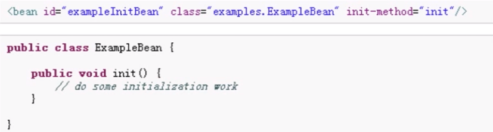
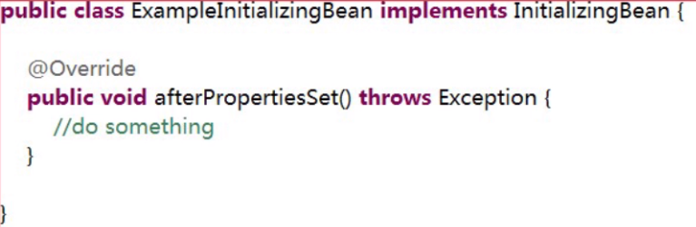
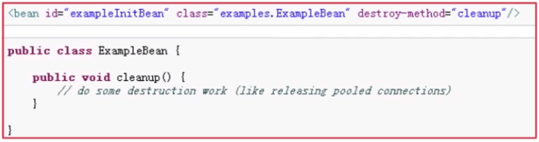
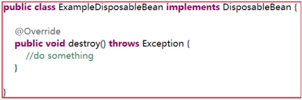

# 1.Bean的作用域
Bean的作用域是指Spring框架管理Bean的方式。<br>

## 1.1.Bean作用域介绍
- 1.singleton:单例，每次请求返回同一个实例
- 2.prototype:每次请求创建重新new一个新的实例
- 3.request:每次http请求创建一个实例，并只在该http请求生命周期中的request有效
- 4.session:同上，只在session中有效
- 5.globle session:基于portlet的web有效(portlet定义了 globle session)

## 1.2.Bean作用域的设置方法
```xml
<bean id="injectionDao" class="com.noble.dao.InjectionDaoImpl" scope="singleton"></bean>
```

# 2.Bean的生命周期
- 1.定义
- 2.初始化
- 3.使用
- 4.销毁

我们能够覆盖初始化和销毁的方法。<br>

## 2.1.覆盖初始化方法
有两种方式覆盖初始化方法：<br>
- 1.xml文件配置
- 2.实现``org.springframework.beans.factory.InitializingBean``接口，覆盖``afterPropertiesSet``方法

### 2.1.1.xml文件配置
<br>
```xml
<bean id="exampleInitBean" class="examples.ExampleBean" init-method="init">
```
```java
public class ExampleBean{
    public void init() {
        // TODO: some initialization work
    }
}
```

### 2.1.2.实现接口方法
<br>
```java
public class ExampleInitializingBean implements InitializingBean {
    @Override
    public void afterPropertiesSet() throws Exception {
        // TODO: some initialization work
    }
}
```

## 2.2.覆盖销毁方法
有两种方式覆盖销毁方法：<br>
- 1.xml文件配置
- 2.实现``org.springframework.beans.factory.DisposableBean``接口，覆盖``afterPropertiesSet``方法

### 2.2.1.xml文件配置
<br>
```xml
<bean id="exampleInitBean" class="examples.ExampleBean" destroy-method="cleanup">
```
```java
public class ExampleBean{
    public void cleanup() {
        // TODO: some destruction work
    }
}
```

### 2.1.2.实现接口方法
<br>
```java
public class ExampleDisposableBean implements DisposableBean {
    @Override
    public void destroy() throws Exception{
        // TODO: something
    }
}

```