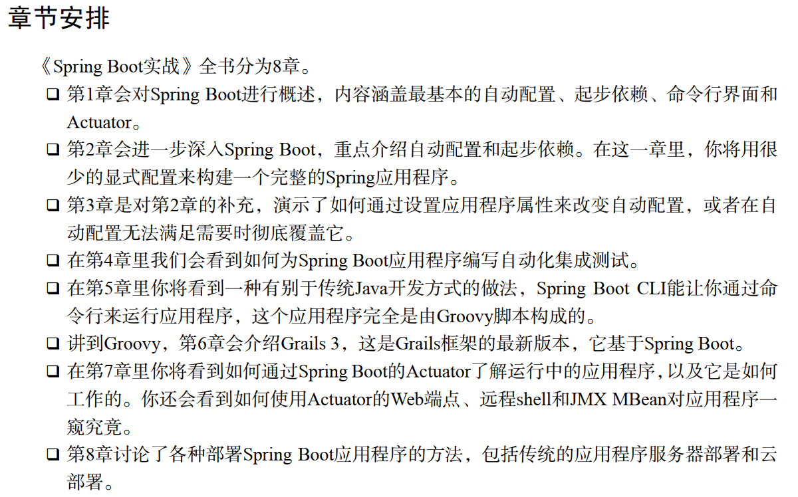

# Spring boot

## 1.Spring boot的出现是为了解决什么问题
Spring boot即微服务，主要特点就是方便项目的搭建。 
Spring 的配置和依赖管理都是重量级的，spring boot 就为简化它们而生的。 

## 2.spring boot 四大特征工具

### 2.1.起步依赖（ starter dependency）
spring 选择在构建时和运行时要包含在应用程序里的库，往往要花费不少工夫 
Spring Boot的起步依赖（ starter dependency）将常用依赖聚合在一起，借此简化一切。它不仅简化了你的构建说明，还让你不必苦思冥想特定库和版本。 

### 2.2.Groovy
Spring Boot的命令行界面提供了一个令人瞩目的选项，它将Java应用程序开发过程中的噪声降到最低，开发方式平易近人。有了Spring Boot CLI，就不再需要访问方法了，不再需要诸如public与private之类的访问修饰符，也不再需要分号或者return关键字。在许多场景中， import语句都可以去掉。因为你是在命令行里以脚本方式运行应用程序，所以连构建说明都能免了。 

### 2.3.Actuator
Spring Boot的Actuator让你能一窥应用程序运行时的内部工作细节，看看Spring应用程序上下文里都有哪些Bean， Spring MVC控制器是怎么与路径映射的，应用程序都能取到哪些配置属性，诸如此类。 

## 3.学习方法
根据Springboot 实战书籍学习： 
 
- 1.跟踪式学习1，2，3章
- 2.第4章先忽略
- 3.第5章和第6章根据情况而定
