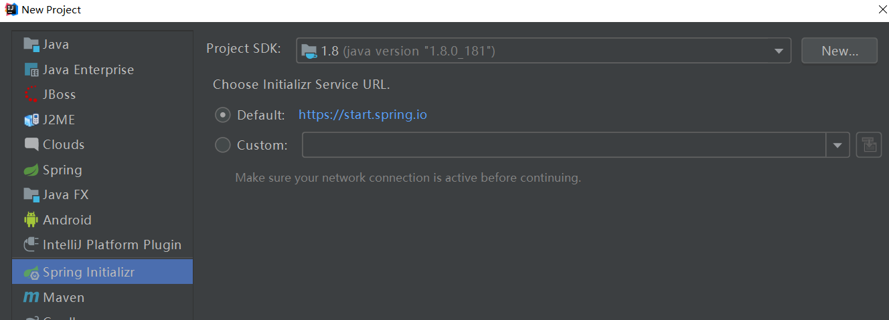
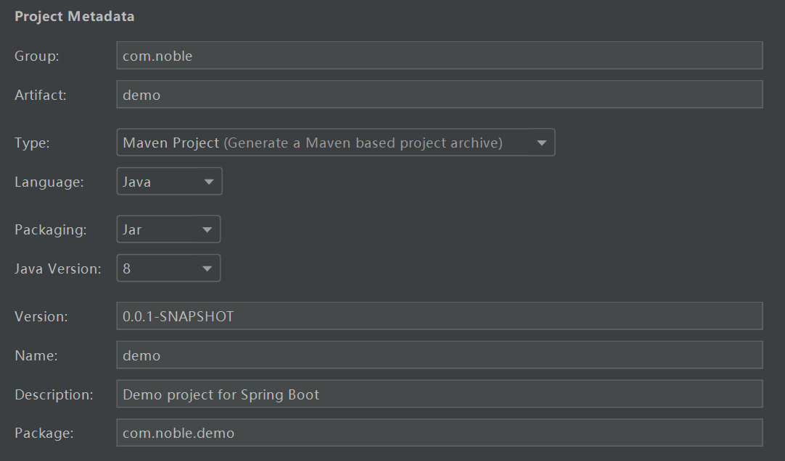
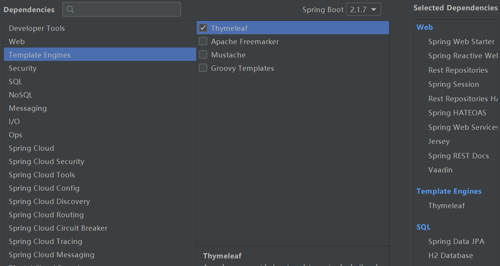

# Spring boot入门

## 1.安装Spring Boot CLI
SpringBootCLI是springBoot项目的一个搭建工具，可以快速搭建SpringBoot项目。<br>

### 1.手工安装
```
https://repo.spring.io/release/org/springframework/boot/spring-boot-cli/2.1.7.RELEASE/spring-boot-cli-2.1.7.RELEASE-bin.zip
https://repo.spring.io/release/org/springframework/boot/spring-boot-cli/2.1.7.RELEASE/spring-boot-cli-2.1.7.RELEASE-bin.tar.gz
```

### 2.包管理工具安装
使用brew

## 2.通过CLI构建一个boot Project
使用Spring Initializ：<br>
<br>

随便填写：<br>
<br>

这里确定勾选需要使用的依赖：<br>
<br>