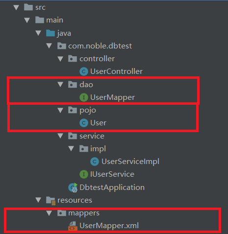

# spring_boot 第一个程序

## 1.整合MyBatis
借鉴文章
[https://programmer.help/blogs/5c5c0b8945cd9.html](https://programmer.help/blogs/5c5c0b8945cd9.html)<br>
MyBatis的配置文件由boot自动生成，但我们依旧需要告诉boot数据库的dbcp：<br>
在``application.properties``中配置:<br>
```
spring.database.driverClassName=com.mysql.cj.jdbc.Driver
spring.datasource.url=jdbc:mysql://10.0.0.3:3306/user?characterEncoding=utf-8
spring.datasource.username=root
spring.datasource.password=123456
```

### 1.1.使用mapper.xml
如果我们需要使用mapper.xml文件作为sql实现工具，还需要其他配置：<br>
<br>

#### 1.1.1.在``application.properties``添加如下配置
告诉spring-boot我们的mapper.xml和pojo在什么地方。<br>
```
mybatis.typeAliasesPackage=com.noble.dbtest.pojo
mybatis.mapperLocations=classpath*:/mappers/*Mapper.xml
```

#### 1.1.2.配置startup class Application.java
```java
@SpringBootApplication
@MapperScan("com.noble.dbtest.dao") //扫描mapper接口dao
public class DbtestApplication {
    public static void main(String[] args) {
        SpringApplication.run(DbtestApplication.class, args);
    }
}
```

#### 1.1.3.确保我们的mappers.xml和pom.xml文件配置ok
- 1.mapper.xml都存在
- 2.pom.xml中引用了mybatis.boot

### 1.2.Transaction-mybatis
理解spring-boot-mybatis的事务原理，下面的文章很棒。<br>
[https://dzone.com/articles/spring-transaction-management](https://dzone.com/articles/spring-transaction-management)<br>
[http://blog.timmattison.com/archives/2012/04/19/tips-for-debugging-springs-transactional-annotation/](http://blog.timmattison.com/archives/2012/04/19/tips-for-debugging-springs-transactional-annotation/)<br>

## 2.整合Logger
文档[https://www.mkyong.com/spring-boot/spring-boot-slf4j-logging-example/](https://www.mkyong.com/spring-boot/spring-boot-slf4j-logging-example/)<br>

### 2.1.配置application.properties
```sh
# logging level
logging.level.org.springframework=ERROR
logging.level.com.mkyong=DEBUG

# output to a file
logging.file=app.log

# temp folder example
#logging.file=${java.io.tmpdir}/app.log

logging.pattern.file=%d %p %c{1.} [%t] %m%n

logging.pattern.console=%d{HH:mm:ss.SSS} [%t] %-5level %logger{36} - %msg%n

## if no active profile, default is 'default'
##spring.profiles.active=prod

# root level
#logging.level.=INFO
```

### 2.2.设置复杂的logger规则
如果我们要设置复杂的logger规则，还是需要配置xml文件的。<br>

#### 2.2.1.step one
编辑``application.properties`` 说明我们配置了xml文件<br>
```sh
#application.properties
## if no active profile, default is 'default'
spring.profiles.active=prod
```

#### 2.2.2.create logback-spring.xml
在classpath(和``application.properties``同目录)<br>

```xml
<?xml version="1.0" encoding="UTF-8"?>
<configuration>
    <include resource="org/springframework/boot/logging/logback/defaults.xml" />

    <springProfile name="default">
        <include resource="org/springframework/boot/logging/logback/console-appender.xml"/>

        <root level="INFO">
            <appender-ref ref="CONSOLE"/>
        </root>
    </springProfile>

    <springProfile name="prod">
        <appender name="CONSOLE" class="ch.qos.logback.core.ConsoleAppender">
            <encoder>
                <pattern>[%d{HH:mm:ss.SSS}][%p][%c{40}][%t] %m%n</pattern>
            </encoder>
            <filter class="ch.qos.logback.classic.filter.ThresholdFilter">
                <level>DEBUG</level>
            </filter>
        </appender>

        <appender name="FILE-ROLLING" class="ch.qos.logback.core.rolling.RollingFileAppender">
            <file>app.log</file>

            <rollingPolicy class="ch.qos.logback.core.rolling.SizeAndTimeBasedRollingPolicy">
                <fileNamePattern>E:\tools\idea\workdir\votesys\log\app.%d{yyyy-MM-dd}.%i.log</fileNamePattern>
                <!-- each archived file, size max 10MB -->
                <maxFileSize>10MB</maxFileSize>
                <!-- total size of all archive files, if total size > 20GB, it will delete old archived file -->
                <totalSizeCap>20GB</totalSizeCap>
                <!-- 60 days to keep -->
                <maxHistory>60</maxHistory>
            </rollingPolicy>

            <encoder>
                <pattern>[%d{HH:mm:ss.SSS}][%p][%c{40}][%t] %m%n</pattern>
            </encoder>
        </appender>

        <logger name="org.springframework" level="INFO"/>
        <logger name="com.noble.votesys.dao" level="DEBUG"/>
        <root level="ERROR">
            <appender-ref ref="FILE-ROLLING"/>
            <appender-ref ref="CONSOLE"/>
        </root>
    </springProfile>

</configuration>
```