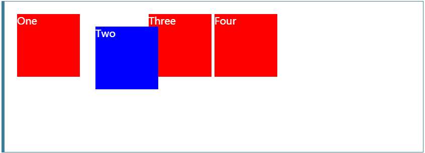

# CSS样式积累

## 1.position

下面的网址有对``position``做详细的讲解：

[https://developer.mozilla.org/en-US/docs/Web/CSS/position](https://developer.mozilla.org/en-US/docs/Web/CSS/position)

position可以帮助我们对block元素做特别的位置处理，常用的value包括``relative``,``absolute``,``fixed``默认值是``static``。

### 1.1.relative

relative是让block元素相对于他本身原来的位置做偏移。通过``top``,``left``,``right``参数控制。

网站原实例：

```html
<div class="box" id="one">One</div>
<div class="box" id="two">Two</div>
<div class="box" id="three">Three</div>
<div class="box" id="four">Four</div>
```

```css
.box {
  display: inline-block;
  width: 100px;
  height: 100px;
  background: red;
  color: white;
}

#two {
  position: relative;
  top: 20px;
  left: 20px;
  background: blue;
}
```




### 1.2.absolute和fixed

这两个参数都是让block元素脱离当前文本流。区别点在他们固定元素位置的方式不同。

- 1.absolute使block元素假设其他文本流不存在
- 2.fixed通过``top``,``left``,``right``和``margin``设置block元素相对于浏览器窗口的位置。并且不随滚动轴移动。

**关于fixed示例：**

我想要card元素页面居中(对有宽高的盒子页面居中设置left,right,top,bottom为0是常见的作法)：

```css
.card {
  width: 350px;
  height: 250px;
  position: fixed;
  margin: auto;
  left: 0;
  right: 0;
  top: 0;
  bottom: 0;
}
```

**关于absolute示例：**

对不确定宽高的元素浏览器居中。