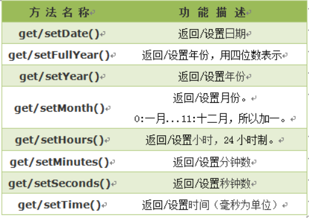
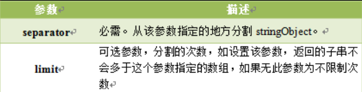
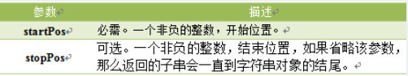
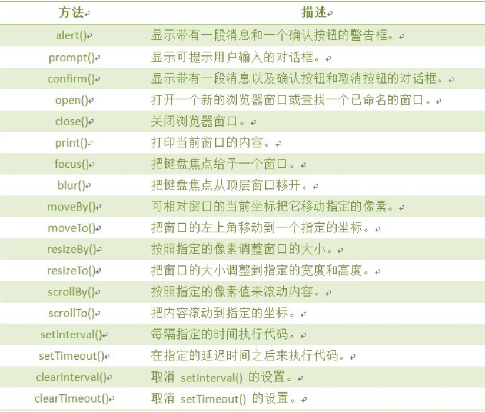

# JavaScript对象使用
JavaScript 中的所有事物都是对象，如:字符串、数值、数组、函数等，每个对象带有属性和方法。<br>

## 1.日期对象 Date
日期对象可以储存任意一个日期，并且可以精确到毫秒数（1/1000 秒）。<br>

### 1.1.定义Date
```
var date = new Date();
```
date 成为日期对象，并且已有初始值：当前时间(当前电脑系统时间)。<br>

### 1.2.Date的set/get方法
<br>

## 2.字符串对象
```js
var str = "helloworld";
stringObject.length   //返回字符串的长度
stringObject.toUpperCase(); //将字符串转成大写,并返回
stringObject.charAt(index);   //返回指定位置的字符
stringObject.indexOf(substring, startpos);//indexOf() 方法可返回某个指定的字符串值在字符串中首次出现的位置。
```

### 2.1.split()
```js
stringObject.split(separator,limit);
```
<br>
```js
var mystr = "www.imooc.com";
document.write(mystr.split(".")+"<br>");
document.write(mystr.split(".", 2)+"<br>");
```

### 2.2.substring()
substring() 方法用于提取字符串中介于两个指定下标之间的字符。<br>
```js
stringObject.substring(startPos,stopPos);
```
<br>

## 3.window对象
window对象是BOM的核心，window对象指当前的浏览器窗口。<br>

方法函数:<br>
<br>