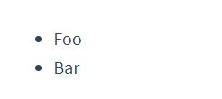
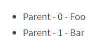

# class绑定,条件渲染,列表渲染

## 1.class绑定
操作元素的 class 列表和内联样式是数据绑定的一个常见需求。<br>
实例:<br>
```html
<div v-bind:class="classObject"></div>
```

```js
data: {
  isActive: true,
  error: null
},
computed: {
  classObject: function () {
    //返回值不是一个字符串,而是一种数据结构
    return {
      active: this.isActive && !this.error,
      'text-danger': this.error && this.error.type === 'fatal'
    }
  }
}
```

## 2.条件渲染
### 2.1.v-if
``v-if`` 指令用于条件性地渲染一块内容。这块内容只会在指令的表达式返回 ``truthy`` 值的时候被渲染。<br>
```html
<h1 v-if="awesome">Vue is awesome!</h1>
```
### 2.2.v-else
也可以用 v-else 添加一个“else 块”：<br>
```js
<h1 v-if="awesome">Vue is awesome!</h1>
<h1 v-else>Oh no 😢</h1>
```


``v-else`` 元素必须紧跟在带 ``v-if`` 或者 ``v-else-if`` 的元素的后面，否则它将不会被识别。<br>
### 2.3.v-else-if
``v-else-if``，顾名思义，充当 ``v-if`` 的``“else-if 块”``，可以连续使用：<br>

```html
<div v-if="type === 'A'">
  A
</div>
<div v-else-if="type === 'B'">
  B
</div>
<div v-else-if="type === 'C'">
  C
</div>
<div v-else>
  Not A/B/C
</div>
```

### 2.1.在 ``<template>`` 元素上使用 v-if 条件渲染分组
因为 ``v-if`` 是一个指令，所以必须将它添加到一个元素上。但是如果想切换多个元素呢？此时可以把一个 ``<template>`` 元素当做不可见的包裹元素，并在上面使用 ``v-if``。最终的渲染结果将不包含 ``<template>`` 元素。<br>
```html
<template v-if="ok">
  <h1>Title</h1>
  <p>Paragraph 1</p>
  <p>Paragraph 2</p>
</template>
```

## 3.列表渲染
我们可以用 ``v-for`` 指令基于一个数组来渲染一个列表。``v-for`` 指令需要使用 ``item in items`` 形式的特殊语法，其中 ``items`` 是源数据数组，而 ``item`` 则是被迭代的数组元素的**别名**。<br>
```html
<ul id="example-1">
  <li v-for="item in items">
    {{ item.message }}
  </li>
</ul>
```

```js
var example1 = new Vue({
  el: '#example-1',
  data: {
    items: [
      { message: 'Foo' },
      { message: 'Bar' }
    ]
  }
})
```
结果：<br>
<br>

``v-for``可以访问当前索引:<br>
```html
<ul id="example-2">
  <li v-for="(item, index) in items">
    {{ parentMessage }} - {{ index }} - {{ item.message }}
  </li>
</ul>
```
```js
var example2 = new Vue({
  el: '#example-2',
  data: {
    parentMessage: 'Parent',
    items: [
      { message: 'Foo' },
      { message: 'Bar' }
    ]
  }
})
```
结果:<br>
<br>