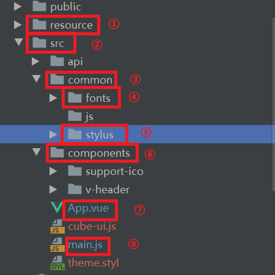
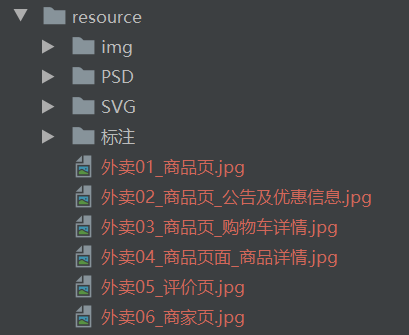
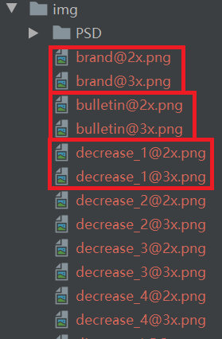

# 开发项目目录

## 1.实例图如下
 

## 2.①resource
resource存放资源文件。如下图主要是图片资源。 
 

关于资源图片还有一个概念需要说明： 
设备像素比，观察下图可以发现每个资源文件都有2种或以上。 
 
[设备像素比的相关概念可以看这篇文章](https://www.zhangxinxu.com/wordpress/2012/08/window-devicepixelratio/) 

## 3.②SRC目录
src目录是存放源码的目录。 

### 3.1.fonts
fonts目录存放了从icomoom下载的字符文件。 

### 3.2.stylus
stylus是代替css语法的一种格式。方便快速开发css样式。 
