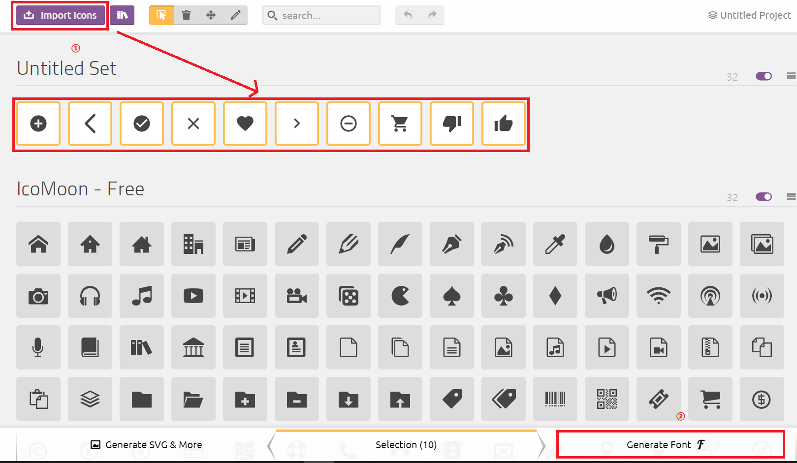
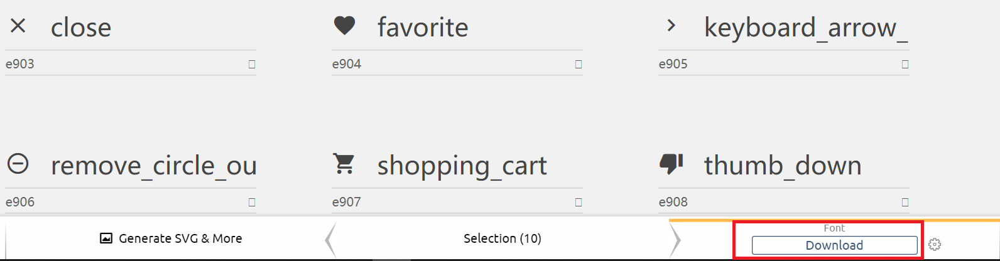

# 图标字体制作
使用工具[https://icomoon.io/](https://icomoon.io/) 
该工具的功能是： 
将原本的svg图标转换成CSS格式，我们可以在``html``文件中通过引入一个````标签来使用这些图标。 

## 1.icomoon使用
我们可以使用``icomoon``网站上自带的免费图标，也可以上传``UI设计师``给我们的``svg``动态图标。 
上传方式如下图： 
 

让后再把转换成图标字体的文件下载下来： 
 