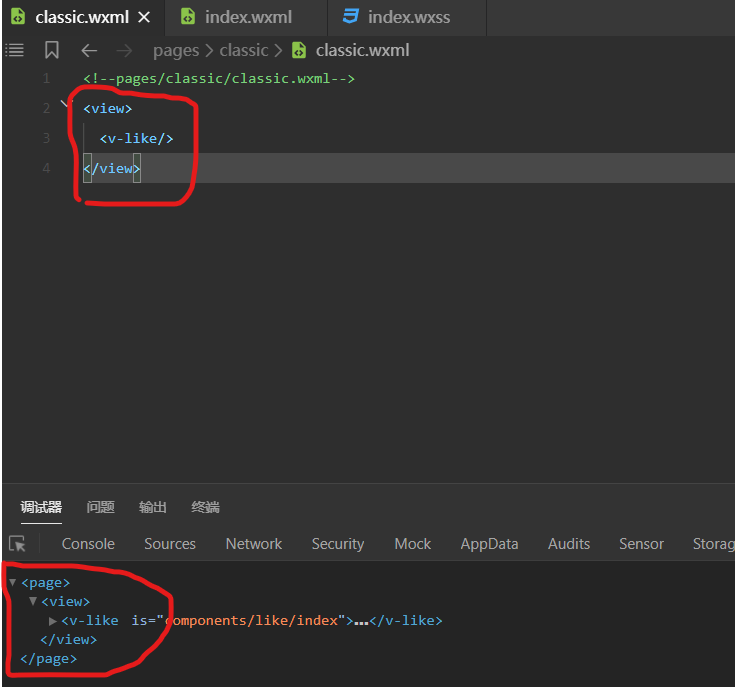

# 小程序细则

## 1.小程序尺寸单位与设计原则

当设计师以iphone6为模板设计页面时：

- 1.宽750px高1334px

当以上为设计原稿时，像素在小程序的换算单位是除以二。也就是说如果一个图片的大小是20px，则在小程序中他的大小是10px。

如果要换算成rpx单位，在iphone6上是1：1关系。

#### 1.1.rpx单位

rpx是自适应的像素单位，依据用户的手机屏幕大小，rpx会让图片大小放大或缩小。

- 1.关于border边框 和 字体大小是否要用rpx要认真考虑

## 2.page样式的巧妙应用

我们观察下图：

任何一个页面都会在外部包裹一个page元素。所以我们可以在page元素上加一些全局样式。

关于全局page样式有几个结论：

- 1.app.wxss文件的样式可以被page继承
- 2.app.wxss配置的样式，只有极少数会被组件继承(组件本身就需要封闭的环境，这点符合)
  - 2.1.字体样式可以被组件继承

## 3.消除无意义的空白

组件开发要消除无意义的留白，这些留白会影响我们外部使用组件时的排布。