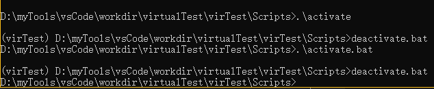

# python简介

## 1.python语言的特性
- 1.python语言是解释性语言(边解释边执行)
- 2.python语言支持过程编程，面向对象编程和函数式编程
- 3.python语言最重要的设计理念是追求高度的可读性

## 2.python语言的其他特性
python语言与C/C++和Java相比，主要具有以下特征：<br>
- 1.没有数据类型概念(在一般的编程过程中会很方便，不用我们去维护数据类型，但在面向一些底层的操作时，python可能需要一些特殊的处理，可能会很麻烦)
- 2.python有成千上万的第三方库，和C++，java一样有命名冲突的问题，但因为第三方库没有办法中心化管理，所以pyhthon使用了特殊的管理方法，就是虚拟化环境(virtualenv)

## 3.virtualenv
virtualenv是一个第三方包，是管理虚拟环境的常用方法之一。此外，Python 3 中还自带了虚拟环境管理包。<br>
我们可以使用``pip install virtualenv``来安装<br>

### 1.创建项目的虚拟环境
```shell
$ cd my_project_folder
$ virtualenv venv  # venv 可替换成别的虚拟环境的名称
```
执行和，在本地会创建一个与虚拟环境同名的文件夹，包含Python可执行文件和pip库的拷贝，可用于安装其他包。<br>

但是默认情况下，虚拟环境不会包含也无法使用系统环境的``global site-packages``。如果想使用系统环境的第三方软件包，可以在创建虚拟环境时使用参数``-system-site-packages``。<br>
```shell
virtualenv -system-site-packages venv
```

另外，我们也可以自己指定虚拟环境所使用的Python版本，但前提是系统中已经安装了该版本：<br>
```shell
virtualenv -p /usr/bin/python2.7 venv
```

### 2.使用虚拟环境
进入虚拟环境目录，启动虚拟环境。<br>
```python
cd venv
source bin/activate # Windows 系统下运行 Scropts\
python -V
```

如果未对命令进行个性化，此时命令行前面应该会多出来一个括号，括号里为虚拟环境的名称。启动虚拟环境后安装的所有模块都会安装到该虚拟环境目录里。<br>

### 3.退出虚拟环境
```
deactivate
```
退出如下图：<br>
<br>
如果醒目开发完成后想删除虚拟环境，直接删除虚拟环境的目录即可。<br>