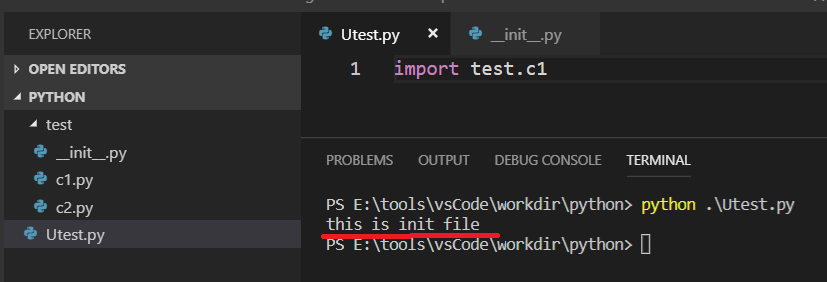

# python包与模块
<br>
在实际的资源管理器中:<br>
- 1.包为文件夹(该文件夹下必须有__init__.py文件)
- 2.模块为一个文件
- 3.类在文件中(一个文件可以包含多个类,类与文件名可以不同)

## 1.包的引入
python中使用``import``关键字引入其他包:<br>
- 1.python包不会重复导入
- 2.避免循环导入包

```python
# 引入一个模块
import package.model as pm
# 引入一个变量或函数
from package.model import variable
# 引入所有变量函数 (收__all__的限制)
from package import *
```

### 1.1.相对导入包与绝对导入包
```python
# 引入同级目录包下的模块 (import 后面不能接 .不存在: import .package)
from .package1 import model1

# 引入上级目录包下的模块(三个. 表示再上一级目录)
from ..package1 import model1
```

### 1.2.__init__.py文件
当我们导入一个包时,会自动执行该包下的``__init__.py``文件(导入包或包下的文件都会执行):<br>
<br>

#### 1.2.1.通过Init文件限制成员导入
在``__init__.py``文件中加入如下代码:<br>
```python
# 内置变量 __all__ 指向一个列表,列表元素是字符串 'c1'
__all__ = ["c1"]
```
当包的``__init__.py``文件中有上述代码时,我们在导入该包时,只能导入``c1``

#### 1.2.2.init文件批量导入包
在一个包下的很多模块可能都会用到一些常用包,如下:<br>
```python
import sys
import io
import datetime
```
我们为避免将上面的代码在每一个模块中都写一遍,可以将上面的代码放在``__init__.py``文件中,并在各个模块中导入本包名即可.<br>
```python
import package
```

## 2.模块内置变量
使用以下内置函数,可以返回当前模块的所有变量:<br>
```python
dir()
```

### 2.1.内置变量如下
```python
__annotations__
__builtins__      # 内置函数在这里面
__cached__        # 获取导入文件的缓存路径
__doc__           # 文档注释(''' 中的内容 ''')
__file__          # 文件名(资源管理器中的值)
__loader__
__name__          # 文件全名(包含包名,入口文件显示 __main__)
__package__       # 文件包名
__spec__
```

#### 2.1.1.内置变量常用用法__name__
```python
if __name__ == '__main__':
    # Todo: sentences
```