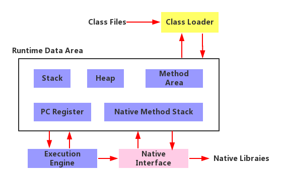

# 1.jvm如何加载class

## 1.jvm介绍
JVM就是java虚拟机,存在的目的就是屏蔽底层操作系统,让java字节码可以在任意平台运行.<br>
JVM本身就是一个虚拟机,有自己的:
- 1.处理器
- 2.指令系统
- 3.堆栈
- 4.寄存器

JVM屏蔽了底层操作系统的特征,java代码只需要生成能在JVM上运行的目标字节码,就可以不加修改在多种平台上运行.<br>
<br>
- 1.Class Loader:依据特定格式 加载class文件到内存
- 2.Execution Engine:对命令进行解析
- 3.Native Interface:融合不同开发语言原生库为java所用
- 4.Runtime Data Area:JVM内存空间模型

## 2.反射
实例:<br>
被反射的类:<br>
```java
package com.noble.test;

public class Text {
    private String name;
    public void sayHi(String content){
        System.out.println(content+" "+this.name);
    }
    private String outName(){
        return "hello "+name;
    }
}
```
反射方法:<br>
```java
package com.noble.objc;

import com.noble.test.Text;

import java.lang.reflect.Field;
import java.lang.reflect.InvocationTargetException;
import java.lang.reflect.Method;

public class Instant {
    public static void main(String[] args) throws ClassNotFoundException, IllegalAccessException, InstantiationException, NoSuchMethodException, InvocationTargetException, NoSuchFieldException {
        Class tc = Class.forName("com.noble.test.Text");
        Text text = (Text)tc.newInstance();

        Field field = tc.getDeclaredField("name");
        field.setAccessible(true);
        field.set(text,"noble");

        Method methodSayHi = tc.getMethod("sayHi", String.class);
        methodSayHi.invoke(text,"hello");

        Method methodOutName = tc.getDeclaredMethod("outName");
        methodOutName.setAccessible(true);
        System.out.println(methodOutName.invoke(text));
    }
}
```

#### 类从编译到执行的过程
- 1.编译器将Text.java编译为Text.class字节码文件
- 2.ClassLoader将字节码文件转换为JVM中的class<Text>类
- 3.JVM利用class<Text>类实例化Text对象

## 3.classLoader
- 1.ClassLoader是java的核心组件
- 2.主要工作在class装载阶段,从系统外部获取class二进制数据流
- 3.所有的class都由ClassLoader加载,再交给java虚拟机进行连接和初始化操作

### 3.1.classLoader的种类
- 1.BootStrapClassLoader: C++编写,加载核心库java.*
- 2.ExtClassLoader: java编写,加载扩展库javax.*
- 3.AppClassLoader: java编写,加载程序所在目录
- 4.自定义ClassLoader: java编写,定制化加载