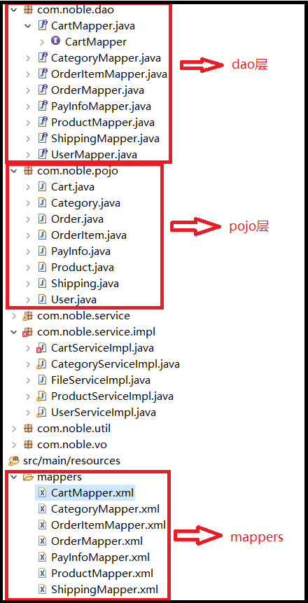
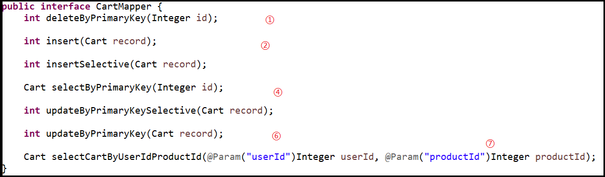

# Mybatis一般使用
当使用Mybatis的插件-Generator自动生成dao层和pojo层mapper和对应的xml实现,如下:<br>
<br>
补充说明:一张数据库表对应一个pojo类一个dao类和一个mapper.xml文件<br>

## 1.Mapper接口介绍
<br>
在Mapper接口中定义,这些接口的实习都是需要执行SQL语句的,Mybatis将他们分装成接口,对上层业务隐藏了sql和数据库底层<br>

接口定义好了,他们的实现写在mappers的xml文件中,里面是类sql语言<br>

## 2.mappers中的xml文件介绍
mappers目录中的文件同样是mybatis插件自动生成的<br>
看一个实例(关注注释内容):<br>
```xml
<?xml version="1.0" encoding="UTF-8" ?>
<!DOCTYPE mapper PUBLIC "-//mybatis.org//DTD Mapper 3.0//EN" "http://mybatis.org/dtd/mybatis-3-mapper.dtd" >
<mapper namespace="com.noble.dao.CartMapper">
    <!-- resultMap 数据库中的一张表对应为java类中的'com.noble.pojo.Cart',如type的值.在当前文件中,如果sql查询的结果是Cart这个类,就用id的值'BaseResultMap'表示 -->
	<resultMap id="BaseResultMap" type="com.noble.pojo.Cart">
		<constructor>
			<idArg column="id" jdbcType="INTEGER"
				javaType="java.lang.Integer" />
			<arg column="user_id" jdbcType="INTEGER"
				javaType="java.lang.Integer" />
			<arg column="product_id" jdbcType="INTEGER"
				javaType="java.lang.Integer" />
			<arg column="quantity" jdbcType="INTEGER"
				javaType="java.lang.Integer" />
			<arg column="checked" jdbcType="INTEGER"
				javaType="java.lang.Integer" />
			<arg column="create_time" jdbcType="TIMESTAMP"
				javaType="java.util.Date" />
			<arg column="update_time" jdbcType="TIMESTAMP"
				javaType="java.util.Date" />
		</constructor>
	</resultMap>
    <!--使用id值为'Base_Column_List'表示数据表的所有表项,仅仅为了方便,提高重用性 -->
	<sql id="Base_Column_List">
		id, user_id, product_id, quantity, checked, create_time,
		update_time
	</sql>
    <!-- 下面是一条select查询语句,使用id 绑定mapper类中的selectByPrimaryKey方法接口,resultMap="BaseResultMap"表示返回值是Cart类,如上所述.parameterType表示传入的参数,处理写完整的类名也可以直接写'int' -->
	<select id="selectByPrimaryKey" resultMap="BaseResultMap"
		parameterType="java.lang.Integer">
		select
        <!--使用了Base_Column_List,如上所述 -->
		<include refid="Base_Column_List" />
		from mmall_cart
		where id = #{id,jdbcType=INTEGER}
	</select>
    <!-- 一条delete语句,与CartMapper类的deleteByPrimaryKey方法接口绑定 -->
	<delete id="deleteByPrimaryKey"
		parameterType="java.lang.Integer">
		delete from mmall_cart
		where id = #{id,jdbcType=INTEGER}
	</delete>
    <!--insert语句,实现了CartMapper类的insert接口 -->
	<insert id="insert" parameterType="com.noble.pojo.Cart">
		insert into mmall_cart (id,
		user_id, product_id,
		quantity, checked, create_time,
		update_time)
		values
		(#{id,jdbcType=INTEGER}, #{userId,jdbcType=INTEGER},
		#{productId,jdbcType=INTEGER},
		#{quantity,jdbcType=INTEGER},
		#{checked,jdbcType=INTEGER}, now(),
		now())
	</insert>
    <!--一条insert语句,实现了CartMapper类的insertSelective接口方法,和上面insert语句不同的是如果Cart类的成员变量有null,不会报错,会添加默认值 -->
	<insert id="insertSelective" parameterType="com.noble.pojo.Cart">
		insert into mmall_cart
		<trim prefix="(" suffix=")" suffixOverrides=",">
			<if test="id != null">
				id,
			</if>
			<if test="userId != null">
				user_id,
			</if>
			<if test="productId != null">
				product_id,
			</if>
			<if test="quantity != null">
				quantity,
			</if>
			<if test="checked != null">
				checked,
			</if>
			<if test="createTime != null">
				create_time,
			</if>
			<if test="updateTime != null">
				update_time,
			</if>
		</trim>
		<trim prefix="values (" suffix=")" suffixOverrides=",">
			<if test="id != null">
				#{id,jdbcType=INTEGER},
			</if>
			<if test="userId != null">
				#{userId,jdbcType=INTEGER},
			</if>
			<if test="productId != null">
				#{productId,jdbcType=INTEGER},
			</if>
			<if test="quantity != null">
				#{quantity,jdbcType=INTEGER},
			</if>
			<if test="checked != null">
				#{checked,jdbcType=INTEGER},
			</if>
			<if test="createTime != null">
				now(),
			</if>
			<if test="updateTime != null">
				now(),
			</if>
		</trim>
	</insert>
    <!--一条ubdate语句,实现了CartMapper类的updateByPrimaryKeySelective接口方法,和下面update语句不同的是如果Cart类的成员变量有null,不会报错,会保留原内容 -->
	<update id="updateByPrimaryKeySelective"
		parameterType="com.noble.pojo.Cart">
		update mmall_cart
		<set>
			<if test="userId != null">
				user_id = #{userId,jdbcType=INTEGER},
			</if>
			<if test="productId != null">
				product_id = #{productId,jdbcType=INTEGER},
			</if>
			<if test="quantity != null">
				quantity = #{quantity,jdbcType=INTEGER},
			</if>
			<if test="checked != null">
				checked = #{checked,jdbcType=INTEGER},
			</if>
			<if test="createTime != null">
				create_time = #{createTime,jdbcType=TIMESTAMP},
			</if>
			<if test="updateTime != null">
				update_time = now(),
			</if>
		</set>
		where id = #{id,jdbcType=INTEGER}
	</update>
    <!--一条update语句 -->
	<update id="updateByPrimaryKey"
		parameterType="com.noble.pojo.Cart">
		update mmall_cart
		set user_id =
		#{userId,jdbcType=INTEGER},
		product_id = #{productId,jdbcType=INTEGER},
		quantity = #{quantity,jdbcType=INTEGER},
		checked =
		#{checked,jdbcType=INTEGER},
		create_time =
		#{createTime,jdbcType=TIMESTAMP},
		update_time = now()
		where id =
		#{id,jdbcType=INTEGER}
	</update>
    <!--我自定义的select语句,实现了我们自定义的selectCartByUserIdProductId接口方法.因为有多个参数,所有参赛列表使用了'map' -->
	<select id="selectCartByUserIdProductId"
		resultMap="BaseResultMap" parameterType="map">
		select
		<include refid="Base_Column_List" />
		from mmall_cart
		where user_id = #{userId}
		and product_id = #{productId}
	</select>
</mapper>
```

## 3.mappers.xml文件中重要sql语句写法技巧
### 3.1.where语句
有这样的需求:<br>
需要查询一些数据,有两个查询条件,如果两个查询条件都不为空,就使用and将两个查询条件都放在where语句段中.如果其中一个查询条件为空,就仅仅使用另一个查询条件.<br>
遇到的问题是,我们自己拼接sql语句,当其中一个查询条件为空时,可能出现where字段和and存放在一起,构成语法错误.这种时候使用``<where>``标签代替where关键字就很合适,如下:<br>
```xml
<select id="selectByNameAndProductId" resultMap="BaseResultMap"
    parameterType="map">
    SELECT
    <include refid="Base_Column_List" />
    from mmall_product
    <where>
        <!--if语句为真时,mybatis会自动删除第一个and -->
        <if test="productName != null">
            and name like #{productName}
        </if>
        <if test="productId != null">
            and id = #{productId}
        </if>
    </where>
</select>
```

### 3.2.foreach使用

```xml
<select id="selectByNameAndCategoryIds"
    resultMap="BaseResultMap" parameterType="map">
    select
    <include refid="Base_Column_List" />
    from mmall_product
    where status = 1
    <if test="productName != null">
        and name like #{productName}
    </if>
    <if test="categoryIdList != null">
        and category_id in
        <!--categoryIdList是我们传入的参数List类型,使用foreach将该参数拼接成 sql可以识别的结构'() ,'的形式 -->
        <foreach item="item" index="index" open="(" separator=","
            close=")" collection="categoryIdList">
            <!--item不是我们自己传入的参数 -->
            #{item}
        </foreach>
    </if>
</select>
```

### 3.3.查询结果为null时
如果我们接受返回结果是``int``,如下:<br>
```java
int getCartProductCont(@Param("userId") Integer userId);
```
但查询结果可能是``null``,如下:<br>
```xml
<select id="getCartProductCont" parameterType="int" resultType="int">
	select IFNULL(sum(quantity),0) from mmall_cart
	where user_id = #{userId}
</select>
```
上面的sql当userId不存在时返回``null``,为了不让程序出错,我们使用``IFNULL``关键字处理<br>

## 4.其他对mappers.xml文件的常用操作
考虑如下需求:<br>
业务对数据库执行完sql后,想拿到执行sql后的数据.比如:插入一条数据,前端想要得到mysql表的自增ID是多少(注释部分):<br>
```xml
<!-- 加入两个属性,useGeneratedKeys="true" keyProperty="目标列名"-->
<insert id="insert" parameterType="com.noble.pojo.Shipping" useGeneratedKeys="true" keyProperty="id">
	insert into mmall_shipping (id, user_id, receiver_name,
	...
	#{receiverZip,jdbcType=VARCHAR}, now(), now()
	)
</insert>
```