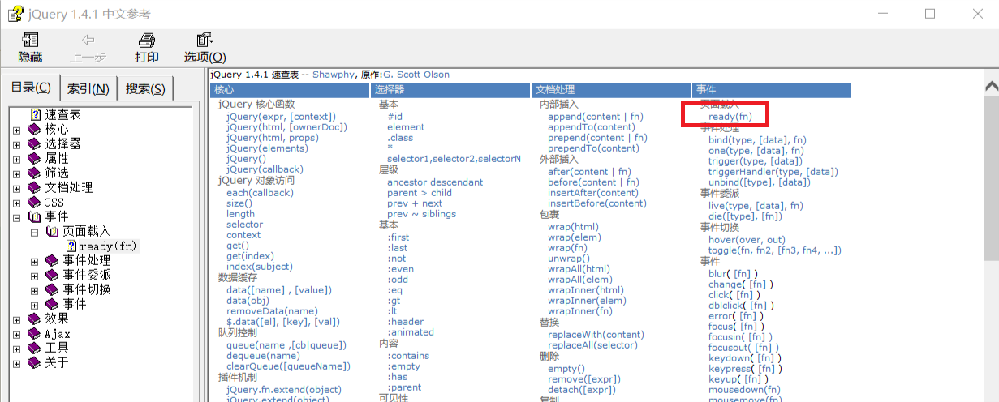

# 显示和隐藏广告
```html
<!DOCTYPE html>
<html>
	<head>
		<meta charset="utf-8" />
		<title></title>
		<script type="text/javascript" src="js/jquery-1.11.3.min.js"></script>
	</head>
	<body>
		
	</body>
	<script>
		function hideAD(){
			$("#img1").slideUp();
		};
		
		function showAD(){
			$("#img1").slideDown();
			setTimeout("hideAD()",3000);
		};
		
		$(function(){
			setTimeout("showAD()",3000);
		});
	</script>
</html>
```