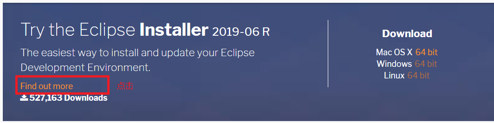
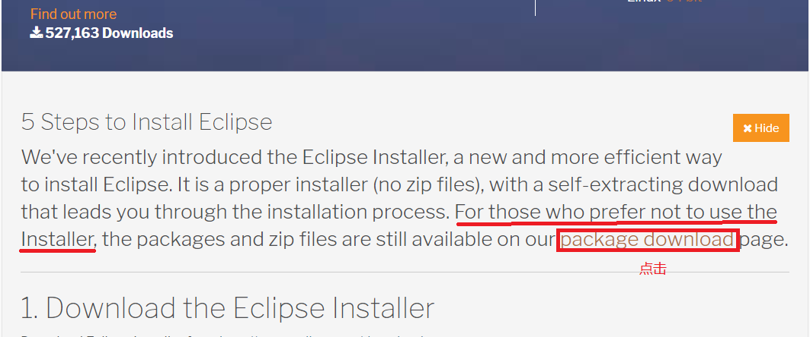
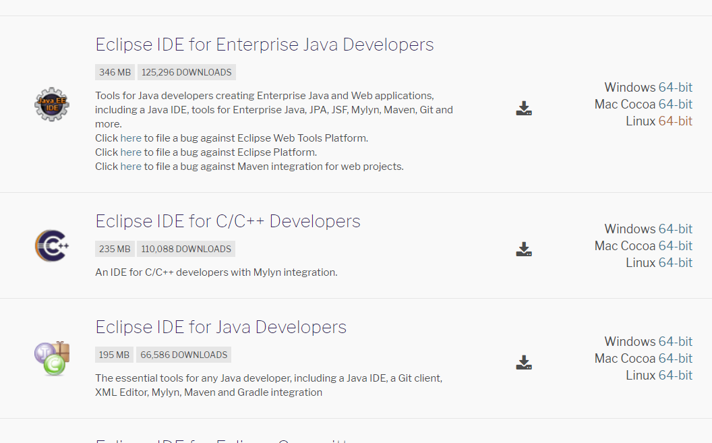
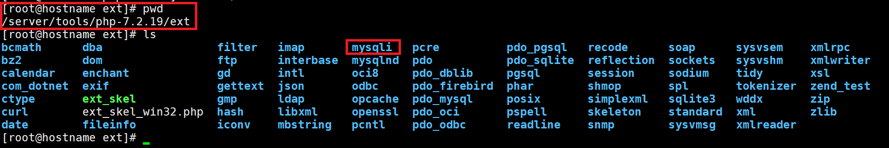
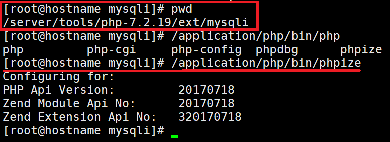
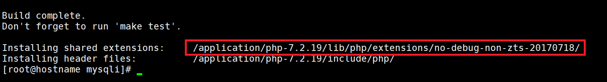
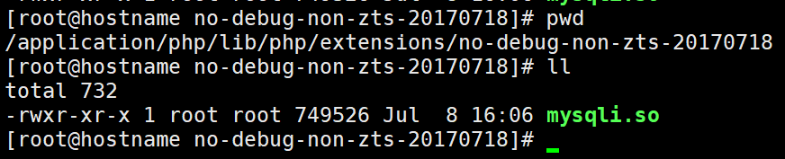

# php 开发环境搭建
## 1.ubuntu中php开发环境搭建
[一个优秀的博客可参考](https://www.cnblogs.com/impy/p/8040684.html)<br>

## 2.在eclipse搭建php开发环境
打开eclipse软件安装界面:<br>
<br>
在``work with``输入当前eclipse的发布版本,在下面就会出现可以安装的工具包<br>
再输入``php``就会检索到关键字目标<br>
找到``PHP development Tools(PDT)``安装即可<br>

## 3.在linux下搭建php开发环境
LNMP架构在其他文章已经详细叙述了,首先介绍如何在Ubuntu下安装eclipse:<br>

### 3.1.Ubuntu安装eclipse
去官网下载:[https://www.eclipse.org/downloads/packages/](https://www.eclipse.org/downloads/packages/)<br>
<br>
在当前业面做如下图操作:<br>
<br>
接下来选中你需要的版本就ok了:<br>
<br>

## 4.php安装扩展
只介绍编译安装php的扩展安装方法:<br>
找到我们之前的php源码包:<br>
<br>
如上图,我们可以在php源码包的``ext``目录下找到很多扩展.

### 4.1.找到扩展
找到我们要安装的扩展,比如``mysqli``,运行phpize命令:<br>
phpize命令在安装的php路径的bin下:<br>
<br>
```
yum install m4
yum install autoconf
/application/php/bin/phpize
```

### 4.2.编译扩展
接下来就需要``./configure``来预编译:<br>
```
./configure -prefix=/application/php/ext/mysqli --with-php-config=/application/php/bin/php-config
```
```
make && make install
```

### 4.3.编辑php.ini文件
在编译安装成功后如下:<br>
<br>
在该目录下我们能找到一个``.so``文件:<br>
<br>

<br>
编辑``php.ini``文件:<br>
```
-rw-r--r-- 1 root root 71564 Jul  8 12:06 /application/php/etc/php.ini
```
<br>
```
extension=/application/php/lib/php/extensions/no-debug-non-zts-20170718/mysqli.so
```

### 4.4.重启php-fpm
自己指定php.ini文件的路径:<br>
```
/application/php/sbin/php-fpm -c /application/php/etc/php.ini
```