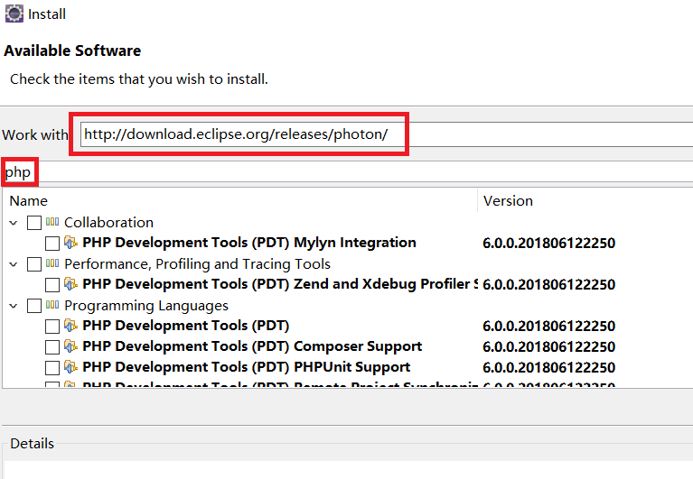

# php 开发环境搭建
## 1.ubuntu中php开发环境搭建
[一个优秀的博客可参考](https://www.cnblogs.com/impy/p/8040684.html) 

## 2.在eclipse搭建php开发环境
打开eclipse软件安装界面: 
 
在``work with``输入当前eclipse的发布版本,在下面就会出现可以安装的工具包 
再输入``php``就会检索到关键字目标 
找到``PHP development Tools(PDT)``安装即可 