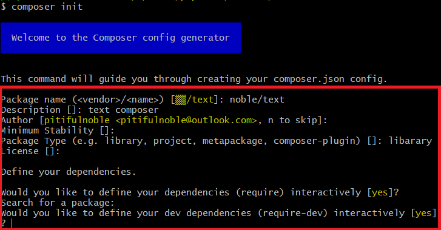
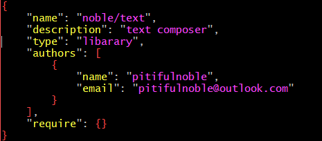

# composer包管理器

## 1.基本安装和配置
[windows环境搭建](https://www.codecasts.com/blog/post/wampserver-composer-php-dev-enviroments-on-windows)<br>

[更改国内源](https://pkg.phpcomposer.com/#how-to-use-packagist-mirror)<br>
```
composer config -g repo.packagist composer https://packagist.phpcomposer.com
composer config -g repo
```

## 2.使用composer
- 1.搜索(search)
- 2.展示(show)
- 3.申明依赖(require)
- 4.安装(install)
- 5.更新(update)

### 2.1.初始化composer项目
在项目根目录下执行:<br>
```
composer init
```
<br>
下面需要填写一些基本信息:<br>

//TODO:参数描述


<br>
完成后便在当前目录创建了一个``composer.json``文件.<br>
<br>

### 2.2.安装扩展包

#### 2.2.1.查找search
以安装monolog为例:<br>
```
composer search monolog
```