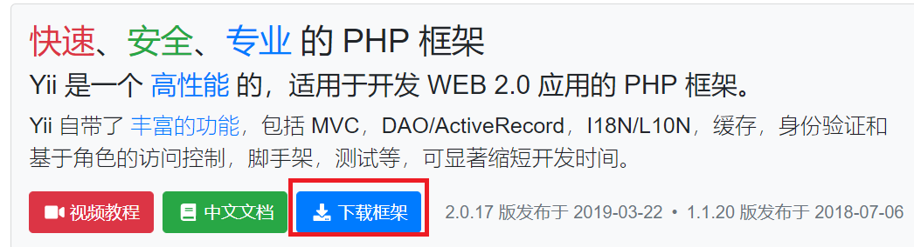
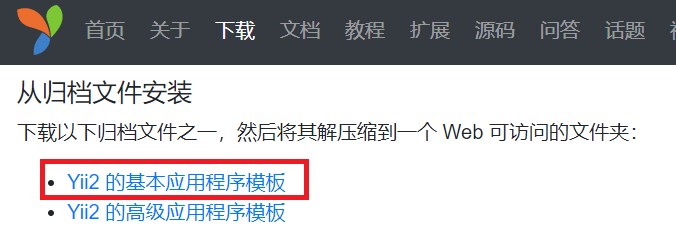
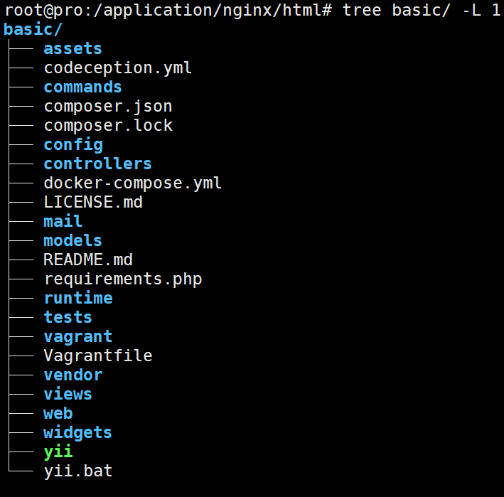
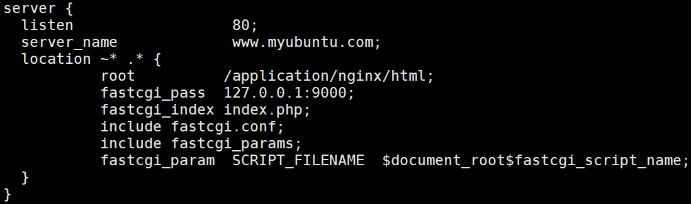
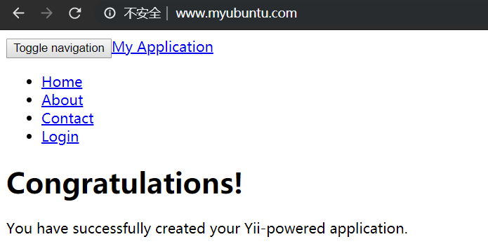

# yii框架

## 1.环境搭建
去官网下载:[https://www.yiichina.com/](https://www.yiichina.com/)<br>
<br>
<br>
将下载好的压缩包解压到目标web目录下即可.<br>

yii框架目录如下:<br>
<br>
搭建好php,nginx,mysql,nginx配置如下:<br>
<br>

接下来我们配置好cookieValidationKey:<br>
在config/web.php下17行:<br>
```
'cookieValidationKey' => '1fjdkld94858',
```

接下来用浏览器访问主页面:<br>
<br>

## 2.高级模板环境搭建
[教程纲领](https://github.com/yiisoft/yii2-app-advanced/blob/master/docs/guide/README.md)<br>
[高级模板安装](https://github.com/yiisoft/yii2-app-advanced/blob/master/docs/guide/start-installation.md)<br>
[高级模板初始化](https://www.yiichina.com/tutorial/1322)<br>