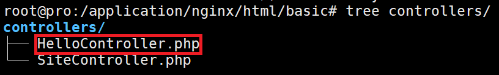

# yii控制器

## 1.入口文件
所有的web请求都请求入口文件,入口文件再将请求转发给控制器的操作(实际上就是方法).<br>

入口文件:<br>
```
basic/web/index.php
```

## 2.创建自己的控制器和操作
<br>
```php
<?php
namespace app\controllers;
use yii\web\Controller;
class HelloController extends Controller
{
    public function actionIndex(){
        return "{'noble':'apple'}";
    }
}
```

在网页访问:<br>
```
url: http://www.myubuntu.com/?r=hello/index
```

## 3.请求处理
### 3.1.接受参数的方法
```php
<?php
namespace app\controllers;
use yii\web\Controller;
class HelloController extends Controller
{
    public function actionIndex(){
        $request = \YII::$app->request;
        return $request->get('id');//用get方法获得参数(同样也有post方法)
    }
}
```
``\YII::$app->request``获得用户的请求.通过get方法获得用户的参数.<br>
获取参数的get函数可以添加默认值:<br>
```php
$request->get('id', 20);
```
### 3.2.请求常用参数
#### 3.2.1.获取参数
```php
$request = Yii::$app->request;
$get = $request->get(); 
// 等价于: $get = $_GET;

$id = $request->get('id');   
// 等价于: $id = isset($_GET['id']) ? $_GET['id'] : null;

$id = $request->get('id', 1);   
// 等价于: $id = isset($_GET['id']) ? $_GET['id'] : 1;

$post = $request->post(); 
// 等价于: $post = $_POST;

$name = $request->post('name');   
// 等价于: $name = isset($_POST['name']) ? $_POST['name'] : null;

$name = $request->post('name', '');   
// 等价于: $name = isset($_POST['name']) ? $_POST['name'] : '';
```

#### 3.2.2.判断请求方法
```php
$request = Yii::$app->request;

if ($request->isAjax) { /* 该请求是一个 AJAX 请求 */ }
if ($request->isGet)  { /* 请求方法是 GET */ }
if ($request->isPost) { /* 请求方法是 POST */ }
```

#### 3.2.3.获取url信息
```php
$request->url  //返回 /admin/index.php/product?id=100, 此 URL 不包括主机信息部分。
$request->absoluteUrl  //返回 http://example.com/admin/index.php/product?id=100, 包含host infode的整个URL。
$request->hostInfo  //返回 http://example.com, 只有主机信息部分。
$request->pathInfo  //返回 /product， 这个是入口脚本之后，问号之前（查询字符串）的部分。
$request->queryString  //返回 id=100，问号之后的部分。
$request->baseUrl  //返回 /admin，主机信息之后， 入口脚本之前的部分。
$request->scriptUrl  //返回 /admin/index.php，没有路径信息和查询字符串部分。
$request->serverName  //返回 example.com，URL 中的主机名。
$request->serverPort  //返回 80，这是 web 服务中使用的端口。
```