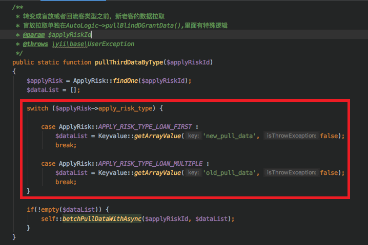

# 数据拉取设计文档
## 1.数据表设计
```sql
CREATE TABLE `data_pull_table`(
    `id` int(11) NOT NULL AUTO_INCREMENT COMMENT '自增id',
    `user_type` varchar(50) NOT NULL COMMENT '用户类型',
    `online_time` datetime NOT NULL COMMENT '上线时间',
    `offline_time` datetime NOT NULL COMMENT '下线时间',
    `data_sourse_msg` varchar(50) NOT NULL COMMENT '数据源描述',
    `data_sourse_type` varchar(50) COMMENT '数据源',
    `status` enum('active','inactive') NOT NULL DEFAULT 'active',
    `data_pull_create_at` datetime NOT NULL DEFAULT '1000-01-01 00:00:00',
    `data_pull_update_at` datetime NOT NULL DEFAULT '1000-01-01 00:00:00',
    PRIMARY KEY (`id`)
)ENGINE=InnoDB AUTO_INCREMENT=118 DEFAULT CHARSET=utf8;
```

|id|user_type|online_time|offline_time|data_sourse_msg|data_sourse_type|
|------|----------|-------------|------------|-----|-----|
|11|new |2019-08-04 12:00:00|2019-11-01 12:00:00| 百度磐石系统PREA信用分数|baidu_panshi,fraud_preal|

## 2.信息读取
创建一个新的dao类，和data_pull_table对应。<br>
common/models/DataPullTable中实现一个方法：<br>
```php
//@param 用户类型
//@return channolname,interfacename 数组
Array getDataSource(String userType){
    $list = $this->find()->where('user_type' == userType)->where(now()>'online_time')->where(now()<'offline_time').findall();
    $array = [];
    for(array entry : $list){
        $array.addKey(entry.getKey);
        $array.addValue(entry.getValue);
    }
    return $array;
}
```

将common/modules;/risk/common/AutoLogic的pullBlindDGrantData<br>
<br>

()函数逻辑全部干掉,调用DpService的pullThirdDataByType($applyRiskId)方法.