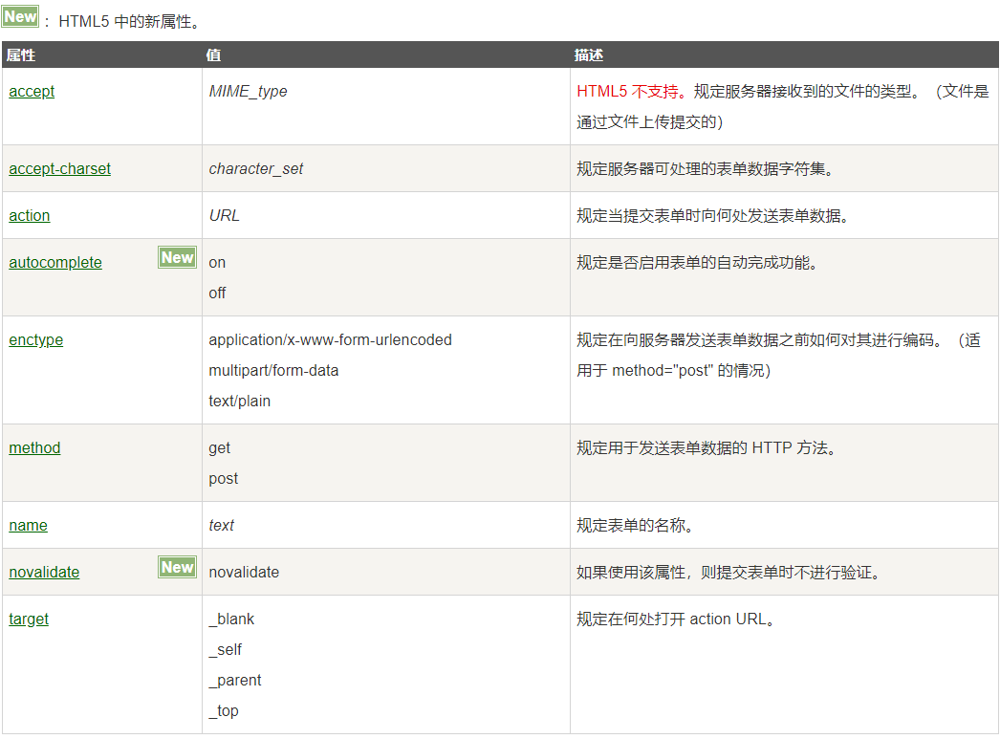
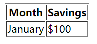
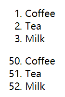

# 常用标签总结

## 1.form表单

### 1.form表单基本结构
```html
<form action="demo_form.php" method="get">
  First name: <input type="text" name="fname"><br>
  Last name: <input type="text" name="lname"><br>
  <input type="submit" value="提交">
</form>
```

### 2.form表单的属性
<br>
**注意**:对于``enctype``当需要上传富文本时使用``multipart/form-data``<br>


## 2.table表格

### 2.1.表格的基本结构
```html
<table border="1">
<tr>
    <th>Month</th>
    <th>Savings</th>
</tr>
<tr>
    <td>January</td>
    <td>$100</td>
</tr>
</table>
```

### 2.2.``<tr>``和``<th>``
``<tr>``表示行数,``<td>``表示列数.<br>
<br>

## 3.列表标签``<ol>``

### 3.1.基本结构
```html
<ol>
  <li>Coffee</li>
  <li>Tea</li>
  <li>Milk</li>
</ol>
 
<ol start="50">
  <li>Coffee</li>
  <li>Tea</li>
  <li>Milk</li>
</ol>
```
<br>

## 4.div标签
``<div>``标签默认占据一行,本身没有什么特殊效果,但配合css和js可以实现多种样式,是网页中最常见的标签<br>