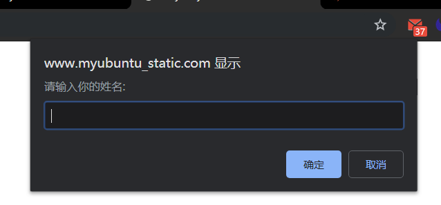

# JavaScript实习基本互动

## 0.调试
```js
alert(string);   //弹窗
console.log(string); //console内容
debugger;
typeof a;        //判断数据类型
a instanceof Array;//判断是否是某一类的实例
```

## 0.解析json
```js
var jsondata = $.parseJSON(data);
```

## 0.业面跳转
```js
$(location).attr("href","http://www.myubuntu.com/mainBody.html");
```

## 1.输出内容:document.write()

### 1.1.一般使用
```js
<script type="text/javascript">
document.write("Hello World!");
</script>
```
### 1.2.字符串拼接
Javascript使用``+``做字符串拼接:<br>
```js
document.write("Hello "+"World!");
```
### 1.3.可以输出HTML标签
```js
document.write("Hi~"+"<br/>"+"noble");
```

## 2.弹窗警告
语法:<br>
```js
alert("error");
```

## 3.消息对话框prompt(提问)
语法如下:
```js
var myname=prompt("请输入你的姓名:");
if(myname!=null)
  {   alert("你好"+myname); }
else
  {  alert("你好 my friend.");  }
```
需要我们输入内容:<br>
<br>

## 3.事件

### 3.1.鼠标单击事件onclick
onclick是鼠标单击事件，当在网页上单击鼠标时，就会发生该事件。同时onclick事件调用的程序块就会被执行，通常与按钮一起使用。<br>
```html
<html>
<head>
   <script type="text/javascript">
      function add2(){
        var numa,numb,sum;
        numa=6;
        numb=8;
        sum=numa+numb;
        document.write("两数和为:"+sum);  }
   </script>
</head>
<body>
   <form>
      <input name="button" type="button" value="点击提交" onclick="add2()" />
   </form>
</body>
</html>
```

### 3.2.鼠标经过事件onmouseover
鼠标经过事件，当鼠标移到一个对象上时，该对象就触发onmouseover事件，并执行onmouseover事件调用的程序。<br>
```html
<!DOCTYPE HTML>
<html>
<head>
<meta http-equiv="Content-Type" content="text/html; charset=utf-8" />
<title> 鼠标经过事件 </title>
<script type="text/javascript">
    function message(){
      confirm("请输入密码后，再单击确定!"); }
</script>
</head>
<body>
<form>
密码:<input name="password" type="password" >
<input name="确定" type="button" value="确定" onmouseover="message()"/>
</form>
</body>
</html>
```

### 3.3.鼠标移开事件onmouseout
鼠标移开事件，当鼠标移开当前对象时，执行onmouseout调用的程序。<br>
```html
<!DOCTYPE HTML>
<html>
<head>
<meta http-equiv="Content-Type" content="text/html; charset=utf-8" />
<title>鼠标移开事件 </title>
<script type="text/javascript">
  function message(){
    alert("不要移开，点击后进行慕课网!"); }
</script>
</head>
<body>
<form>
  <a href="http://www.imooc.com" onmouseout="message()">点击我</a>
</form>
</body>
</html>
```

### 3.4.内容选中事件onselect
选中事件，当文本框或者文本域中的文字被选中时，触发onselect事件，同时调用的程序就会被执行。<br>
