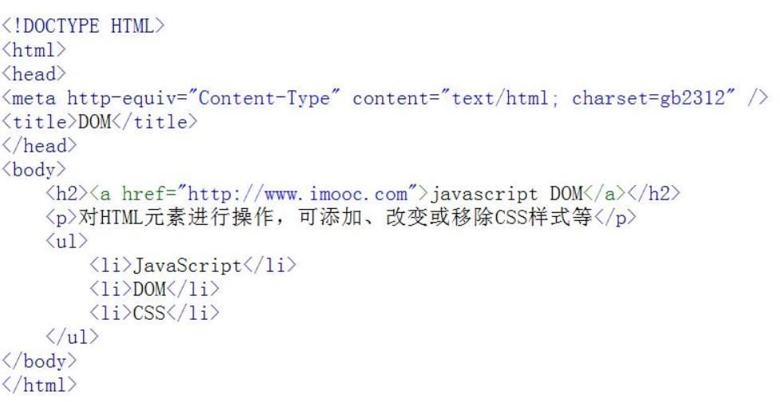
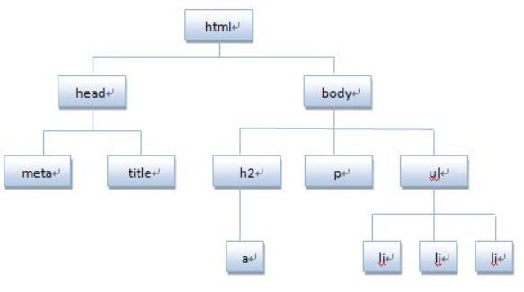
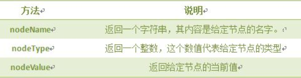
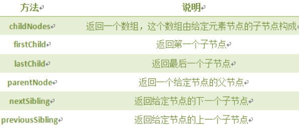
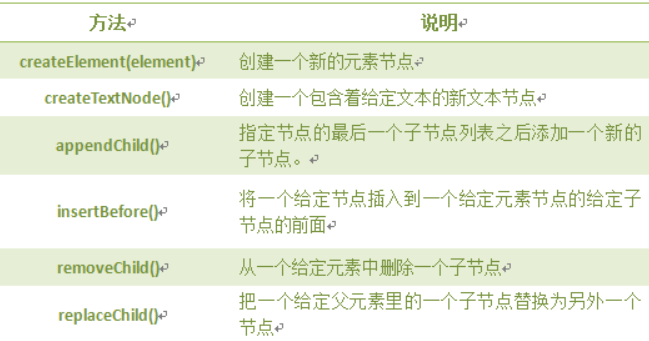

# DOM
文档对象模型DOM（Document Object Model）定义访问和处理HTML文档的标准方法。DOM 将HTML文档呈现为带有元素、属性和文本的树结构（节点树）。<br>

## 1.前置说明
要理解DOM,先说明解读HTML文件的一种视角:节点.<br>
比如如下html文档:<br>
<br>

**将HTML代码分解为DOM节点层次图:**<br>
<br>
HTML文档可以说由节点构成的集合，DOM节点有:<br>

- 1.元素节点：上图中<html>、<body>、<p>等都是元素节点，即标签。
- 2.文本节点:向用户展示的内容，如<li>...</li>中的JavaScript、DOM、CSS等文本。
- 3.属性节点:元素属性，如<a>标签的链接属性href="http://www.imooc.com"。

**节点属性**:<br>
<br>

**遍历节点树**:<br>
<br>

**DOM操作**:<br>
<br>
**注意** 前两个是document()方法.<br>

## 1.获取节点的方法
```js
document.getElementById(id);//通过id获得 节点
document.getElementsByName(name); //通过属性(name)返回值是一个数组
document.getElementsByTagName(Tagname); //通过标签名(如<table>)来获得,返回值是数组
```