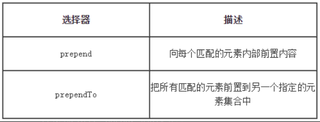

# jQueryDOM操作

## 1.元素节点的创建
常见的就是直接把这个节点的结构给通过HTML标记字符串描述出来，通过$()函数处理<br>
```js
$("<div></div>")
```

一个简单的实例:<br>
```html
<body>
    <script>
    var a = $("<div>hey</div>");
    $("body").append(a);
    </script>
</body>
```

## 2.插入元素

### 2.1.append()和appendTo()
创建好的元素需要添加到html中,这就需要两个函数:``append()``和``appendTo()``<br>
```
append：这个操作与对指定的元素执行原生的appendChild方法，将它们添加到文档中的情况类似。

appendTo：实际上，使用这个方法是颠倒了常规的$(A).append(B)的操作，即不是把B追加到A中，而是把A追加到B中。
```
<div style="color:red;">.append()和.appendTo()两种方法功能相同，主要的不同是语法——内容和目标的位置不同</div><br>
实例:<br>

```js
$("div").append("<div>HelloWorld</div>");
```


### 2.2.before()和after()
- before与after都是用来对相对选中元素外部增加相邻的兄弟节点
- 2个方法都是都可以接收HTML字符串，DOM 元素，元素数组，或者jQuery对象，用来插入到集合中每个匹配元素的前面或者后面
- 2个方法都支持多个参数传递after(div1,div2,....)
```js
$("div").before("<p>HelloWorld</p>");
```

### 2.3.prepend()与prependTo()
<br>

```js
$("div").prepend("<p>HelloWorld</p>");
```