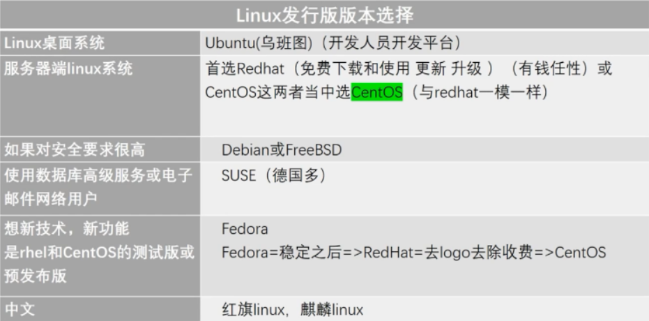

# Linux发展过程

## 重点了解GNU，GPL的知识
GNU<：br>
是一家公司的项目，目的是开发一套系统代替Unix 
GPL： 
是一套规则，通用公共许可 
- 1.所有人可以自由传播开源软件
- 2.虽然人可以任意修改开源软件，但必须公开

## 重点了解Linux系统的常见发行版，不同场景选择
 

## Linux发展过程
 Unix诞生 贝尔实验室  
 谭教授 谭宁邦 
 - minix mini unix 
 - 主要用于教学 

 斯托曼 stallman 
 - 想开发一个系统：自由 开源 替代unix
 - 公司：自由软件基金会 FSF
 - 项目：GNU
 - 守则：GPL

 托瓦斯 
91年 开发Linux内核
