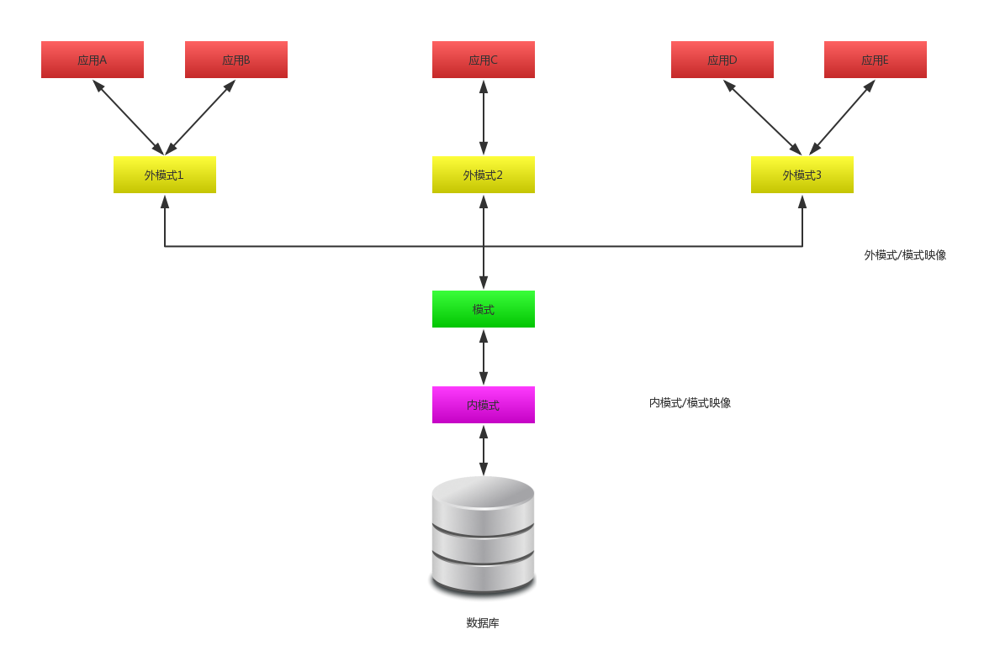

# 关系数据库绪论

## 1.数据库最基本概念
- 1.数据 
  以符号形式记录信息的对象成为数据。 
  数据所表示的含义成为数据的语义。 

- 2.数据库 
  数据库是长期存储在存储设备内，有组织的，可共享的大量数据的集合。 
  数据库中的数据按一定的数据模型组织、描述和存储，具有较小的冗余度(redundancy)、较高的数据独立性(data independency)、和易扩展性(scalability)、并可为各种用户使用。 

- 3.数据库管理系统 
  数据库管理系统和操作系统一样是计算机的基础软件。 

- 4.数据库系统 
  数据库系统是由数据库、数据库管理系统(及其应用开发工具)、应用程序和数据库管理员(DataBase Administrator,DBA)组成的存储、管理、处理和维护数据的系统。 

## 2.数据库系统的特点
### 1.数据结构化
数据库系统实现整体数据的结构化，这是数据库的主要特征之一，也是区别于文件系统的主要区别。 
### 2.数据的共享性高、冗余程度低且易扩展
数据共享可以大大降低数据冗余，还可以避免数据之间的不一致性。 
### 3.数据的独立性高
- 物理独立：数据和应用程序在存储上相互独立
- 逻辑独立：数据应用和管理上和应用程序相互独立

### 4.数据由数据管理系统统一管理和控制
- 1.数据的安全性包含
- 2.数据的完整性检查
- 3.并发控制
- 4.数据库恢复

## 3.数据模型
数据模型通常分成两类：一类是概念模型，另一类是逻辑模型和物理模型。 
### 1.概念模型
概念模型是为了描述自然世界。为了方便进一步抽象为机器语言描述，定义了一些专业术语的对象用来描述自然世界，如下： 
- 1.实体
- 2.属性
- 3.码
- 4.联系

### 2.逻辑模型
逻辑模型是用机器表述现实世界的方式，常用的逻辑模型如下： 
- 层次模型
- 网状模型
- 关系模型

## 数据库的三级模式结构
 

### 模式(schema)
模式也称逻辑模式，是数据库中全体数据的逻辑结构和特征的描述，是所有用户的公共数据视图。 

### 外模式(external schema)
外模式也称子模式(subschema)或用户模式，它是数据库用户(包括应用程序员和最终用户)能够看见和使用的局部数据的逻辑结构和特征的描述，是数据库用户的数据视图，是与某一应用有关的数据的逻辑表示。 

### 内模式(internal schema)
内模式也称储蓄模式(storage schema)，一个数据库只有一个内模式。它是数据库物理结构和存储方式的描述，是数据库在数据库内部的组织方式。 
