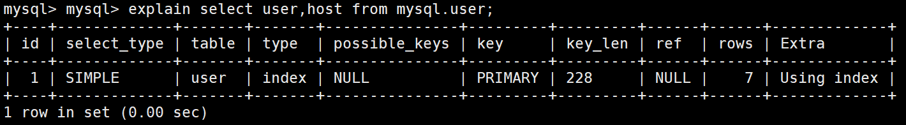
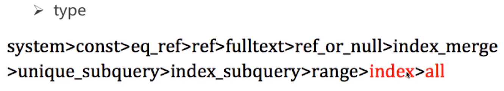
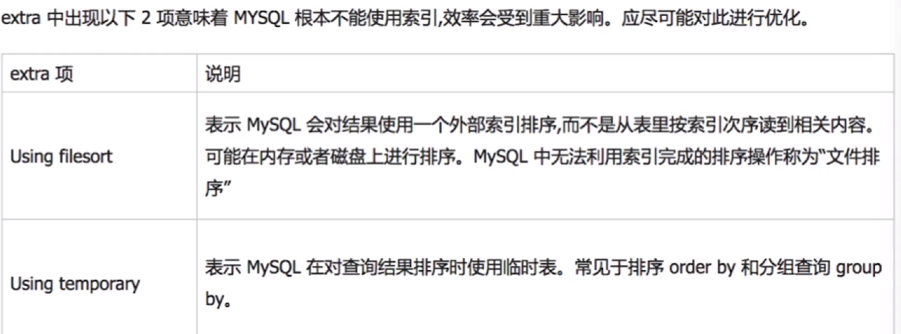
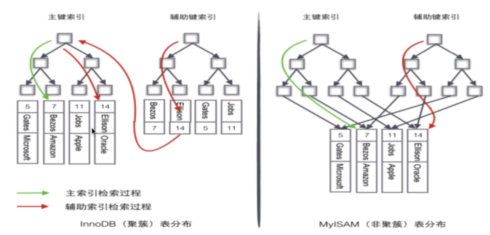

# 数据库的索引

## 1.问题
### 1.1.常见问题
- 1.为什么要使用索引(避免全局查找表,加快信息检索)
- 2.什么样的信息能够成为索引(主键,唯一键等,只要是能让数据做一定区分的字段)
- 3.索引的数据结构(主流是B+树,还有哈希结构,bitMap)
- 4.密集索引和稀疏索引的区别

### 1.2.衍生问题
- 1.如何定位并优化慢查询SQL
- 2.联合索引最左匹配原则的成因
- 3.索引是建立的越多越好吗

#### 1.2.1.如何定位并优化慢查询SQL
- 1.根据慢查询日志定位慢SQL
- 2.使用explain工具分析sql
- 3.修改sql或让sql尽量走索引

##### 1.2.1.1.根据慢查询日志定位慢SQL
在sql下执行:<br>
```sql
show variables like '%query%';
```
关注三个变量:<br>
```js
long_query_time 10.00000                // 超过10秒的sql被记录
slow_query_log  OFF                     // 慢查询日志关闭
slow_query_log_file /user/log/slow.log  // 慢查询日志的路径
```
判断是否有慢sql:<br>
```sql
show status like '%slow_queries%';
```
去slow_query_log_file指定的文件查看.<br>

##### 1.2.1.2.使用explain工具分析sql
在sql语句前添加``explain``工具即可.<br>
<br>

- 1.关注字段 type
    - <br>
    - 1.观察上图type的类型越靠后效率越低
    - 2.如果是index或者是all表示全扫描,是需要优化的
- 2.关注字段 extra
    - <br>
    
##### 1.2.1.3.修改sql或让sql尽量走索引
很多时候,修改sql语句不能满足业务需求,我们可以添加索引.<br>
如果我们要优化如下sql语句:<br>
```sql
select name from person_info_lage order by name desc;
```
添加索引:<br>
```sql
alter table person_info_lage add index idx_name(name);
```


## 2.常见索引
### 2.1.B-TREE
- 1.根节点至少包括两个节点
- 2.树中每个节点至少包含m个孩子(m>=2)
- 3.除了根节点和叶子节点,其他节点至少包含Ceil(m/2)个孩子
- 4.所有叶子节点都位于同一层

### 2.2.B+ TREE
- 1.非叶子节点的子树指针与关键字数相同
- 2.非叶子节点仅用来索引,值都保存在叶子节点中

### 2.3.HaSh索引
Hash索引可以在O(1) 的时间复杂度中查找数据,但也有明显的缺陷:<br>
- 1.仅能满足``=``和``IN``不能使用范围查询
- 2.不能利用Hash以外的索引做查找
- 3.不能避免表扫描(hash对撞)

### 2.4.BitMap索引
适用范围是:数据值的范围是固定的.<br>

### 2.5.密集索引,稀疏索引

<br>

InnoDB 密集索引.<br>
- 1.一个表只有一个密集索引
- 2.如果主键被定义,则主键是密集索引
- 3.如果没有定义主键,该表第一个唯一非空索引被视为密集索引
- 4.如果不满足上述条件,InnoDB会生成一个隐藏的密集索引
- 5.非主键索引存储相关键位和其对应的主键值,包含两次查找

稀疏索引.<br>
- 1.每个索引的查找过程都是一致的,没有区别
- 2.在MySQL中稀疏索引(索引和数据存在不同的文件中),密集索引(索引和数据都在一个文件中)


## 3.索引在工程上的应用
- 1.primary key(主键)
- 2.key(一般索引)
- 3.unique key(唯一键)
- 3.foreign key(外键)
- 4.(联合索引)

### 3.1.primary key
- 1.一个table只能有一个``primary key``
- 2.在InnoDB引擎中只要使用了索引都会先查找``primary key``再查找目标数据

#### 3.1.1.申明方法
```sql
CREATE TABLE `user` (
  `user_id` INT(11) NOT NULL AUTO_INCREMENT,
  `user_name` CHAR(35) NOT NULL,
  PRIMARY KEY (`user_id`),
) ENGINE=InnoDB AUTO_INCREMENT=4080 DEFAULT CHARSET=utf8;
```

### 3.2.key
- 1.一个表可以有多个key
- 2.key作用在Field，不要求改Field必须唯一
- 3.我们一般对经常被作为查询限制条件的Field(如：在where字段后)增加key

#### 3.2.1.申明方法
```sql
CREATE TABLE `mmall_cart` (
  `id` int(11) NOT NULL AUTO_INCREMENT,
  `user_id` int(11) NOT NULL,
  `product_id` int(11) DEFAULT NULL COMMENT '商品id',
  `quantity` int(11) DEFAULT NULL COMMENT '数量',
  `checked` int(11) DEFAULT NULL COMMENT '是否选择,1=已勾选,0=未勾选',
  `create_time` datetime DEFAULT NULL COMMENT '创建时间',
  `update_time` datetime DEFAULT NULL COMMENT '更新时间',
  PRIMARY KEY (`id`),
  KEY `user_id_index` (`user_id`) USING BTREE
) ENGINE=InnoDB AUTO_INCREMENT=146 DEFAULT CHARSET=utf8;
```

### 3.3.unique key
- 1.功能和普通key一样，唯一的限制是被修饰的Field的值必须唯一

#### 3.3.1.申明方法
```sql
CREATE TABLE `mmall_user` (
  `id` int(11) NOT NULL AUTO_INCREMENT COMMENT '用户表id',
  `username` varchar(50) NOT NULL COMMENT '用户名',
  `password` varchar(50) NOT NULL COMMENT '用户密码，MD5加密',
  `email` varchar(50) DEFAULT NULL,
  `phone` varchar(20) DEFAULT NULL,
  `question` varchar(100) DEFAULT NULL COMMENT '找回密码问题',
  `answer` varchar(100) DEFAULT NULL COMMENT '找回密码答案',
  `role` int(4) NOT NULL COMMENT '角色0-管理员,1-普通用户',
  `create_time` datetime NOT NULL COMMENT '创建时间',
  `update_time` datetime NOT NULL COMMENT '最后一次更新时间',
  PRIMARY KEY (`id`),
  UNIQUE KEY `user_name_unique` (`username`) USING BTREE
) ENGINE=InnoDB AUTO_INCREMENT=22 DEFAULT CHARSET=utf8;
```


### 3.4.foreign key
- 1.外键用来提高连表查询速度
- 2.一个表A拥有一个Field，是另一个表B的主键，这是外键的形式(我们在表A申明外键)


#### 3.4.1.申明方法
```sql
CREATE TABLE `ticket` (
    `id` INT(11) NOT NULL AUTO_INCREMENT,
    `user_id` INT(11) NOT NULL,
    `vote_id` INT(11) NOT NULL,
    PRIMARY KEY (`id`),
    FOREIGN KEY (`user_id`) REFERENCES user(`id`),
    FOREIGN KEY (`vote_id`) REFERENCES vote(`id`)
)ENGINE=InnoDB AUTO_INCREMENT=212 DEFAULT CHARSET=utf8;
```

#### 3.4.2.使用JOIN ON语法
```sql
select user.name from ticket JOIN user 
ON user.id=ticket.user_id 
WHERE user.id = '4077';
```

- 1.第一行``ticket JOIN user``连接成一个大表(我们可以查询这张大表的任何字段)
- 2.第二行``ON user.id=ticket.user_id ``限制连接方式
- 3.第三行添加了筛选条件

如果要连接更多的表使用多个JOIN ON：<br>
```sql
select user.name from
ticket JOIN user ON user.id=ticket.user_id
JOIN vote ON vote.id=ticket.vote_id
WHERE user.id = '4077';
```