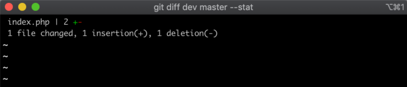
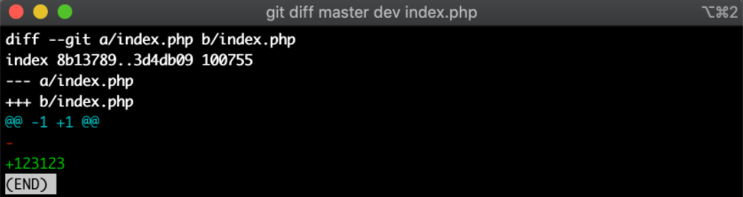
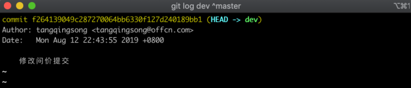

# git进阶使用

## 01.diff查看代码差异

### 1.1.不同分支文件差异

```shell
git diff master dev  --stat
```



- 1.哪些文件修改了
- 2.增加了几行删除了几行

### 1.2.显示文件的具体修改

```shell
git diff master dev index.php
```



我们传入了两个分支名，以及一个具体文件名

- 1.显示不同分支具体的修改
- 2.增加那些内容，删除了哪些内容


## 02.查看不同分支提交记录

### 2.1.查看dev分支比master分支多提交哪些commit

```shell
git log dev ^master
```



- 上图显示dev分支比master多一条commit记录