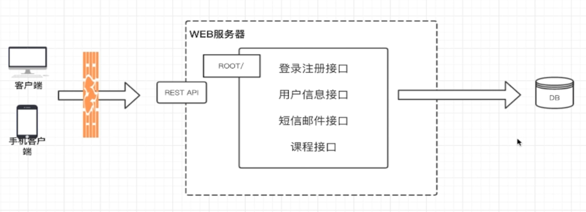
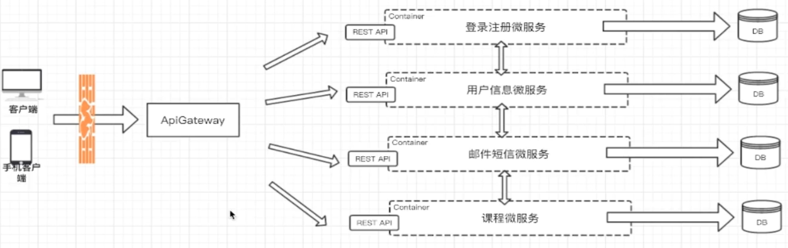

# 初识微服务

## 1.微服务的定义

使用一套小服务来开发单个应用的方式，每个服务运行在**独立的进程**中，一般采用**轻量级通讯**机制互联，并且他们可以采用**自动化**方式部署。

## 2.画一个微服务架构图

### 2.1.假定业务需求

- 2.1.1.一个在线教育网站的部分功能
- 2.1.2.用户可以登录注册，获取用户的信息
- 2.1.3.有发送邮件和短信的功能
- 2.1.4.可以查看课程列表和课程基本CRUD

## 3.单体架构图

## 4.微服务架构图

## 5.微服务的特征

- 1.优势
  - 1.1.独立性
  - 1.2.敏捷性
  - 1.3.技术栈灵活
  - 1.4.高效团队
- 2.劣势
  - 2.1.额外的工作
  - 2.2.数据一致性
  - 2.3.沟通成本