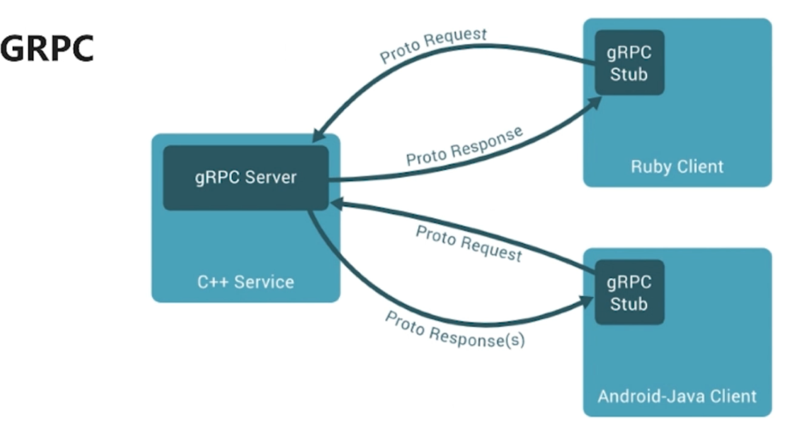

# 微服务架构引入的问题

- 微服务如何互相通信
- 微服务如何发现彼此
- 微服务怎么部署？更新？扩容？

## 1.微服务如何通信

### 1.1.从通信模式考虑

|      | 一对一            | 一对多                |
| ---- | ----------------- | --------------------- |
| 同步 | 请求响应模式      | --------------        |
| 异步 | 通知/请求异步响应 | 发布订阅/发布异步响应 |

### 1.2.从通信协议考虑

- 1.REST API
- 2.RPC
- 3.MQ

### 1.2.选择RPC服务

- 1.I/O、线程调度模型
- 2.序列化方式
- 3.多语言支持
- 4.服务治理

### 1.3.流行的RPC框架

- 1.Dubbo/Dubbox(阿里开源/当当维护)

- 2.Motan(新浪微博开源)

- 3.Thrift(Apache)

- 4.Grpc(google)

  

### 1.4.Dubbo

- 1.蓝色表示系统初始化执行的逻辑
- 2.虚线是异步调用，蓝色是同步调用
- 3.只支持java

### 1.5.Motan

- 逻辑和dubbo差不多
- 只支持java

### 1.6.Thrift

- 1.支持多语言微服务
- 2.需要我们自己实现的逻辑较多

### 1.7.GRPC

- 逻辑和Thrift差不多

### 1.8.开源RPC框架对比

| RPC对比      | Dobbo | Motan | Thrift       | GRPC           |
| ------------ | ----- | ----- | ------------ | -------------- |
| 开发语言     | Java  | Java  | 跨语言       | 跨语言         |
| 服务治理     | OK    | OK    | OFF          | OFF            |
| 多种序列化   | OK    | OK    | 只支持Thrift | 只支持protobuf |
| 多种注册中心 | OK    | OK    | OFF          | OFF            |
| 管理中心     | OK    | OK    | OFF          | OFF            |
| 跨语言通信   | OFF   | OFF   | OK           | OK             |
| 整体性能     | 3     | 4     | 5            | 3              |

## 2.服务发现问题

### 2.1.客户端发现

### 2.2.服务端发现

## 3.服务的部署，更新和扩容

服务编排---可以解决微服务