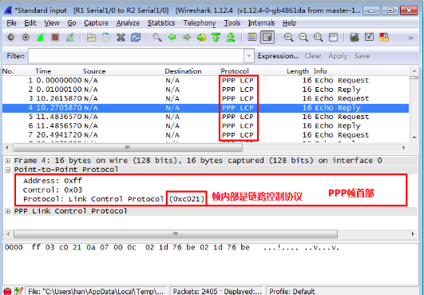

# 数据链路层
## 4.1数据链路层要实现3个功能

### 封装成帧
从网络层下来的数据包要加上头部和尾部，封装
成帧。 
在局域网中头部要有原mac地址，目标mac地址
遵循带冲突检验的载波侦听多路访问技术CSMA/CD 
尾部带有FCS用于差错检验

### 透明传输

帧有开始符(SOH)结束符(EOT)，如果在数据中有开始符和
结束符，数据数据链路层就会加入转移字符(ESC)

### 差错检验

循环冗余检验CRC的差错检验技术，还有很多其他的
## 4.2点到点
__PPP协议__ 
 - 1.简单      不提供可靠传输
 - 2.封装成帧   首部和尾部 帧开始符帧结束符
 - 3.透明传输 加转译字符 受到后去除转译字符
 - 4.差错检验 CRC计算FCS
 - 5.支持多种网络层协议 IPV4 IPV6或其他网络层协议都可以封装到PPP帧中
 - 6.多种类型链路  光纤 铜线 同步传输 异步传输 串行，并行均可
 - 7.检测连接状态
 - 8.最大传输单元 默认1500字节
 - 9.网络层地址协商 能够为拨号的一端分配IP地址 子网掩码 网官和DNS
 - 10.数据压缩传输

透明传输：帧开始字符 帧结束字符 
补充知识： 
 - 同步传输 以帧为单位传输  PPP协议使用0比特填充 凡是发现有5个连续的1就插一个0 (01111110)7E
 - 异步传输 以字节为单位传输 PPP协议使用字节填充 把一个字节拆成2半加D5

__PPP协议__ 
 
使用wireshark抓包时，定界符7E是看不到的在网卡处
被过滤，同样被过滤的还有FCS。 

## 4.2广播信道的数据链路层
使用CSMA/CD带冲突检测的载波侦听多路访问技术通信是
以太网，每个地址都有mac地址。 
__1.以太网中有最短帧 512b也就是64个字节 默认以太网
设计最大传输距离是5000m，而实际不会达到这么远，所以512b足够__ 
__2.冲突解决方法：退避算法__ 
__3.以太网帧没有结束字符编码因为使用的是曼彻斯特编码__ 

__网卡的作用__ 
1.串行数据和并行数据转换 
2.数据链路层的功能，封装成帧，帧的差错检验和CSMA/CD 

__扩展以太网__ 
增加集线器可以在数量上扩展以太网 
扩增距离可以使用光纤 

__优化以太网__ 

网桥，减小冲突域，但增加了延迟 

有足够多的接口的网桥就成为现在的交换机，交换机直接接电脑 

双汇聚网络构架中的生成树协议： 
根据ID选择一个根交换机，其他交换机选根端口(离跟交换机进) 
每根网线 那头离交换机进 指定端口，
指定端口和根端口是通路，其他为阻断端口 

__以太网的帧格式__ 
 
 
