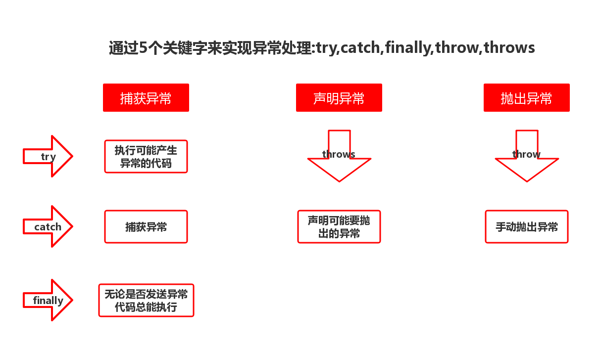

# 异常体系
wiki文档:[https://wiki.imooc.com/java/javaexception.html](https://wiki.imooc.com/java/javaexception.html)<br>
## 1.异常体系简述
Java有强大的异常体系(如同).<br>
<br>
异常根是``Throwable``,拥有两个子类Error和Exception,其中Error是不可处理的异常,直接导致程序崩溃.二Exception是可处理的异常.我们的关注重心在Exception<br>

### 1.1Exception分类

- 非检查异常:非强迫要求检查的异常
- 检查异常:编译器强迫要求检查的异常项

## 2.异常处理的方法
- 1.抛出
- 2.捕获

<br>

### 2.1.try-catch-final捕获异常
```java
public class Main {
	public static void main(String[] args) {
		Scanner sn = new Scanner(System.in);
		int a,b;
		System.out.println("=====程序开始了======");
		System.out.print("请输入第一个参数:");
		try {
			a = sn.nextInt();
			System.out.print("请输入第二个参数:");
			b = sn.nextInt();
			System.out.println("输出结果:"+(a/b));
			}catch(Exception e) {
				e.printStackTrace();
				System.out.println("程序出错了");
			}
		System.out.println("=====程序结束了======");
	}
}
```

### 2.2.抛出异常
通过throws关键字抛出异常<br>
```java
public void method(){
  try{
    //code 1
    throw new 异常类型();
  }catch(异常类型 ex){
    //对异常进行处理的code 2
  }
}
```
```java
public void method() throws 异常类型{
  //代码段1
  throw new 异常类型();//不建议抛出非检查类型
}
```

### 2.3自定义异常类型
创建一个新类继承``Exception``即可<br>
```java
public class TestException extends Exception {
	public TestException() {
		super("");
	}
}
```

### 2.4.异常链
有时候我们会捕获一个异常后再抛出一个异常.<br>
异常链则保留所有异常信息,逐层抛出,将异常的原因一个传一个串起来<br>
以下示例就是一个异常链的应用<br>
```java
public class Main {
	public static void main(String[] args) {
		try {
			testThree();
		} catch (Exception e) {
			e.printStackTrace();
		}
	}
	public static void testOne() throws TestException {
		throw new TestException();
	}
	public static void testTwo() throws Exception {
		try {
			testOne();
		}catch(TestException e) {
			throw new Exception("Exception 2",e);
		}
	}
	public static void testThree() throws Exception {
		try {
			testTwo();
		}catch(Exception e) {
			Exception exc = new Exception("Exception 3");
			exc.initCause(e);
			throw exc;
		}
	}
}
```

终端输出:<br>
```java
java.lang.Exception: Exception 3
	at com.noble.test.Main.testThree(Main.java:25)
	at com.noble.test.Main.main(Main.java:6)
Caused by: java.lang.Exception: Exception 2
	at com.noble.test.Main.testTwo(Main.java:18)
	at com.noble.test.Main.testThree(Main.java:23)
	... 1 more
Caused by: com.noble.test.TestException: 
	at com.noble.test.Main.testOne(Main.java:12)
	at com.noble.test.Main.testTwo(Main.java:16)
	... 2 more
```

## 3.常见异常处理
[常见异常处理(上)](http://file.mukewang.com/class/assist/45/106515/Java%E5%B8%B8%E8%A7%81%E5%BC%82%E5%B8%B8%E7%B1%BB%E5%9E%8B%E5%8F%8A%E5%8E%9F%E5%9B%A0%E5%88%86%E6%9E%90%EF%BC%88%E4%B8%8A%EF%BC%89.pdf)<br>
[常见异常处理(下)](http://file.mukewang.com/class/assist/45/106515/Java%E5%B8%B8%E8%A7%81%E5%BC%82%E5%B8%B8%E7%B1%BB%E5%9E%8B%E5%8F%8A%E5%8E%9F%E5%9B%A0%E5%88%86%E6%9E%90%EF%BC%88%E4%B8%8B%EF%BC%89.pdf)<br>