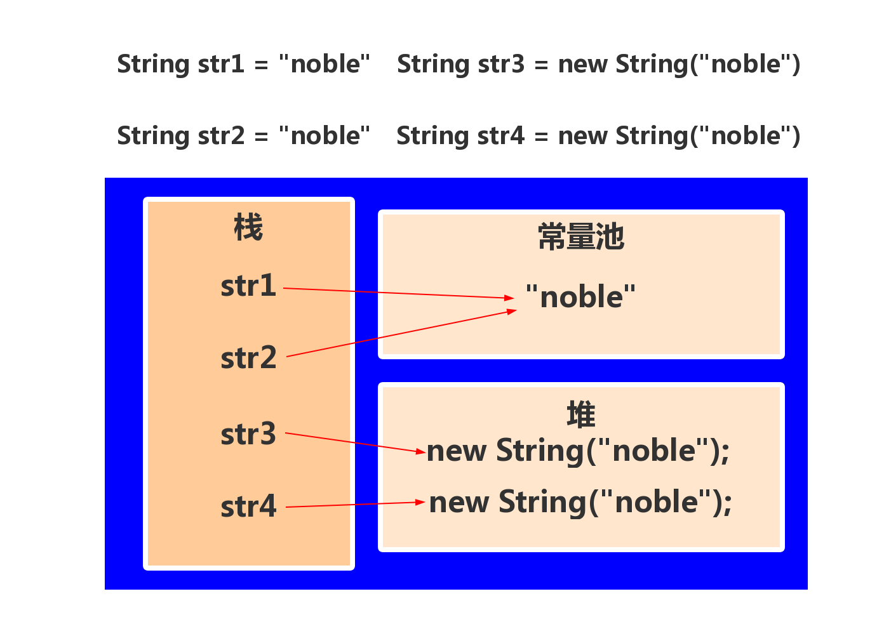

# 1.String类

## 1.1.创建String类的方法
```java
String s1 = "noble";             //创建一个字符串对象noble,名为s1
String s2 = new String();        //创建一个空字符串,名为s2
String s3 = new String("noble"); //创建一个字符串对象noble,名为s3
String s4 = new String(byte[] bytes);  //通过字节数组,创建一个String类
```


## 1.2.String的常用方法

| 方法 | 说明 |
|------|------|
| int length() | 返回当前字符串的长度 |
| int indexOf(int ch) | 查找ch字符再该字符串中第一次出现的位置 |
| int indexOf(String str) | 查找str子字符串再该字符串中第一次出现的位置 |
| int lastIndexOf(int ch) | 查找ch字符再该字符串中最后一次出现的位置 |
| int lastIndexOf(String str) | 查找str子字符串在该字符串中最后一次出现的位置 |
| String substring(int beginIndex) | 获取从beginIndex位置开始到结束的子字符串 |
| String substring(int beginIndex, int endIndex) | 获取从beginIndex位置开始到endIndex位置的子字符串 |
| String trim() | 返回去除了前后空格的字符串 |
| boolean equals(Object obj) | 将该字符串与指定对象比较,返回true或false |
| String toLowerCase() | 将字符串转换为小写 |
| String toUpperCase() | 将字符串转换为大写 |
| char charAt(int index) | 获取字符串中指定位置的字符 |
| String[] split(String regex, int limit) | 将字符分割为子字符串,返回字符串数组 |
| byte[] getBytes() | 将该字符串转换为byte数组 |


**注意:** 在网络上都是使用二进制传输的,所以``getBytes()``方法将字符串转换成二进制数组是很有用的方法,当我们需要将二进制数组转换成原来的字符串时,使用构造方法:<br>
```java
String s4 = new String(byte[] bytes);  //通过字节数组,创建一个String类
String s4 = new String(byte[] bytes, Charset charset); 
```

### 1.3.字符串的内存模型
<br>

## 2.StringBuilder类介绍

### 2.1.String类的不可变型
我们不论如何操作String类型,其在内存中的存储是不发生变化的.所以,当有复杂的字符串操作时,会出现很多的中间变量.这时使用StringBuilder就非常合适.<br>