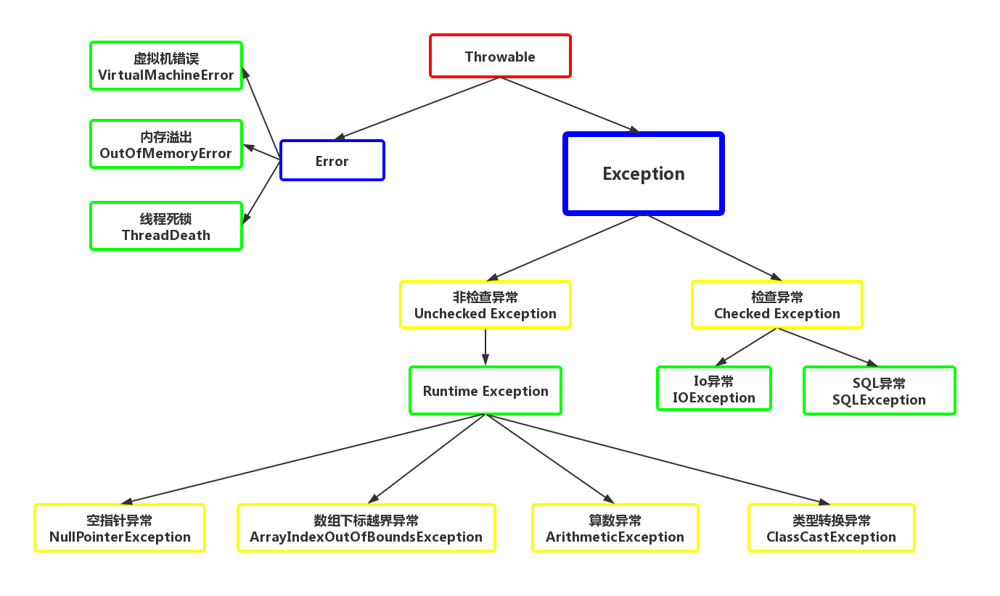
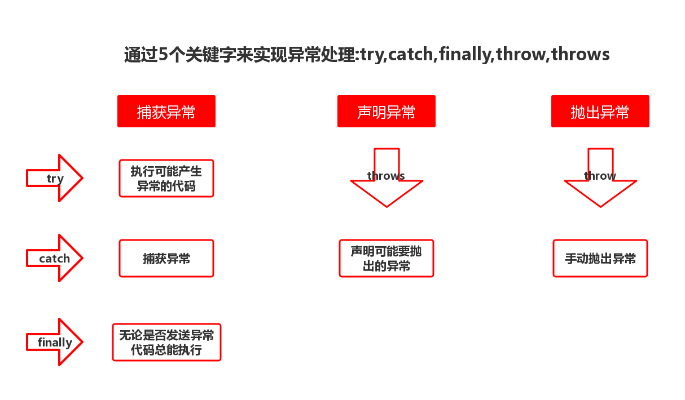

# 异常体系

## 1.异常体系简述
Java有强大的异常体系(如同).<br>
<br>
异常根是``Throwable``,拥有两个子类Error和Exception,其中Error是不可处理的异常,直接导致程序崩溃.二Exception是可处理的异常.我们的关注重心在Exception<br>

### 1.1Exception分类

- 非检查异常:非强迫要求检查的异常
- 检查异常:编译器强迫要求检查的异常项

## 2.异常处理的方法
- 1.抛出
- 2.捕获

<br>

### 2.1.try-catch-final捕获异常
```java
public class Main {
	public static void main(String[] args) {
		Scanner sn = new Scanner(System.in);
		int a,b;
		System.out.println("=====程序开始了======");
		System.out.print("请输入第一个参数:");
		try {
			a = sn.nextInt();
			System.out.print("请输入第二个参数:");
			b = sn.nextInt();
			System.out.println("输出结果:"+(a/b));
			}catch(Exception e) {
				e.printStackTrace();
				System.out.println("程序出错了");
			}
		System.out.println("=====程序结束了======");
	}
}
```

### 2.2.抛出异常
通过throws关键字抛出异常<br>
```java

```