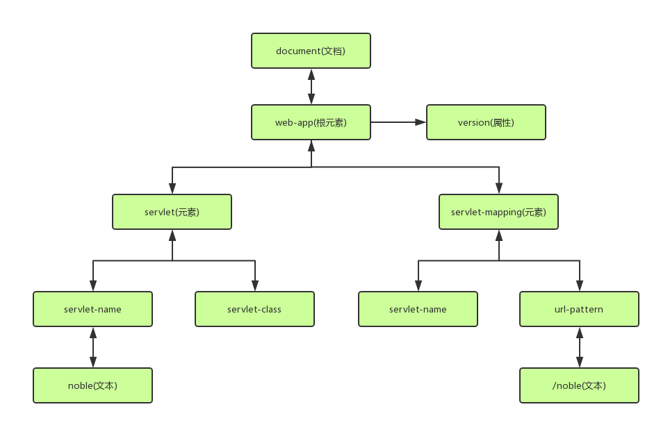

# 1.XML

## 1.XML简介
XML(Extensible Markup Language)可扩展标记语言。XML语法和HTML比较相似。
XML多用于配置文件。<br>

## 2.XML语法
### 1.XML文档声明
```xml
<?xml version="1.0" encoding="UTF-8"?>
```

- 1.文档声明必须以``<?xml``开头，以``?>``结尾
- 2.文档声明必须从文档的0行0列位置开始
- 3.文档声明只有三个属性：
  - 1.version：指定XML文档的版本。必须标注，我们一般不会选择1.1版本，只会选择1.0版本
  - 2.encoding：指定文档的编码。可选属性，默认是utf-8

### 2.元素element
```xml
<servlet>
```

- 1.元素是XML文档中最重要的组成部分
- 2.普通元素的结构：开始标签、结束标签组成。如``<noble>hello world</noble>``
- 3.元素体：元素体可以是元素也可以是文本，例如``<b><a>hello</a></b>``
- 4.空元素：空元素只有开始标签，而没有结束标签，但元素必须自己闭合，例如``<c/>``
- 5.元素命名：
  - 1.区分大小写
  - 2.不能使用空格
  - 3.不建议以XML、xml、Xml开头
- 6.格式良好的XML文档，必须只有一个根元素

### 3.属性
```xml
<noble version="3.5">
```

- 1.属性是元素的一部分，它必须出现在元素的开始标签中
- 2.属性的定义格式：属性名=属性值，其中属性值必须使用引号
- 3.一个元素可以有多个属性，但一个元素中不能出现同名属性
- 4.属性名不能使用空格、冒号等特殊字符，且必须以字母开头

### 4.注释
XML注释与HTML相同，以``<!--``开始，以``-->``结束。<br>

### 5.转义字符
XML中的转义字符与HTML一样。<br>
因为很多符号已经被XML文档结构所使用，所以在元素体或属性值中想使用这些符号就必须使用转义字符，例如：``<``、``>``、``'``、``"``、``&``。<br>

| 字符 | 字符引用(十进制) | 字符引用(十六进制) | 预定义实体引用 |
|-----|------------------|------------------|---------------|
| <  | &#60;  | &#x3c;  | &lt;  |
| >  | &#62;  | &#x3e;  | &gt;  |
| "  | &#34;  | &#x22;  | &quot;  |
| '  | &#39;  | &#x27;  | &apos;  |
| &  | &#38;  | &#x26  | &amp;  |

**CDATA区**<br>
```xml
<![CDATA[
  随意内容
]]>
```
当大量的转义字符出现在xml文档中时，会使xml文档的可读性大幅降低。这时如果使用CDATA段就会好一些。<br>
在CDATA段中出现的``<``、``>``、``'``、``"``、``&``都无需使用转义字符。这可以提高xml文档的可读性<br>
在CDATA段中不能包含``]]>``，即CDATA段的结束定界符。<br>


## 3.XML解析
XML作为配置文件，我们需要能够解析里面的内容。<br>

### 1.解析方法
开发中常用的解析方法有以下三种：<br>
- 1.DOM:将XML文档全部加载到内存，并解析成一个Document对象
  - 优点：元素与元素之间保留结构关系，故可以进行增删改查操作
  - 缺点：XML文档过大，可能出现内存溢出
- 2.SAX：是一种速度更快，更有效的方法。它逐行扫描文档，一遍扫描一遍解析。并以事件驱动的方式进行具体解析，每执行一行，都将触发对应的事件。(了解)
  - 优点：处理速度快，可以处理大文件
  - 缺点：只能读，逐行后释放资源
- 3.PULL：Android内置的XML解析方式。类似SAX。(了解)

### 2.解析开发包
根据三种解析理论，有相应的解析开发包供我们使用。<br>
- 1.JAXP: sun公司提供的支持DOM和SAX开发包
- 2.JDOM：dom4j兄弟
- 3.jsoup：一种处理HTML特定解析开发包
- 4.dom4j：比较常用的解析开发包，hibernate底层采用

### 3.DOM原理
DOM的核心原理是：节点与语法树。<br>
<br>
无论是元素还是属性都做为一个个节点，这些节点组成一个树，通过对树的遍历来访问资源。<br>

### 4.API使用
如果要使用dom4j，必须导入jar包``dom4j-1.6.1.jar``。<br>
dom4j必须使用核心类SAXReader加载xml文档获得Document，通过Document对象获得文档的元素，然后就可以访问任何节点。<br>
常用API如下：<br>
```java
SAXReader//对象
  Document read(String path); //加载xml文档

Document//对象
  Element getRootElement(); //获得根元素

Element//对象
  List elements(String elementName);//获得指定名称的所有字元素
  List elements();                  //获得所有字元素
  Element element(String elementName);//获得指定名称的第一个子元素
  Element element();                  //获得第一个子元素
  String getName();                   //获得当前元素的元素名
  String attributeValue(String attr); //返回当前对象指定的属性值
  String elementTest(String elementName);//返回指定元素的文本值
  String getTest();                     //获取当前元素的文本值
```

实例如下：<br>
```java
try {
			SAXReader saxReader = new SAXReader();
			Document document = saxReader.read("src/com/noble02/web.xml");
			Element rootElement = document.getRootElement();
			Element servletElement = rootElement.element("servlet");
			String servletClass = servletElement.element("servlet-class").getText();
			System.out.println(servletClass);
			rootElement.attributeValue("");


			Class clazz =  Class.forName(servletClass);

		} catch (Exception e) {
			// TODO Auto-generated catch block
			e.printStackTrace();
		}
```


## 4.XML约束
因为XML的语法格式非常自由，标签可以随意定义，那么通过约束来规范XML格式，就显得尤为重要了。因为只有遵循统一的标准，接口才可以相互匹配。<br>
常见的XML规范有：DTD、Schema。<br>

### 1.DTD规范
DTD(Document Type Definition),文档类型定义，用来约束XML文档。规定XML文档中元素的名称，子元素的名称及顺序，元素的属性等。<br>
在开发中，我们几乎不自己编写DTD约束文档，通常情况我们都是遵循通过框架提供的DTD约束文档编写对应的XML文档。常见框架使用DTD约束有：struts2、hibernate等。<br>
DTD文档可以存在于本地系统上，也可以存在于互联网上。DTD文档在本地系统上，一般是公司内部自己项目使用。DTD文档在网络上时，一般都是框架提供的。<br>

#### 1.DTD语法规范
##### 1.文档声明
我们要使用DTD的文法规范，首先需要使我们的xml文档和对应的DTD文档关联。这是通过声明实现的。<br>
我们通过在XML文档中内嵌DTD的路径语句来关联相应的DTD文档。<br>

**对于在系统本地的DTD文档**<br>
我们在xml中声明``<!DOCTYPE web-app SYSTEM "web-app_2_3.dtd">``即可。例如：<br>
```xml
<?xml veresion="1.0" encoding="utf-8" standalone="no" ?>
<!DOCTYPE web-app SYSTEM "web-app_2_3.dtd">
<web-app>
</web-app>
```

**对于在网络上的DTD文档**<br>
我们在xml中声明``<!DOCTYPE web-app PUBLIC "-//Sun Microsystems, Inc.//DTD Web Application 2.3//EN" "http://java.sun.com/dtd/web-app_2_3.dtd">``即可。例如：<br>
```xml
<?xml veresion="1.0" encoding="utf-8" standalone="no" ?>
<!DOCTYPE web-app PUBLIC "-//Sun Microsystems, Inc.//DTD Web Application 2.3//EN" "http://java.sun.com/dtd/web-app_2_3.dtd">
<web-app>
</web-app>
```

##### 2.元素声明
```
定义元素语法：<!ELEMENT 元素名 元素描述>
  元素名：自定义
  元素描述包括：符号和数据类型
    常见的符号：? * + () | ,
    常见类型：#PCDATA 表示内容是文本，不能是字标签
```

|符号|符号描述|描述|实例|
|---|--------|---|----|
| ?  | 问号  | 表示对象可以出现零或一次  | (welcome-file-list?)  |
| *  | 星号  | 表示对象可以出现任意多次，可以是零次  | (servlet*)  |
| +  | 加号  | 表示对象最少出现一次  | (app+)  |
| ()  |  括号 |  用来给元素分组 |  (servlet-name,description?,(servlet-class l jsp-file)) |
| l  | 竖线  | 表示可选  | (servlet-class l jsp-file)  |
| ,  | 逗号  | 表示对象必须按指定的顺序出现  | (servlet-name,url-pattern+)  |

#### 2.DTD实例介绍


实战：通过DTD文档web-app_2_3.dtd编写XML<br>

```xml
<?xml version="1.0" encoding="UTF-8"?>
<!--
	DTD教学实例文档。
	模拟servlet2.3规范，如果开发人员需要在xml使用当前DTD约束，必须包括DOCTYPE。
	格式如下：
	<!DOCTYPE web-app SYSTEM "web-app_2_3.dtd">
-->
<!ELEMENT web-app (servlet*,servlet-mapping* , welcome-file-list?) >
<!ELEMENT servlet (servlet-name,description?,(servlet-class|jsp-file))>
<!ELEMENT servlet-mapping (servlet-name,url-pattern+) >
<!ELEMENT servlet-name (#PCDATA)>
<!ELEMENT servlet-class (#PCDATA)>
<!ELEMENT url-pattern (#PCDATA)>
<!ELEMENT description (#PCDATA)>
<!ELEMENT jsp-file (#PCDATA)>

<!ELEMENT welcome-file-list (welcome-file+)>
<!ELEMENT welcome-file (#PCDATA)>

<!ATTLIST web-app version CDATA #IMPLIED>

```

结果如下：<br>
```xml
<?xml version="1.0" encoding="UTF-8"?>
<!DOCTYPE web-app SYSTEM "web-app_2_3.dtd">
<web-app version="2.0">
	<servlet>
		<servlet-name></servlet-name>
		<servlet-class></servlet-class>
	</servlet>
	<servlet-mapping>
		<servlet-name></servlet-name>
		<url-pattern></url-pattern>
	</servlet-mapping>

	<welcome-file-list>
		<welcome-file></welcome-file>
		<welcome-file></welcome-file>
		<welcome-file></welcome-file>
	</welcome-file-list>
</web-app>
```

### 2.Schema规范
- Schema是新的XML文档约束；
- Schema要比DTD强大很多，是DTD替代者
- Schema本身也是XML文档，但Schema文档的扩展名为xsd，而不是xml
- Schema功能更强大，数据类型更完善
- Schema支持命名空间

#### 1.Schema重点要求
要求可以通过schema约束文档编写xml文档即可。常见的框架使用schema的有：Spring等。<br>

我们看一个Schema文档实例``web-app_2_5_.xsd``：<br>
```xml
<?xml version="1.0" encoding="UTF-8"?>
<!--
	Schema教学实例文档。
	模拟servlet2.5规范，如果开发人员需要在xml使用当前Schema约束，必须包括指定命名空间。
	格式如下：
	<web-app xmlns="http://www.example.org/web-app_2_5"
			xmlns:xsi="http://www.w3.org/2001/XMLSchema-instance"
			xsi:schemaLocation="http://www.example.org/web-app_2_5 web-app_2_5.xsd"
			version="2.5">
-->
<xsd:schema xmlns="http://www.w3.org/2001/XMLSchema"
	targetNamespace="http://www.example.org/web-app_2_5"
	xmlns:xsd="http://www.w3.org/2001/XMLSchema"
	xmlns:tns="http://www.example.org/web-app_2_5"
	elementFormDefault="qualified">

	<xsd:element name="web-app">
		<xsd:complexType>
			<xsd:choice minOccurs="0" maxOccurs="unbounded">
				<xsd:element name="servlet">
					<xsd:complexType>
						<xsd:sequence>
							<xsd:element name="servlet-name"></xsd:element>
							<xsd:element name="servlet-class"></xsd:element>
						</xsd:sequence>
					</xsd:complexType>
				</xsd:element>
				<xsd:element name="servlet-mapping">
					<xsd:complexType>
						<xsd:sequence>
							<xsd:element name="servlet-name"></xsd:element>
							<xsd:element name="url-pattern" maxOccurs="unbounded"></xsd:element>
						</xsd:sequence>
					</xsd:complexType>
				</xsd:element>
				<xsd:element name="welcome-file-list">
					<xsd:complexType>
						<xsd:sequence>
							<xsd:element name="welcome-file" maxOccurs="unbounded"></xsd:element>
						</xsd:sequence>
					</xsd:complexType>
				</xsd:element>
			</xsd:choice>
			<xsd:attribute name="version" type="double" use="optional"></xsd:attribute>
		</xsd:complexType>
	</xsd:element>
</xsd:schema>
```

#### 2.Schema命名空间
对于DTD来说，实践过程中最重要的困难就是名称冲突问题，而在Schema中通过引入命名空间概念很好的解决了该问题。<br>
我们详细的理解以下这个概念。<br>

##### 1.声明名称空间
名称空间声明的一般形式为：第一部分是一个关键字xmlns:，第二部分是名称空间的前缀，第三部分是一个等号，第四部分是双引号，将第五部分的名称空间标识URI包括起来。需要注意的是，名称空间的前缀不能为xml，因为在XML中这个字符串是保留作特殊用途的。例：<br>
```xml
 xmlns:tns="http://www.whtest.com/"    //其中tns为前缀。
```
还可以隐式声明名称空间，即省略掉冒号和名称空间前缀。例：<br>
```xml
xmlns="http://www.whtest.com/"   //注意在一个文档中只能有一个隐式声明的命名空间
```


#
