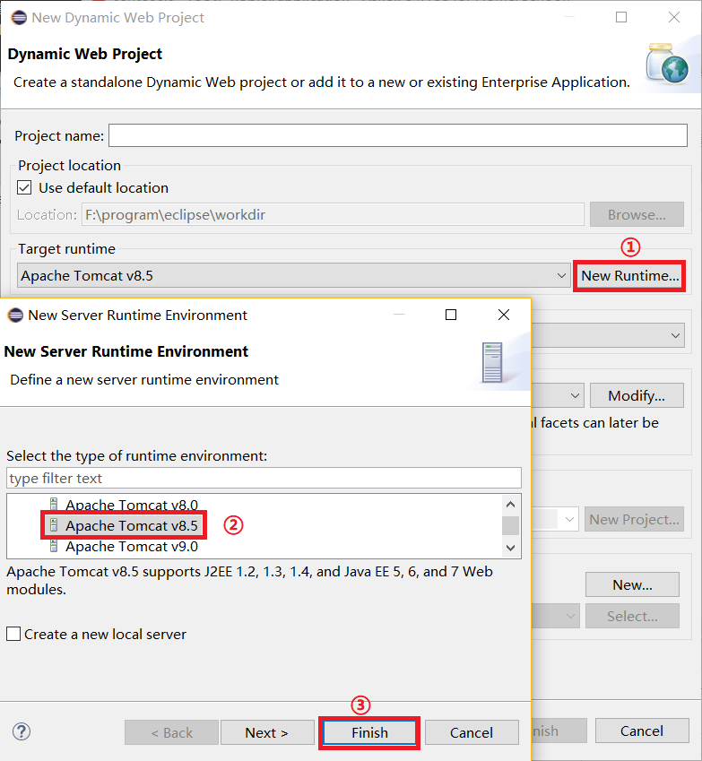
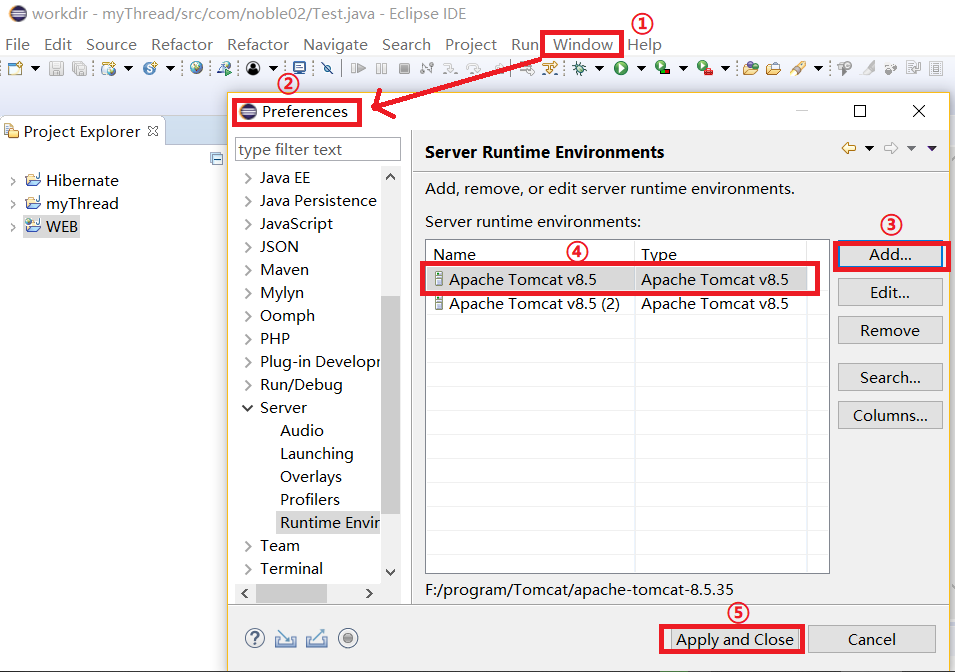
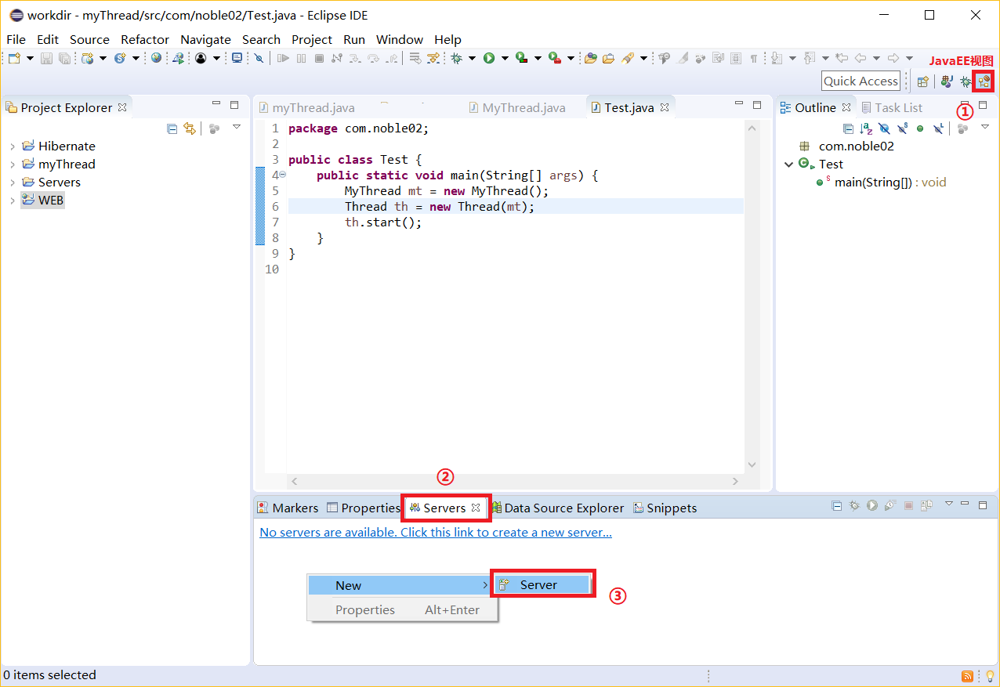
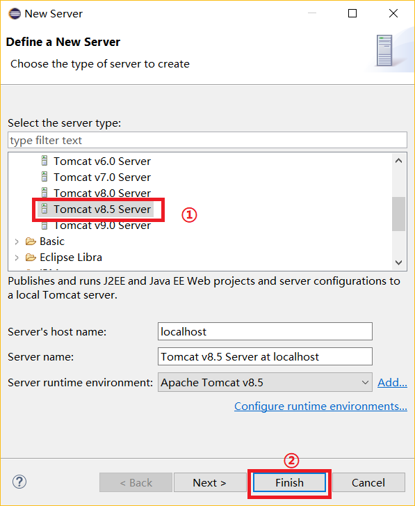
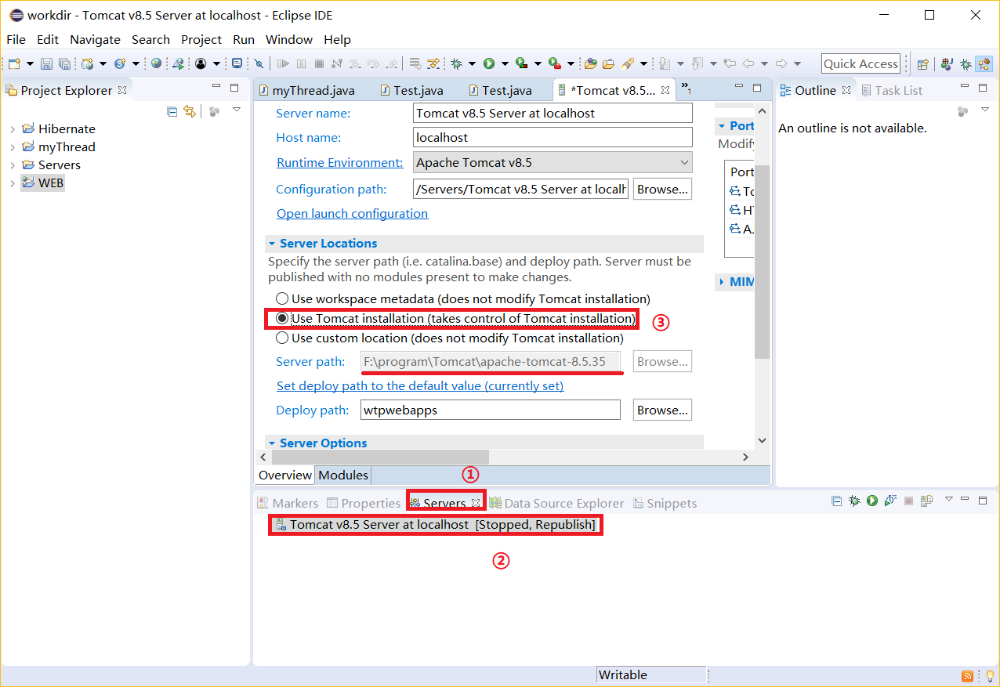
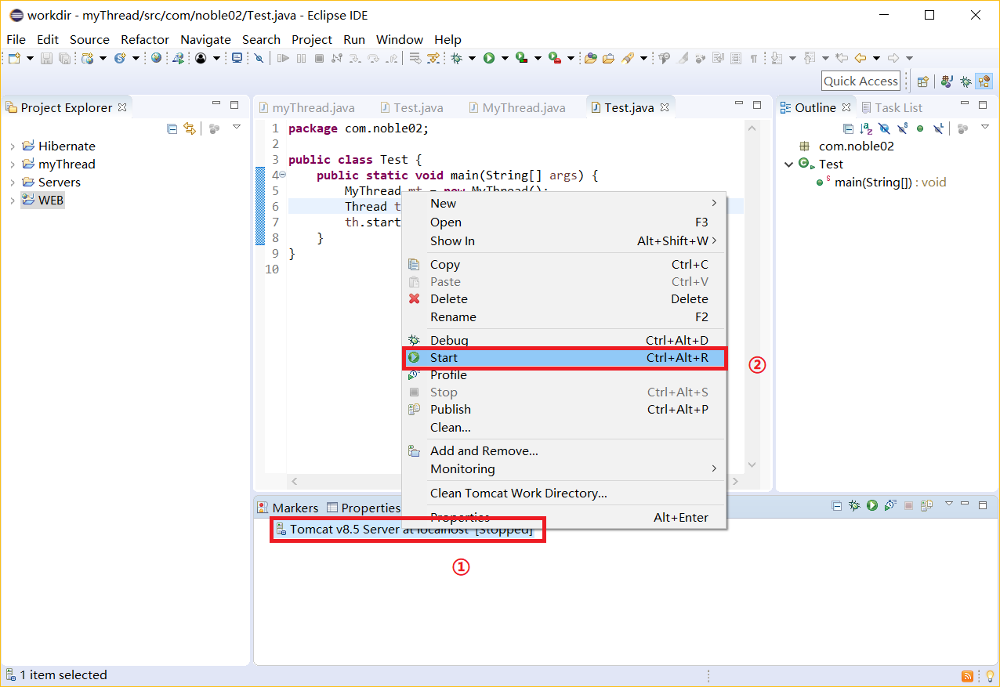
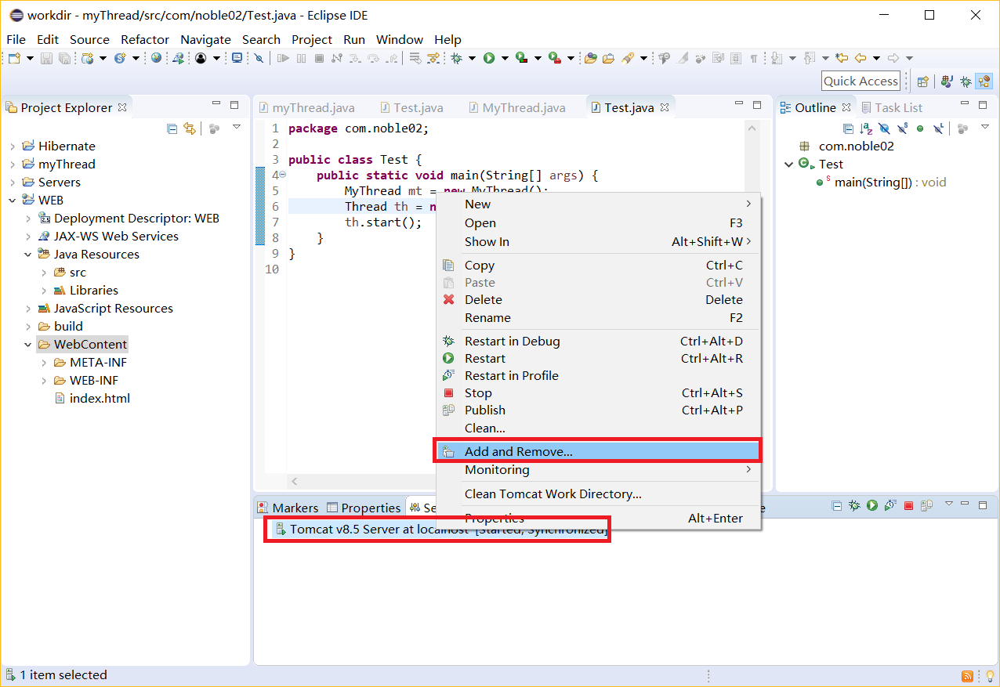
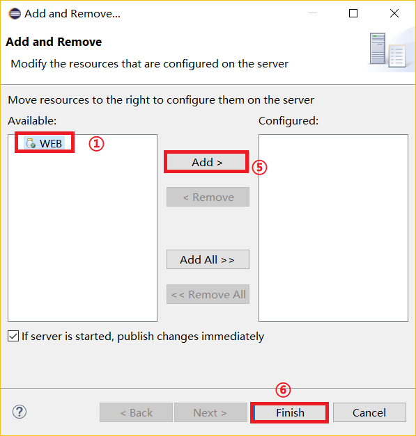

# web应用

## 1.Tomcat
Tomcat服务器是一个免费的开源代码的Web应用服务器，属于轻量级应用服务器，在中小型系统和并发访问用户不是很多的场合下被普遍使用，是开发和调试JSP程序的首先。 
支持Servlet和JSP规范。 

## 2.Tomcat使用说明
Tomcat服务器可以响应动态java页面(Servlet和JSP),也可以响应静态页面html，不过性能不好，在实际开发环境中一般使用apache或Nginx和Tomcat一起耦合使用。 

## 3.eclipse和Tomcat绑定
### 里程碑一：创建Dynamic Web Project项目
 

### 里程碑二：绑定运行时环境
 

### 里程碑三：确定工程的发布位置
 
 
 

### 里程碑四：开启Tomcat服务器
 

### 里程碑五：工程发布
 
 

#
