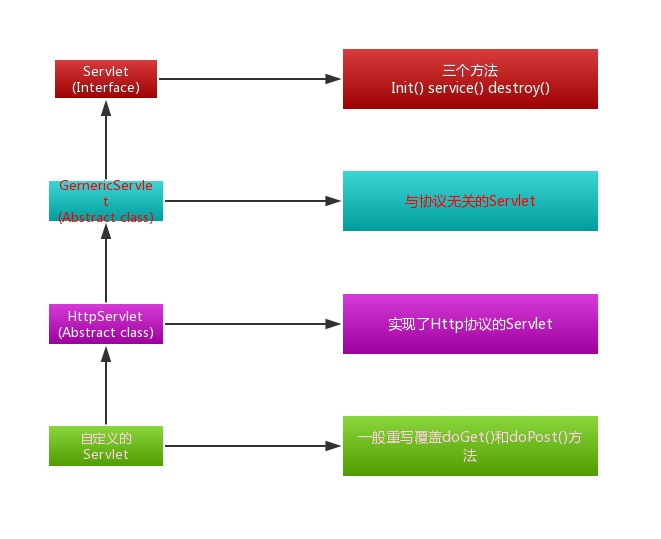

# Servlet
- [1.什么是servlet](#1.Servlet简介)
- [2.Tomcat容器等级]()
- [3.实例编写一个servlet]()
- [4.Servlet生命周期]()
- [5.Servlet获取九大内置对象]()
- [6.Servlet与表单]()
- [7.Servlet与路径跳转]()


## 1.Servlet简介
Servlet在代码形式上就是一个类. 在TomCat容器中就是独立的一个小程序,而且是可以接受并处理用户请求,可以作出响应的一个实体.<br>

## 2.tomcat容器等级
```
Tomcat -> Container(容器) -> Engine(容器) -> HOST -> Servlet(容器) -> Context(容器) -> Wrapper
```
可以参考下图:<br>
<br>

## 3.servlet代码结构
我们编写一个servlet类,这个类应该继承HttpServlet,它需要重写并覆盖doGet和doPost方法,如下:<br>
<br>

### 3.1.编写一个类继承HttpServlet
```java
public class HappyServlet extends HttpServlet {

	@Override
	protected void doGet(HttpServletRequest req, HttpServletResponse resp) throws ServletException, IOException {
		// TODO Auto-generated method stub
		super.doGet(req, resp);
	}

	@Override
	protected void doPost(HttpServletRequest req, HttpServletResponse resp) throws ServletException, IOException {
		// TODO Auto-generated method stub
		super.doPost(req, resp);
	}

}
```
重写doGet()方法和doPost()方法<br>

### 3.2.将自定义的Servlet在web.xml中注册

```xml
<servlet>
    <servlet-name>HappyServlet</servlet-name>
    <servlet-class>com.noble.websource.HappyServlet</servlet-class>
</servlet>
<servlet-mapping>
    <servlet-name>HappyServlet</servlet-name>
    <url-pattern>/servlet/happy</url-pattern>
</servlet-mapping>
```
