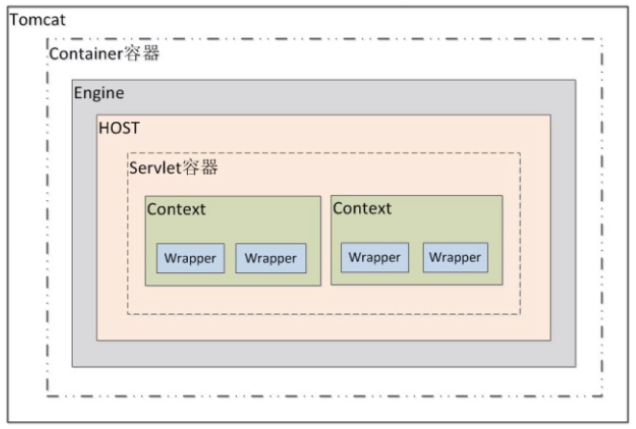

# Servlet

## 1.Servlet简介
Servlet运行在服务端的java小程序，是sun公司提供一套规范(接口)，用来处理客户端请求，响应浏览器资源。但servlet的实质就是java代码，通过java的API动态的向客户端输出内容。<br>

## 2.快速开始
### 里程碑一：创建Dynamic Web Project

### 里程碑二：编写源代码
我们在Dynamic Web工程的java Resource目录下的src中编写代码。<br>
<br>

我们在源码中重写Servlet接口。<br>
```java
package com.noble.server;

import java.io.IOException;

import javax.servlet.Servlet;
import javax.servlet.ServletConfig;
import javax.servlet.ServletException;
import javax.servlet.ServletRequest;
import javax.servlet.ServletResponse;

public class QuikStart implements Servlet {
	@Override
	public void service(ServletRequest req, ServletResponse res) throws ServletException, IOException {
		System.out.println("To be Continue...");
	}

	@Override
	public void destroy() {
		// TODO Auto-generated method stub
	}

	@Override
	public ServletConfig getServletConfig() {
		// TODO Auto-generated method stub
		return null;
	}

	@Override
	public String getServletInfo() {
		// TODO Auto-generated method stub
		return null;
	}

	@Override
	public void init(ServletConfig config) throws ServletException {
		// TODO Auto-generated method stub
	}
}
```

### 里程碑三：编辑配置文件
我们在配置文件会设置URL等相关信息。<br>
<br>

```java
<?xml version="1.0" encoding="UTF-8"?>
<web-app xmlns:xsi="http://www.w3.org/2001/XMLSchema-instance" xmlns="http://java.sun.com/xml/ns/javaee" xsi:schemaLocation="http://java.sun.com/xml/ns/javaee http://java.sun.com/xml/ns/javaee/web-app_2_5.xsd" id="WebApp_ID" version="2.5">
  <display-name>WEB</display-name>

  <servlet>
  	<servlet-name>noble</servlet-name>
  	<servlet-class>com.noble.server.QuikStart</servlet-class>
  </servlet>
  <servlet-mapping>
  	<servlet-name>noble</servlet-name>
  	<url-pattern>/quikstart</url-pattern>
  </servlet-mapping>

  <welcome-file-list>
    <welcome-file>index.html</welcome-file>
    <welcome-file>index.htm</welcome-file>
    <welcome-file>index.jsp</welcome-file>
    <welcome-file>default.html</welcome-file>
    <welcome-file>default.htm</welcome-file>
    <welcome-file>default.jsp</welcome-file>
  </welcome-file-list>
</web-app>
```

### 里程碑四：重启Tomcat并运行

## 3.Servlet生命周期
Servlet的生命周期匹配与Servlet接口的三个函数：<br>
```java
public void init(ServletConfig config);
public void service(ServletRequest req, ServletResponse res);
public void destroy();
```
**注意：** 当有用户访问服务器页面时，就会创建对象(实现了Servlet接口)<br>

- 1.当对象创建时，会执行init方法
- 2.当对象销毁时(关闭服务器Tomcat)时会执行destroy方法
- 3.每次有用户访问页面时，会执行service方法

### 1.init方法
我们可以通过init函数的config参数获得配置文件web.xml中的一些信息，但因为用处不大，这里不做介绍。<br>

### 2.service方法
每当有客户访问服务器时，通过配置文件找到该类时，会执行service方法。<br>

### 3.destroy方法
当服务器关闭时会执行该方法。<br>

## 4.servlet配置文件详解
文件``/WebContent/WEB-INF/web.xml``是servlet的主配置文件。<br>
该配置文件的模板一般是：<br>
```xml
<!-- servlet的类配置 -->
<servlet>
	<servlet-name>noble</servlet-name>
	<servlet-class>com.noble.server.QuikStart</servlet-class>
	<init-param>
		<param-name>url</param-name>
		<param-value>jdbc:mysql://10.0.0.21/mydb</param-value>
	</init-param>
</servlet>

<!-- servlet虚拟路径的配置 -->
<servlet-mapping>
	<servlet-name>noble</servlet-name>
	<url-pattern>/quikstart</url-pattern>
</servlet-mapping>
```
其中url-pattern的配置方式：<br>
- 1.完全匹配 访问的资源与配置的资源完全相同才能访问到
	- ``<url-pattern>/quikstart</url-pattern>``
- 2.目录匹配 格式：``/虚拟目录../*`` ``*``代表任意
	- ``<url-pattern>/quikstart/*</url-pattern>``
- 3.扩展名匹配 格式：*.扩展名
	- ``<url-pattern>*.pdf</url-pattern>``

注意目录匹配和扩展名混合使用的配置方式``<url-pattern>/quikstart/*.pdf</url-pattern>``是不支持的。<br>

### 一般问题
#### 1.Servlet的类何时创建？
默认第一次用户访问时创建，但当我们在主配置文件中加入<load-on-startup> servlet对象在服务器启动时就创建。<br>

### tomcat是否有默认的全局配置？
有的，在Tomcat的conf目录下面有一个web.xml文件，里面就是Tomcat的全局配置信息，当我们自己的web.xml中的配置信息不全时，Tomcat会引用全局的配置文件信息。<br>


#
