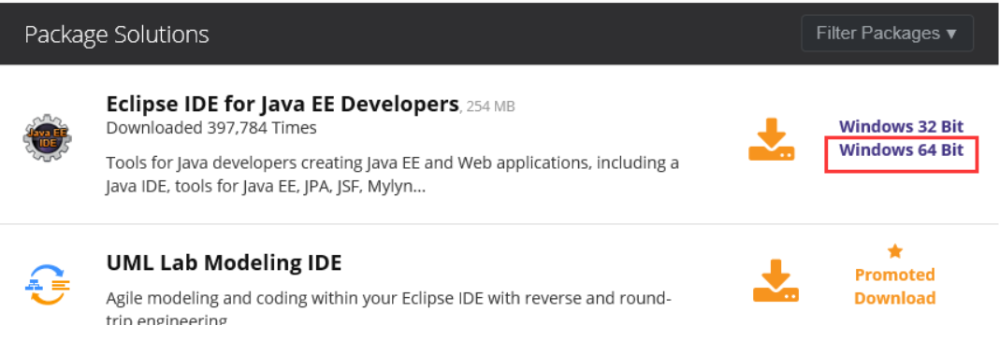
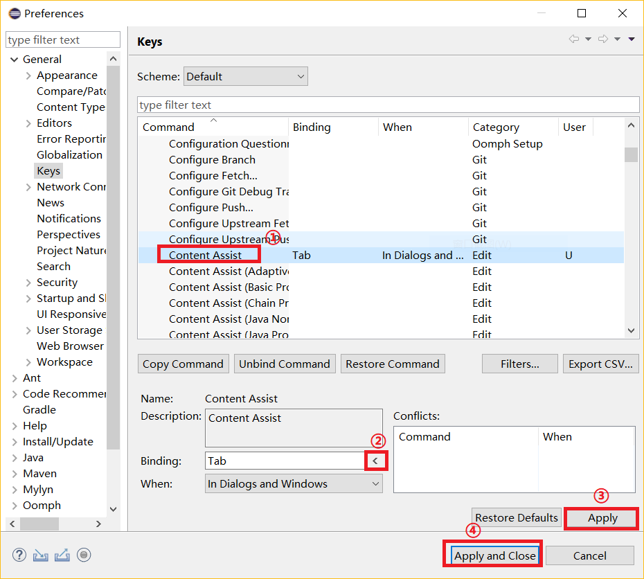
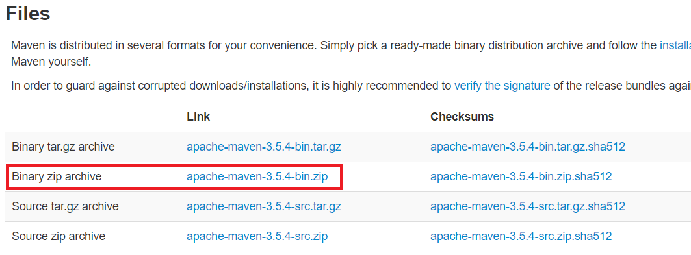

# java开发环境搭建

## 1.JDK下载

#### Linux系统
#### 里程碑一：将下载好的版本解压到指定文件夹：<br>
```
tar xf jdk-8u60-linux-x64.tar.gz -C /application/
ln -s /application/jdk1.8.0_60 /application/jdk
```

#### 里程碑二：配置环境变量
```
cat >>/etc/profile<<'EOF'
export JAVA_HOME=/application/jdk
export PATH=$JAVA_HOME/bin:$JAVA_HOME/jre/bin:$PATH
export CLASSPATH=.:$JAVA_HOME/lib:$JAVA_HOME/jre/lib:$JAVA_HOME/lib/tools.jar
EOF

source /etc/profile
```

检查：<br>
```
java -version
```

#### Windows系统
#### 环境变量配置
```
变量名：JAVA_HOME
变量值：C:\Program Files (x86)\Java\jdk1.8.0_91        // 要根据自己的实际路径配置
变量名：CLASSPATH
变量值：.;%JAVA_HOME%\lib\dt.jar;%JAVA_HOME%\lib\tools.jar;         //记得前面有个"."
变量名：Path
变量值：%JAVA_HOME%\bin;%JAVA_HOME%\jre\bin;
```

## 2.下载Eclipse
Eclipse为Java应用程序及Android开发的IDE（集成开发环境）。Eclipse不需要安装，下载后把解压包解压后，剪切eclipse文件夹到你想安装的地方，打开时设置你的工作目录即可。<br>

Eclipse的版本有多个，这里选择下载Eclipse IDE for Java EE Developers这个版本。<br>
<br>

## 3.Eclipse相关设置
### 1.更改快捷键方式
```
windows->pereforences->General->Key
```
<br>

## 3.MAVEN管理工具
官网下载：[http://maven.apache.org/download.cgi](http://maven.apache.org/download.cgi)<br>
<br>

在合适的目录下解压并配置环境变量即可<br>


#
