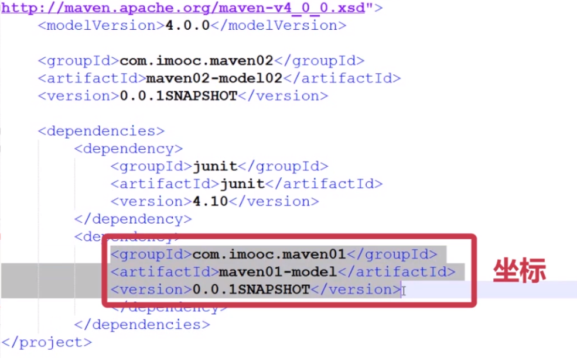

# Maven核心基础知识

## 1.Maven常用命令
```shell
mvn clean    #清空编译结果
mvn compile  #编译开发工程中的main目录
mvn test     #编译开发工程中的tast目录并运行
mvn package  #打出war包
mvn install  #项目发布到本地仓库
mvn clean package -Dmaven.test.skip=true #跳过单元测试
```

## 2.坐标,构建
再Maven项目中每一个依赖,插件,项目输出都被称作 **构建** <br>
这些构建都通过一个 **坐标** 确定位置.<br>
上述信息记录在项目的pom.xml文件中<br>
<br>

## 3.仓库
仓库是用来存放构建的<br>
仓库分为远程仓库和本地仓库,Maven通过坐标查找构建当本地仓库没有目标构建时,就从远程仓库下载,如果远程仓库也没有目标构建,就会报错.<br>

### 3.1.修改远程仓库的镜像
如果下载远程仓库网速慢,或不能访问外网,可以设置远程仓库的镜像目录<br>
通常情况我们不用设置镜像仓库<br>
在``Maven/conf/settings.xml``文件中找到``mirror``在152行<br>
```xml
<mirror>
    <id>mirrorId</id>
    <mirrorOf>repositoryId</mirrorOf>
    <name>Human Readable Name for this Mirror.</name>      <url>http://my.repository.com/repo/path</url>
</mirror>
```
改为:<br>
```xml
<mirror>
    <id>maven.net.cn</id>
    <!-- mirrorOf 设置位central就会屏蔽中心仓库,也可以使用通配符* -->
    <mirrorOf>central</mirrorOf>
    <name>central mirror in china</name>      <url>http://maven.net.cn/content/group/public</url>
</mirror>
```

### 3.2.更改本地仓库的位置
Maven下载的构建默认存放的本地仓库在用户目录下.<br>
- linux 在 ``~/``目录下.m2
- windows 在C盘

修改本地仓库目录的位置在``settings.xml``文件的53行<br>
```xml
<localRepository>/path/to/local/repo</localRepository>
```
改为:<br>
```xml
<localRepository>/application/mavenRepository</localRepository>
```