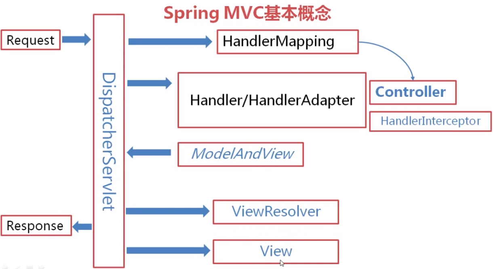

# SpringMVC介绍
 

## 1.SpringMVC
SpringMVC(Manager, View, Controler)是一个设计思想，通过分层简化web开发的困难。 

### 1.1.Request --> 处理用户数据
Request 是用户请求 
Controller是业务逻辑 
DispatcherServlet 就是Manager 
>用户发送的请求被DispatcherServlet截获  
>DispatcherServlet需要通过HandlerMapping找到对应的Controller和HandlerInterceptor生成执行链条(一般化的处理器)，返还给DIspatcherServlet  
>DispatcherServlet调用Handler,处理用户数据。 

### 1.2.返回结果Response
ModelAndView是要返还给用户的原始数据 
>DispatcherServlet调用Handler后会生成ModelAndView返回给DispatcherServlet  
>DispatcherServlet调用ViewREsolver，得知如何显示当前场景，ViewResolver生成View返还给DispatcherServlet 