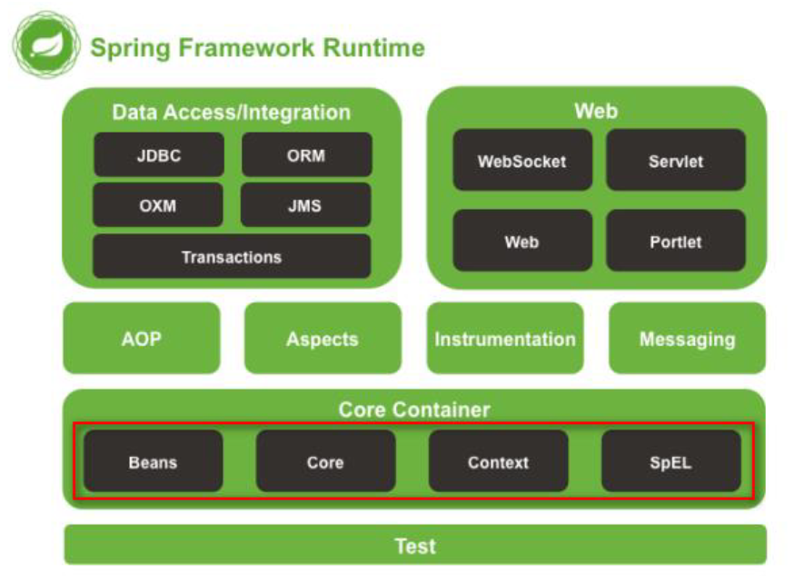
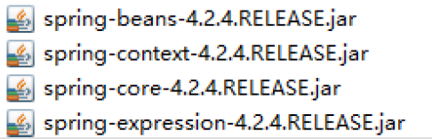
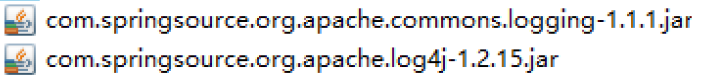
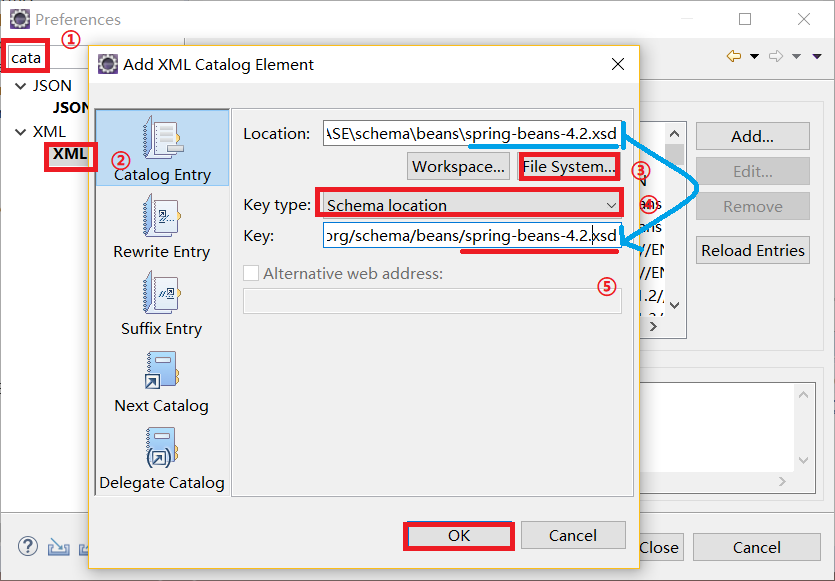
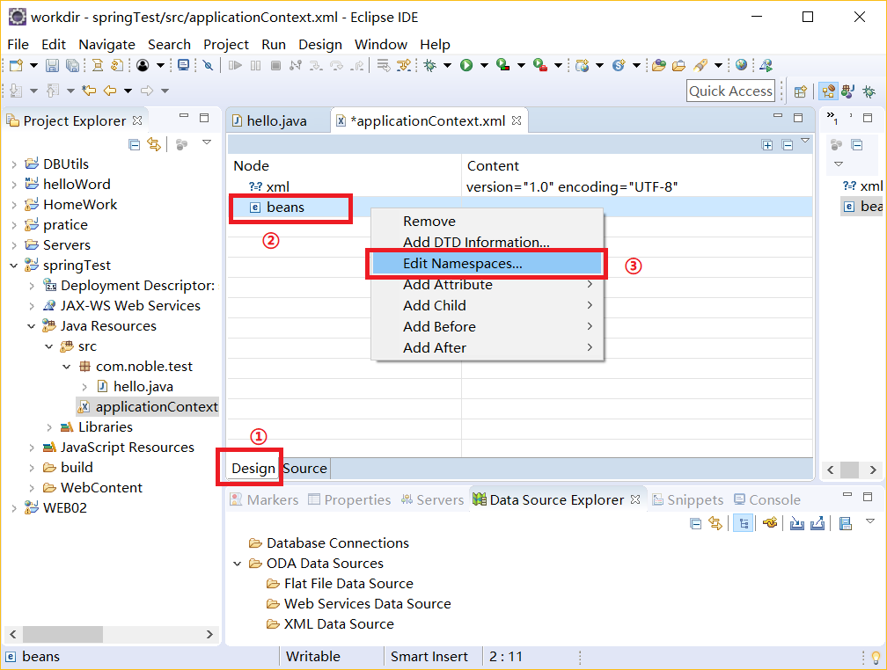
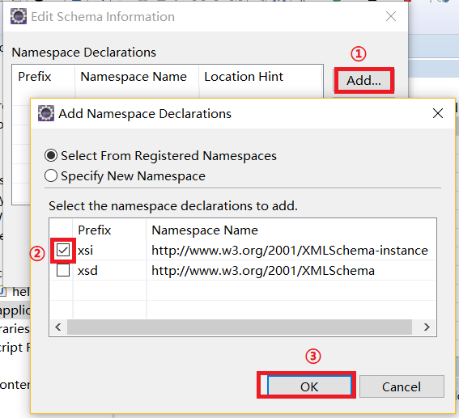
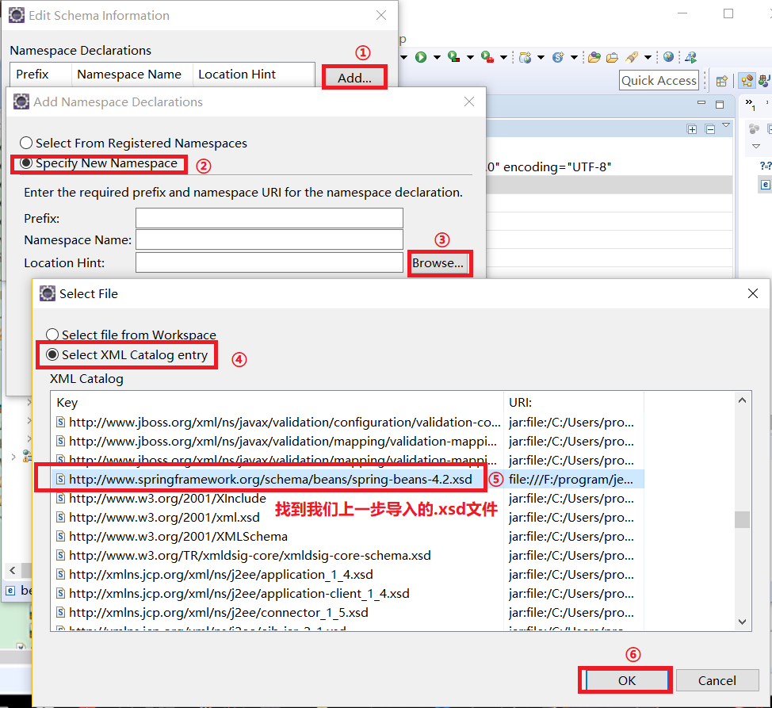
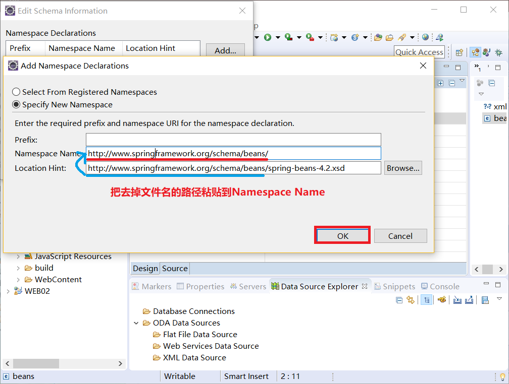
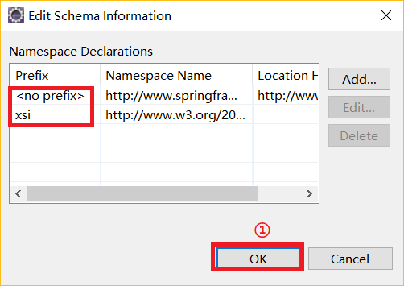

# Spring框架

## 1.Spring简述
Spring是一个开源的轻量级Java开发框架。它是为了解决企业应用开发的复杂性而创建的。框架的主要优势之一是其分层架构，分层架构允许使用者选择使用哪一个组件，同时为J2EE应用程序开发提供集成的框架。Spring使用基本的JavaBean来完成以前只可能又EJB完成的事情。然而，Spring的用途不仅限于服务器端的开发。从简单性、了测试性和松耦合的角度而言，任何Java应用都可以从Spring中受益。Spring的核心是控制反转(IOC)和面向切面(AOP)。简单来说， **Spring是一个分层的JavaSE/EE ful-stack轻量级开发框架。**<br>

EE开发分成三层结构：<br>
- 1.WEB层：Spring MVC
- 2.业务层：Bean管理：(IOC)
- 3.持久层：Spring的JDBC模板 ORM模板用于整合其他的持久层框架

## 2.Spring的优势
- 1.易于解耦合
    - Spring就是一个大工厂，可以将所有对象创建和依赖关系维护，交给Spring管理AOP编程的支持
- 2.AOP编程的支持
    - Spring提供面向切面编程，可以方便的实现对程序进行权限拦截、运行监控等功能
- 3.声明式事务的支持
    - 只需要通过配置就可以完成对事务的管理，而无需手动编程
- 4.方便程序的测试
    - Spring对Junit4支持，可以通过注解 方便的测试Spring程序
- 5.方便集成各种优秀框架
    - Spring不排斥各种优秀的开源框架，其内部提供了对各种优秀框架(如：MyBatis)的直接支持
- 6.降低JavaEE API的使用难度
    - Spring对JavaEE开发中非常难用的一些API(JDBC、JavaMail、远程调用等)，都提供了封装，使这些API应用难度大大降低

## 3.使用Spring框架

### 里程碑一 创建Web项目，引入Spring开发包
<br>
<br>

Spring的日志模块是使用的Apache下的日志包，所以我们还要导入Apache的日志包：<br>
<br>

### 里程碑二 新建类，并向Spring容器注册该类
创建类略。<br>

向Spring注册，意味着我们需要通过一个xml文件向Spring通知，在Spring中xml文件名和文件路径，没有特别要求，但开发时一般放在src目录下。<br>

我们在src目录下创建一个applicationContext.xml文件。<br>

### 里程碑三 导入xml文件约束

#### 1.引入Spring约束
<br>
在上图中步骤③路径在：``spring-framework-4.2.4.RELEASE-dist\spring-framework-4.2.4.RELEASE\schema\beans\spring-beans-4.2.xsd``<br>

最后一步步骤⑤ 我们将Location的text中的最后一段(蓝色下划线)粘贴到Key的text最后面(红色下划线)<br>

#### 2.在xml导入约束
约束已经导入到eclipse了，也选择了Location选项，我们可以不联网的情况下使用约束，下面介绍在自己创建的xml文件使用约束的方法，我们质量xml文件的文件名是applicationContext.xml<br>
我们在自己创建的xml文件中加入下面内容：<br>
```xml
<?xml version="1.0" encoding="UTF-8"?>
<beans></beans>
```

然后切换到视图模式：<br>
<br>

我们首先无脑导入xsi：<br>
<br>

还没完，继续完成下面的操作：<br>
<br>
<br>

一般来说当出现如下图中的信息就说明导入成功：<br>
<br>