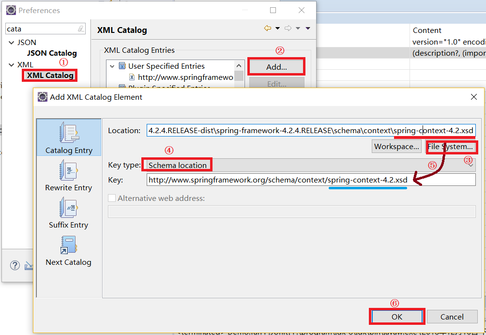
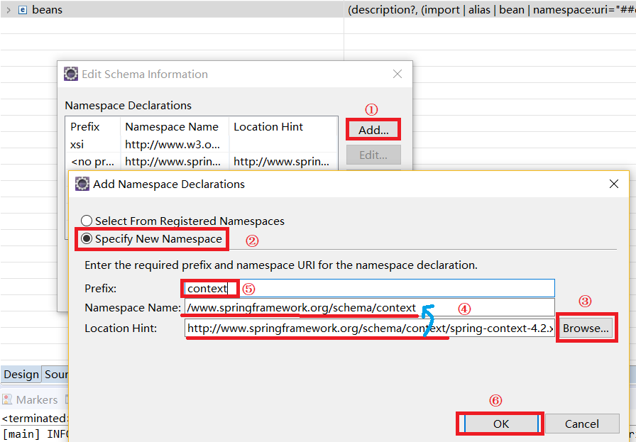

# Spring 注解配置文件

## 1.环境准备
### 里程碑一 创建web环境并导包
可以参考(Spring框架基础)[]<br>

### 里程碑二 导入约束
方法与导入beans约束类似，这次我们导入contest包。<br>
<br>
<br>
注意第二幅图的第五个步骤：把``Namespace Name``最后一个单词填入到``Prefix``中。这一步的作用是确定命名空间。<br>
它等价于：<br>
```xml
xmlns:context="http://www.springframework.org/schema/context"
```

### 里程碑三 编辑applicationContext.xml文件
我们通过编辑applicationContext.xml文件告诉Spring去哪里查找注释。<br>

```xml
<?xml version="1.0" encoding="UTF-8"?>
<beans xmlns:xsi="http://www.w3.org/2001/XMLSchema-instance" xmlns="http://www.springframework.org/schema/beans" xmlns:context="http://www.springframework.org/schema/context" xsi:schemaLocation="http://www.springframework.org/schema/beans http://www.springframework.org/schema/beans/spring-beans-4.2.xsd http://www.springframework.org/schema/context http://www.springframework.org/schema/context/spring-context-4.2.xsd ">
	<!-- 指定扫描com.noble.bean包下的所有类中的注解 -->
	<context:component-scan base-package="com.noble.bean"></context:component-scan>
</beans>
```
通过上面的xml文件Spring会去扫描com.noble.bean和它下面的子包中的所有类文件的注释。<br>

### 里程碑四 将类加入到Spring的管理器中
我们通过加入一个注释将类加入到Spring容器中。<br>
```java
@Component("user")
public class User {
	private String name;
	private int age;
	private Hose house;

    ...........
}
```
我们在类的上方加入``@Component("user")``就相当于在applicationContext.xml文件中加入了``<bean  name="user" class="cn.itcast.bean.User" >``<br>
将类注册到类除了``@Component()``还有三个注解它们的功能完全一样只是名字不同。<br>
- 1.@Service("user") //service层
- 2.@Controller("user") //web 层
- 3.@Repository("user") //dao 层

我们使用不同名字的注释可以帮助开发人员对不同的类属于哪一层有很好的直观帮助。<br>

## 2.其他功能注释
### 1.@Scope
用来指定单例等属性。<br>
```java
@Component("user")
@Scope(scopeName="prototype")
public class User {
	private String name;
	private int age;
	private Hose house;

    ...........
}
```
### 2.@Value
``@Value``值类型的注入。<br>
```java
@Component("user")
public class User {
	@Value("noble")
	private String name;
	private int age;
	private Hose house;

    ............
}
```
上面的@Value注释给name字段赋值noble。<br>

### 3.@Autowired
当要初始化的值是一个类时，我们使用@Autowired。前提条件是要被注入的类已经加入到了Spring容器中<br>
```java
@Component("user")
public class User {
	@Value("noble")
	private String name;
	private int age;
    @Autowired
	private House house;

    ............
}
```
Spring会从容器中寻找一个和Hose类型匹配的实例化对象注入到house中。当容器中有多个对象类型都符合House时，我们一般使用@Resource(name="")<br>

### 4.@Resource(name="")
```java
@Component("user")
public class User {
	@Value("noble")
	private String name;
	private int age;
    @Resource(name="house")
	private House house;

    ............
}
```
``@Resource(name="house")``将容器中house这个类加入到字段house中。<br>

### 5.@PostConstruct和@PreDestroy
```java
@PostConstruct //在对象被创建后调用.init-method
public void init(){
    System.out.println("init method");
}
@PreDestroy    //在销毁之前调用.destory-method
public void destory(){
    System.out.println("destory-method");
}
```