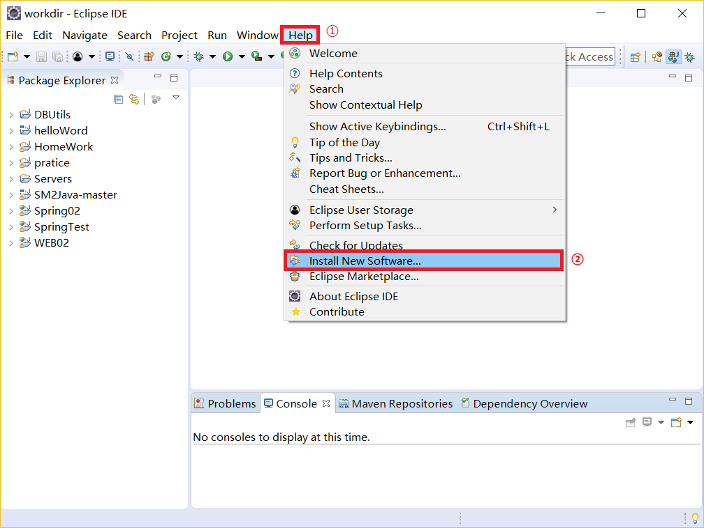
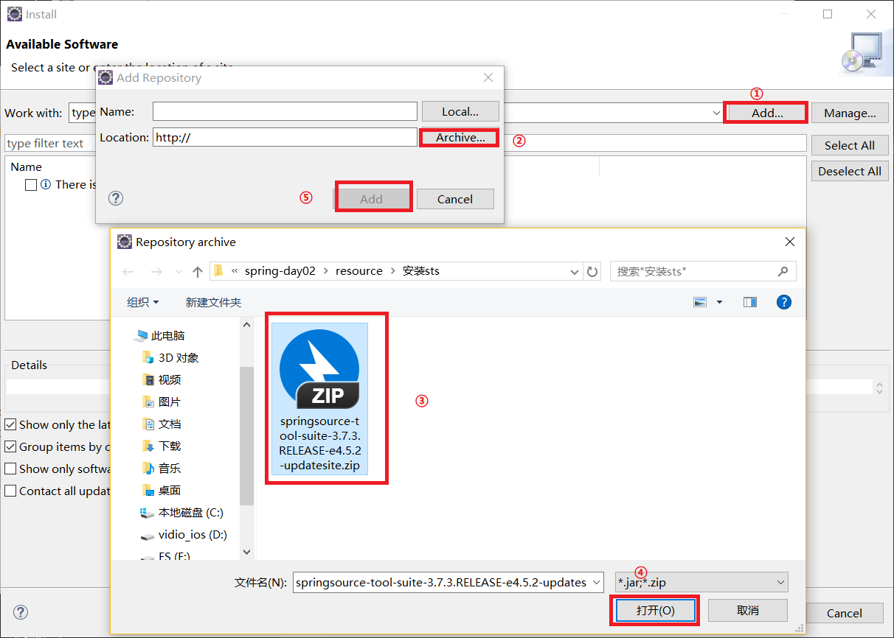
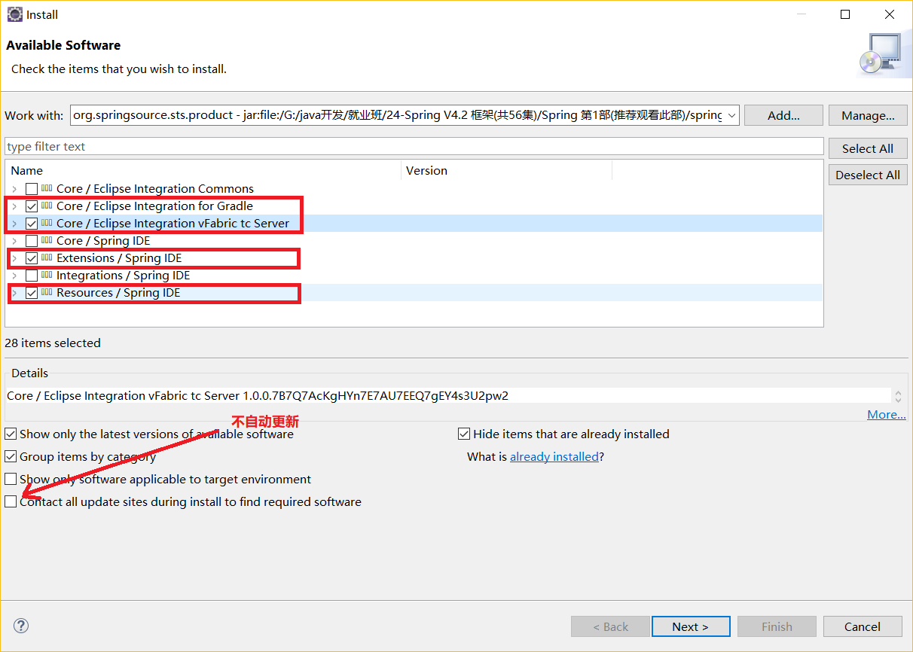
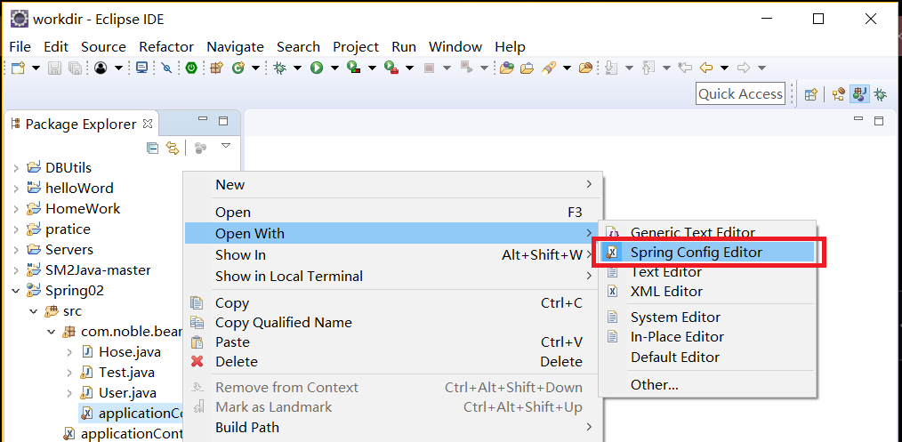
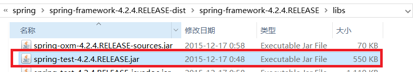
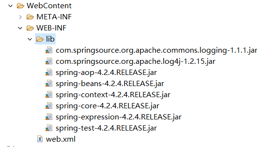

# 安装Sts插件
<br>
<br>
<br>

安装包通过网上查找下载，安装可能失败，可以下载集成sts的eclipse使用。<br>
当出现以下现象时，说明安装成功。<br>
<br>

# eclipse集成Junit
## 里程碑一 导包
4+2+aoe+test<br>
<br>
导完包后总共有8个包，如下：<br>
<br>

## 里程碑二 测试
```java
package com.noble.bean;
//让测试类自动加载容器
@RunWith(SpringJUnit4ClassRunner.class)
//告诉Junit从哪里读取配置文件
@ContextConfiguration("classpath:applicationContext.xml")
public class Test {
	//从容器中得到对象的方法
	@Resource(name="user")
	private User u;
	
	//方法前面的test还是不能少的
	@org.junit.Test
	public void test() {

		System.out.println(u);
	}
}
```
通过以上方法，我们可以不用自己实例化容器，简化了琐碎的事情。获取对象的方法在上面的代码中有实例。<br>

# aop思想
横向重复，纵向抽取。<br>